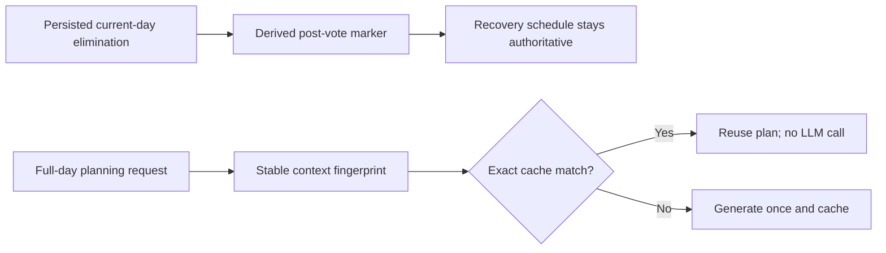

# Durable Post-Vote Planning

## Design
- Treat the current-day elimination in persisted `SeasonState` as the durable source of truth and derive `post_vote_active` into each survivor’s existing Scratch survival context. This avoids a duplicate database field and any new database read.
- Use three stable planning stages: `normal`, `survival_pre_vote`, and `survival_post_vote`. Hash that stage plus the daily brief, lifestyle, and Survival overlay only when full-day planning runs—not every simulation step.
- Keep the deterministic recovery schedule authoritative through midnight. Cache invalidation is logical through the new fingerprint; do not clear other personas’ plans, wake-up caches, or the whole task-decomposition cache.

## Implementation chunks

1. **Add the context-scoped cache contract** — files: [planning_cache.py](D:/Coding/generative_agents/reverie/backend_server/persona/cognitive_modules/planning_cache.py), [test_planning_cache_per_sim.py](D:/Coding/generative_agents/tests/test_planning_cache_per_sim.py), [test_small_cast_forces_replan.py](D:/Coding/generative_agents/tests/test_small_cast_forces_replan.py).
   - Add an optional context fingerprint to plan cache keys and payloads; runtime callers will always supply it, while replay fixtures retain their existing explicit no-context path.
   - Prove same context hits, changed context misses, wake-up caching is unchanged, and one simulation cannot leak into another.
   - Check: `python -m pytest tests/test_planning_cache_per_sim.py tests/test_small_cast_forces_replan.py -q`.

2. **Wire stable context into full-day and decomposition planning** — files: [plan.py](D:/Coding/generative_agents/reverie/backend_server/persona/cognitive_modules/plan.py), [schedule_validator.py](D:/Coding/generative_agents/reverie/backend_server/persona/cognitive_modules/schedule_validator.py), and a focused new planning-context test.
   - Compute the fingerprint only inside `_long_term_planning`; use the coarse stage rather than raw hourly Survival phases so normal pre-vote cache hits do not fragment.
   - Let the exact cache lookup restore a plan; remove the validator’s unsafe early return based on a generic wake-hour key.
   - Add the coarse stage to the existing task-decomposition context hash instead of globally clearing its cache.
   - Prove normal mode makes the same number of planning LLM calls, unchanged context still hits, and one meaningful context change causes exactly one intended miss.

3. **Make post-vote recovery restart-safe and authoritative** — files: [controller.py](D:/Coding/generative_agents/reverie/backend_server/survival/controller.py), [test_survival_rca_20260627.py](D:/Coding/generative_agents/tests/test_survival_rca_20260627.py), [test_survival_rca_refix_20260630.py](D:/Coding/generative_agents/tests/test_survival_rca_refix_20260630.py).
   - At elimination, set the derived marker, keep the deterministic remaining-day schedule, invalidate the old action, and stamp `last_planned_date` to today rather than triggering generic full-day planning.
   - On restart, reconstruct the marker from the persisted current-day elimination and restore recovery once if persona Scratch was saved before injection completed.
   - Prove an actual stale pre-vote cache cannot overwrite recovery, no full-day LLM call occurs post-vote, repeated recovery is idempotent, and normal next-day planning resumes after midnight.

4. **Protect the first recovery action** — files: [plan.py](D:/Coding/generative_agents/reverie/backend_server/persona/cognitive_modules/plan.py) and [test_survival_rca_refix_20260630.py](D:/Coding/generative_agents/tests/test_survival_rca_refix_20260630.py).
   - Prevent the generic stall-breaker’s forced schedule advance when `post_vote_active`; it must select “leave the gathering area and head home,” not skip to the following block.
   - Prove the normal stall-breaker still advances unrelated stuck actions.

5. **Gate all fallback planning prompts** — files: [run_gpt_prompt.py](D:/Coding/generative_agents/reverie/backend_server/persona/prompt_template/run_gpt_prompt.py), [controller.py](D:/Coding/generative_agents/reverie/backend_server/survival/controller.py), and one new post-vote prompt test.
   - When post-vote is active, replace deadline/gathering cues with a concluded-vote recovery statement in the identity overlay, daily fixed-events block, hourly calendar block, and decomposition context.
   - Keep non-Survival and pre-vote prompt inputs byte-for-byte unchanged; output and cleanup contracts do not change.
   - Run the project prompt-verification workflow plus focused prompt/overlay tests.

6. **Make acceptance scoring trustworthy** — files: [analyze_20260630_1.py](D:/Coding/generative_agents/tests/analyze_20260630_1.py) and a new scorer unit test.
   - Paginate `personas_coords`, fail loudly on incomplete gate-window coverage, and narrow vote-prep matching so legitimate post-vote reflection is not flagged.
   - Align labels with what is measured: vote-preparation anywhere, rather than claiming “at Hobbs” while checking all locations.

## Final verification
- Run all focused tests after their respective chunks; stop on the first failure.
- Run `python tests/test_movement_realism.py`, replay cache tests, and prompt verification.
- Performance gates: no new database calls, no per-step hashing, unchanged normal/pre-vote cache-hit behavior, and zero full-day planning LLM calls after elimination.
- Run the paginated scorer on the next full Survival candidate; do not close RCA-1 until it reports complete row coverage and zero stale post-vote restores.
- Run the simplify review, then prepend the required code-change entry to [worklog.md](D:/Coding/double-docs/worklog.md).