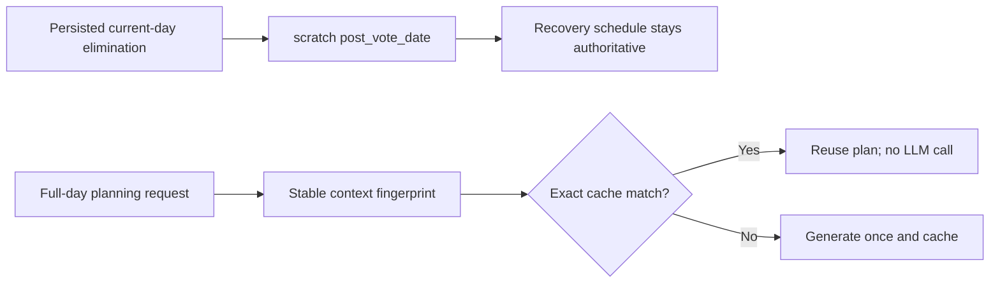

# Durable Post-Vote Planning — **DONE**

**Status:** **DONE** (2026-07-10). Code shipped `1db8cbe2` on `railway`. **Live proof PASS** on `20260709-1` (RCA-1: 0 vote-prep@Hobbs 2311–2400; 14/14 bed @2450 & 2489). Checklist: [`../20260710_checklist.md`](../20260710_checklist.md).

## Design (as built)

- Current-day elimination in persisted `SeasonState` is the restart-safe source of truth. At injection / resume sync, derive `scratch.survival["post_vote_date"]` (today’s date string). No DB migration; no new per-step DB reads.
- Three planning stages: `normal` | `survival_pre_vote` | `survival_post_vote`. Fingerprint = stage + daily brief + lifestyle + overlay, hashed only inside full-day planning (not every step).
- Deterministic recovery schedule stays authoritative until midnight. Cache miss is logical via fingerprint; wake-up cache and other personas’ plans are untouched.
- Stall-breaker does **not** advance the schedule index while post-vote is active (keeps “leave gathering / head home”).
- Fallback prompts (identity overlay, daily fixed-events, hourly calendar) replace upcoming-vote cues with “vote concluded → return home” when the marker matches today.

## What shipped (by chunk)

| # | Chunk | Result |
|---|-------|--------|
| 1 | Context-scoped cache contract | Optional `context_fingerprint` on plan cache keys/payloads; legacy no-fingerprint path kept for replay. Tests in `test_planning_cache_per_sim.py`. |
| 2 | Planner context | `_is_post_vote_active`, `_planning_stage`, `_planning_context_fingerprint` in `plan.py`; post-vote skips full-day replan; stage in decomp pack. Removed unsafe wake-hour “New day” probe in `schedule_validator.py`. New `test_planning_context_fingerprint.py`. |
| 3 | Post-vote barrier | Injection stamps `last_planned_date` to today + `post_vote_date`; supersedes `(b)` and residual `(c) … tonight's vote`; `_sync_post_vote_markers` on `on_step` for resume. |
| 4 | Stall-breaker | Folded into chunk 3 — no schedule advance while post-vote active. |
| 5 | Prompt gates | Post-vote overlay branch; `_scratch_post_vote_active` gates daily fixed-events + hourly calendar in `run_gpt_prompt.py`. Tests in `test_hourly_schedule_calendar.py` + overlay case in `test_survival_rca_refix_20260630.py`. Raw/cleanup prompt contracts unchanged. |
| 6 | Scorer | `analyze_20260630_1.py`: step-window pagination, fail-closed incomplete 2311–2400 window, tightened `VOTE_PREP_RE` (no bare `\bvote\b`), flag only vote-prep **and** Hobbs. |

**Out of scope (intentionally not rewritten):** morning `build_survival_daily_plan_req` — injection supersedes `(b)`/`(c)` in Scratch; lifestyle rewrite gated by `_post_vote_injected_for`.

## Verification already done

- Focused pytest: planning cache, fingerprint, hourly calendar, RCA-1 / re-fix, small-cast replan — pass
- `python tests/test_movement_realism.py` — pass
- Simplify: deduped post-vote date helper in prompt module; overlay fallback date-matches
- Worklog prepended under branch `ivan/durable-post-vote-planning`
- Deployed: local → `origin/railway` `1db8cbe2`; VPS pull + `systemctl restart double-api` confirmed on that SHA

## Remaining — live proof — **DONE**

1. ~~Let `20260709-1` finish~~ — stopped @ 2489 (enough for RCA-1 window).
2. ~~Score~~ — `analyze_20260630_1.py 20260709-1` → **RCA-1 OVERALL: PASS**
3. ~~Require complete window / zero vote-prep@Hobbs / bed gates~~ — all met.
4. ~~Tick checklist + close inquiry~~ — done 2026-07-10; this plan archived to `done/`.
