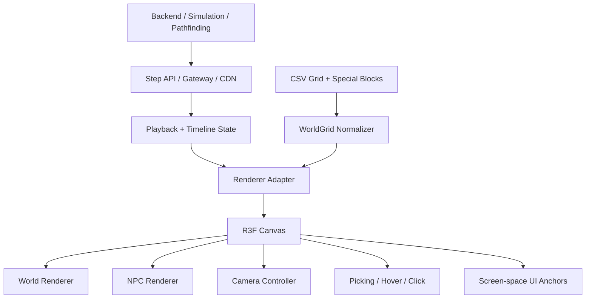

> **Archived 2026-09-09. Not live.** Breakfasts tracker: double-docs/BREAKFASTS-BOARD.md. Spec: double-docs/MVP-breakfasts.md. Map checklist: double-docs/R3F/TODOs_ivan-nicolas.md.

# R3F Pico de renderizado de aldea

## Resumen ejecutivo

El objetivo no es rediseñar la arquitectura del juego. El objetivo es reemplazar el renderizador Phaser actual con un renderizador Three.js / React Three Fiber preservando al mismo tiempo los datos existentes y el modelo de simulación.

Flujo actual:

```txt
CSV grid
  -> pathfinding / simulation
  -> steps / playback data
  -> Phaser renderer
```

Flujo objetivo:

```txt
CSV grid
  -> pathfinding / simulation
  -> steps / playback data
  -> Three.js / React Three Fiber renderer
```

El backend, la interfaz de tablero/control, el modelo mundial CSV, la búsqueda de rutas, la simulación, los datos de pasos y los conceptos de reproducción deberían permanecer prácticamente sin cambios. El espectador debe ser responsable únicamente de la visualización, la animación, la cámara y la interacción.

La validación central para este pico es:

> ¿Se puede visualizar el mundo CSV/grid existente como una aldea 3D convincente sin cambiar la arquitectura de simulación?

## Conclusión principal

Esta migración es realista si se trata como un reemplazo del renderizador, no como una reescritura del juego.

El principio arquitectónico más importante es:

```txt
simulation state
  -> renderer adapter
  -> visual state / animation state
  -> Three.js scene
```

El renderizador debería consumir los mismos datos de cuadrícula y pasos que consume Phaser hoy. No debe poseer búsqueda de rutas, reglas de simulación ni estado de backend.

## CSV sigue siendo la fuente de la verdad

El CSV/grid debe seguir siendo la representación mundial canónica.

Ejemplo:

```csv
grass,grass,road,road
grass,cafe,cafe,road
grass,house,grass,road
```

Esto se convierte en una escena 3D donde:

```txt
grass -> grass tile or ground material
road  -> road tile or path mesh
cafe  -> cafe building prefab
house -> house building prefab
```

Cada celda se asigna a una posición 3D:

```ts
const x = gridX * cellSize;
const z = gridY * cellSize;
const y = 0;
```

En la práctica, la escena probablemente debería centrar el mapa alrededor del origen:

```ts
const x = (gridX - gridWidth / 2) * cellSize;
const z = (gridY - gridHeight / 2) * cellSize;
const y = 0;
```

Modelo recomendado:

```ts
type GridCell = {
  x: number;
  y: number;
  terrain: "grass" | "road" | "floor" | "water";
  collision: boolean;
  sector?: string;
  arena?: string;
  gameObject?: string;
  spawningLocation?: string;
};
```

El CSV debe definir la semántica. El renderizador debería decidir cómo se ve esa semántica.

## No renderice cada mosaico como un componente de React

Una implementación ingenua crearía un componente de React por mosaico:

```tsx
<GridCell />
<GridCell />
<GridCell />
```

Para un mapa de 140x100, eso se convierte en alrededor de 14,000 componentes de React antes de accesorios, edificios, superposiciones o NPC. Ese no es el enfoque correcto.

Utilice `THREE.InstancedMesh` para imágenes de celda repetidas:

- baldosas de hierba
- baldosas de carretera
- baldosas
- árboles del mismo tipo
- sillas, mesas, lámparas, vallas, mostradores repetidos
- superposiciones de ocupación/depuración

React Three Fiber es útil para la composición de escenas, la carga de activos y la interacción, pero las rutas de renderizado en caliente deben ser compatibles con GPU y evitar la rotación del estado de React.

División recomendada:

```txt
React components:
  - Canvas shell
  - camera controller
  - high-level scene sections
  - selected/interactive objects

Imperative Three.js / refs:
  - tile instancing
  - NPC transform updates
  - animation loop
  - large repeated prop sets
```

## Representación mundial recomendada

Utilice un modelo mundial normalizado entre CSV y renderizado.

```txt
CSV files / special block mappings
  -> WorldGrid normalizer
  -> semantic cells
  -> render batches
```

Lotes del renderizador:

```txt
terrain batches:
  grass -> InstancedMesh
  road  -> InstancedMesh
  floor -> InstancedMesh

object batches:
  tree_small -> InstancedMesh
  chair_a    -> InstancedMesh
  table_a    -> InstancedMesh

unique objects:
  cafe building -> GLB prefab
  house building -> GLB prefab
  special interior object -> GLB prefab
```

Los edificios, carreteras, muebles, puntos de generación de NPC y ubicaciones interactivas deben representarse como entradas de cuadrícula semántica más un registro visual:

```ts
type ObjectRegistryEntry = {
  id: string;
  kind: "building" | "prop" | "furniture" | "spawn" | "interaction";
  asset?: string;
  footprint: [number, number];
  walkable: boolean;
  interactive?: boolean;
};
```

La ocupación de las celdas debe visualizarse como una superposición, no integrada en el terreno:

- plano de color sutil
- anillo de contorno
- icono encima de la celda
- mapa de calor de depuración
- resaltado de celda seleccionada

## Arquitectura de escena

Pila recomendada:

- `three`
- `@react-three/fiber`
- `@react-three/drei`
- `three-stdlib`
- `gltfjsx`
- `gltf-transform`
- `three-mesh-bvh` más tarde si la selección/raycasting se vuelve pesada

Arquitectura recomendada:



El renderizador debe exponer una API similar a la API de escena actual de Phaser:

```ts
type VillageSceneApi = {
  focusOnPersona: (name: string) => void;
  zoomIn: () => void;
  zoomOut: () => void;
  resetCamera: () => void;
  worldToScreen: (position: { x: number; z: number }) => { x: number; y: number };
};
```

Esto conserva los puntos de integración de la interfaz de usuario existentes: controles de línea de tiempo, ventanas emergentes de personas, controladores de clic, enfoque de cámara y controles de reproducción.

## Independencia del renderizador

El renderizador no debería saber cómo simular la aldea.

Debería recibir:

- paso actual
- posiciones personales actuales
- rutas para interpolación
- acciones/estados actuales
- metadatos de la cuadrícula mundial
- persona/célula seleccionada

Debería producir:

- interpolación visual
- transiciones de animación
- movimiento de cámara
- eventos de desplazamiento/clic
- posiciones de anclaje del espacio de pantalla para la interfaz de usuario

Esto mantiene limpio el límite:

```txt
Simulation decides what happened.
Renderer decides how it looks.
```

## Sistema NPC

El sistema NPC es probablemente el área de ingeniería/arte más difícil de la migración.

Un NPC simple necesita al menos:

- inactivo
- caminar
- siéntate
- hablar
- cocinar
- interactuar
- esperando
- entrando al edificio
- saliendo del edificio

Pero para evitar el comportamiento robótico, el sistema debería admitir variantes:

- inactivo_a
- idle_b
- inactivo_c
- caminar_normal
- caminar_lento
- caminar_rápido
- hablar_casual
- hablar_emocionado
- interactuar_counter
- interactuar_table

Principio importante:

```txt
NPC simulation state should map to animation state, not drive animation directly.
```

No hagas esto:

```ts
if (persona.action === "walking") {
  play("walk");
}
```

Prefiero esto:

```txt
simulation action
  -> animation state machine
  -> selected clip
  -> blended animation
```

Ejemplo:

```ts
const visualState = animationStateMachine.resolve({
  action: persona.action,
  status: persona.status,
  speed: persona.speedMultiplier,
  carryingItem: persona.carryingItem,
  nearbyTarget: persona.targetObject,
});
```

Entonces `walking` puede convertirse en:

- `walk_slow`
- `walk_fast`
- `walk_with_coffee`
- `walk_tired`

sin cambiar el backend o la simulación.

## Canalización de animación de personajes

Prototipo de flujo de trabajo recomendado:

```txt
Character mesh
  -> Mixamo / AccuRig
  -> animation clips
  -> Blender NLA cleanup
  -> GLB export
  -> Three.js AnimationMixer
```

Herramientas más rápidas para validar el pico:

- Mixamo para clips estilo inactivo/caminar/sentarse/hablar
- Blender para combinar clips y exportar GLB
- Three.js `AnimationMixer` para reproducción
- `SkeletonUtils.clone` para personajes clonados

Herramientas de producción/pulido:

- AccuRig para un mejor control del rigging
- Rokoko para flujos de trabajo de retargeting y mocap
- Cascadeur para movimiento personalizado con conexión a tierra física
- Blender para limpieza final, escala, pivotes, materiales y exportación de GLB

Enfoque de tiempo de ejecución recomendado para el pico:

- un NPC visible
- un carácter GLB
- animaciones `idle` y `walk`
- interpolar a lo largo de una ruta existente
- cambia entre inactivo y caminar según el movimiento

Esto valida la arquitectura antes de resolver el rendimiento de la multitud.

## Estrategia de activos

El mayor riesgo del proyecto no es Three.js. Son activos.

El pueblo necesita:

- casas
- cafetería
- carreteras
- hierba
- árboles
- tablas
- sillas
- contadores
- luces
- signos
- decoraciones
- PNJ
- objetos de cocina
- accesorios de interacción

Todos estos deben compartir un estilo de simulación de vida acogedor y coherente.

### Estrategia de prototipo

Utilice primero los paquetes de activos coherentes comprados o gratuitos.

Buenas fuentes:

- Synty
- Polipizza
- Sketchfab
- CGTrader
- KitBash
- Unity Asset Store, si los términos de licencia/exportación son aceptables
- Unreal Marketplace, si los términos de licencia/exportación son aceptables

Para el primer pico, la coherencia visual importa menos que la validación:

```txt
CSV -> 3D coordinates -> tiles/buildings/NPC path
```

### Estrategia de producción

Para la producción, investigue más seriamente los activos generados por IA.

Herramientas para evaluar:

- Trípode
- Malloso
- Rodin
- Hunyuan 3D
- Enrejado
- Flujos de trabajo de IA de Blender

Uso recomendado de activos de IA:

- ideación rápida de accesorios
- accesorios de fondo
- variantes decorativas
- bloqueos
- mallas de primer paso

No recomendado como única fuente de verdad para arte de producción sin limpieza.

Principales riesgos de los activos de IA:

- estilo inconsistente
- mala topología para la animación
- artefactos de textura
- escala/pivotes inconsistentes
- aún se requiere limpieza manual
- revisión de licencias y uso comercial

Flujo de trabajo de producción práctico:

```txt
AI / purchased base asset
  -> Blender cleanup
  -> retopology or simplification
  -> texture cleanup
  -> pivot/scale alignment
  -> GLB export
  -> glTF validation
  -> optimization
```

## Recomendación de cámara

Comience con una cámara ortográfica restringida de 3/4.

No empieces con:

- cámara completa estilo Sims
- cámara en órbita sin restricciones
- cámara en primera persona
- cámara con mucho interior

Estilo recomendado:

```txt
Animal Crossing readability
+ isometric grid clarity
+ 3/4 cozy village presentation
```

Por qué:

- preserva la legibilidad de la cuadrícula
- mantiene visible el modelo mental CSV
- reduce la carga de activos
- evita la necesidad de modelar interiores completamente desde el principio
- facilita las interacciones al hacer clic o pasar el cursor
- mantiene legible el movimiento de los NPC

Características iniciales de la cámara:

- sartén
- zoom
- centrarse en NPC
- centrarse en la célula/edificio
- rotación limitada opcional más adelante

La órbita libre puede existir como herramienta de depuración, pero no debería ser la cámara predeterminada para el primer pico.

## Recomendaciones de rendimiento

Objetivo:

- navegador
- navegadores de escritorio
- portátiles de gama media

Uso:

- `InstancedMesh` para mosaicos y accesorios repetidos
- geometría estática fusionada/por lotes para escenarios no interactivos
- GLB con compresión Meshopt o Draco
- Texturas KTX2/WebP siempre que sea posible
- atlas de texturas para pequeños accesorios
- sombras simples o sombras de manchas para NPC
- luces limitadas en tiempo real
- iluminación horneada o falsa cuando sea posible
- LOD de animación para NPC

Límites cómodos esperados para un visor de navegador inicial con calidad de producción:

- Celdas de cuadrícula de 14k: bien con la creación de instancias
- docenas a cientos de edificios/accesorios grandes: bien si se optimiza
- cientos a miles de accesorios repetidos: bien si se crean instancias
- 25-75 NPC animados: razonable
- 100-200 NPC animados: posible con LOD y aceleración
- varios cientos de NPC únicos y completamente desollados: problema especializado de representación colectiva

Evite:

- un componente de React por celda
- un material por objeto
- modelos de mercado de alta poli sin optimización
- sombras en tiempo real sobre todo
- actualizando el estado de React en cada cuadro de animación
- trabajo `AnimationMixer` independiente para cientos de NPC lejanos

## Plan de Migración

### Fase 1: Cuadrícula CSV renderizada en 3D

Objetivo:

```txt
CSV -> R3F scene
```

Alcance:

- crear lienzo R3F
- analiza o consume datos de red existentes
- asigna coordenadas de cuadrícula a coordenadas 3D
- renderizar césped/carretera/suelo con creación de instancias
- agregar cámara ortográfica básica 3/4

Complejidad: media

Riesgos:

- falta de coincidencia de coordenadas
- la escala del mapa no coincide
- legibilidad de la cámara
- integración con el shell frontal existente

Criterios de éxito:

- un mapa CSV conocido se representa como una cuadrícula 3D reconocible
- la cámara puede realizar movimientos panorámicos/zoom/enfoque
- las coordenadas se alinean con los datos de paso/ruta existentes

### Fase 2: Edificios y Medio Ambiente

Objetivo:

```txt
semantic cells -> visual prefabs
```

Alcance:

- registro de objetos
- Cargando GLB
- marcadores de posición de casa/café/árbol/mesa/silla
- huellas para objetos más grandes
- marcadores de generación y marcadores de interacción

Complejidad: media-alta

Riesgos:

- problemas de pivote y escala de activos
- estilo inconsistente
- huella de colisión no coincide
- ubicación del edificio en varias celdas

Criterios de éxito:

- el césped, la carretera, la casa, la cafetería y los accesorios aparecen en las ubicaciones correctas de la cuadrícula.
- los objetos de varias celdas se alinean con la cuadrícula
- los activos se cargan de forma fiable en el navegador

### Fase 3: NPC animados

Objetivo:

```txt
step path -> 3D NPC movement -> animation state
```

Alcance:

- carga un NPC GLB
- soporte inactivo y caminando
- interpola datos de ruta existentes en las celdas de la cuadrícula
- dirección del movimiento de la cara
- cambia el estado de la animación según el movimiento

Complejidad: alta

Riesgos:

- problemas de exportación de animación
- no coinciden equipo/clip
- desajuste de velocidad entre el movimiento del camino y el ciclo de caminata
- Costo de CPU con muchos NPC

Criterios de éxito:

- un NPC camina naturalmente por un camino existente
- las transiciones inactivo/caminar funcionan
- el movimiento permanece vinculado a los datos de pasos existentes

### Fase 4: Capa de interacción

Objetivo:

```txt
3D scene -> user interaction -> existing UI
```

Alcance:

- emisión de rayos
- estados de desplazamiento
- haz clic en PNJ
- haga clic en edificio/celda
- resaltado de celda seleccionada
- anclajes emergentes del espacio de la pantalla
- enfoca la cámara en el NPC seleccionado

Complejidad: media-alta

Riesgos:

- rendimiento de transmisión de rayos
- no coincide con las expectativas de popover existentes
- ambigüedad al pasar el mouse/hacer clic en escenas densas
- Alineación de superposición de UI

Criterios de éxito:

- la interfaz de usuario existente puede interactuar con la escena R3F a través de una API de renderizado
- los popovers de personas pueden anclarse a NPC 3D
- las celdas/objetos seleccionados son visualmente claros

### Fase 5: Polaco de producción

Objetivo:

```txt
prototype -> convincing cozy village viewer
```

Alcance:

- pase de iluminación
- sombras/sombras de manchas
- activos optimizados
- variantes de animación
- LOD de animación de NPC
- estados de carga
- pulido de cámara
- pase de dirección de arte
- presupuesto de rendimiento

Complejidad: alta

Riesgos:

- la carga de trabajo de activos crece rápidamente
- Los NPC todavía se sienten robóticos sin suficientes animaciones.
- el rendimiento del navegador varía según el dispositivo
- el pulido lleva más tiempo que la implementación del renderizador

Criterios de éxito:

- el pueblo se siente coherente
- Los NPC se sienten lo suficientemente vivos para el objetivo del producto.
- el rendimiento es estable en las computadoras portátiles de destino
- la arquitectura aún conserva los contratos de simulación/backend existentes

## Primera propuesta de pico

Construya la prueba significativa más pequeña:

```txt
grass
road
cafe
house
one NPC
one path
one 3/4 camera
```

Implementación sugerida:

- agregar `ThreeVillageCanvas`
- agrega el ayudante `gridToWorld`
- codifica o carga una pequeña muestra CSV
- renderiza césped/camino usando `InstancedMesh`
- carga 2-3 recursos GLB de marcador de posición
- agrega un NPC con animación de inactividad/caminata
- mueve NPC a lo largo de un camino de celda de cuadrícula a celda de cuadrícula

Esto valida aproximadamente el 50% de la pregunta sobre migración:

```txt
Can the current grid model become a 3D village?
```

Intencionalmente no resuelve:

- cartera completa de activos de producción
- cada estado de animación
- optimización de multitudes
- todas las interacciones
- reemplazando la validación de Phaser sin cabeza

## ¿Qué puede permanecer sin cambios?

- CSV/grid como fuente de verdad
- simulación de backend
- búsqueda de caminos
- generación de pasos
- concepto de reproducción
- controles de línea de tiempo
- Concepto de interfaz de tablero/control
- forma de estado de persona, con adiciones menores de adaptadores
- metadatos semánticos mundiales

## ¿Qué necesita nuevo trabajo?

- Shell de renderizado R3F
- mapeador de coordenadas de cuadrícula a 3D
- registro mundial de objetos
- Canalización de activos de GLB
- Máquina de estado visual del NPC
- canal de animación
- controlador de cámara
- Selección/raycasting 3D
- optimización de activos
- presupuestos de rendimiento

## Mayores riesgos técnicos

- actuación animada de NPC
- preservando el comportamiento exacto de reproducción/búsqueda
- mapeo de superposiciones de UI 2D a posiciones 3D
- manejo de edificios que ocupan múltiples celdas de la cuadrícula
- manteniendo el renderizador independiente de la simulación
- Dependencias de validación sin cabeza de Phaser, si aún son necesarias

## Los mayores riesgos artísticos

- estilo acogedor y coherente
- suficiente variedad de animación
- coherencia de la escala de activos
- Costo de limpieza de GLB
- Inconsistencia de activos de IA
- NPC con calidad de producción

## Anexo de validación de la investigación

Esta sección incluye la validación de investigaciones más profundas de fuentes web, referencias gráficas, patrones de desarrollo de juegos y orientación de Three.js/R3F orientada a la producción.

### Decisión validada

La hipótesis de la migración es válida:

```txt
CSV/grid
  -> backend simulation and pathfinding
  -> steps/playback data
  -> renderer adapter
  -> Three.js / R3F scene
```

El visor debe ser un adaptador visual del estado existente. No debería convertirse en la fuente de la verdad del juego.

R3F es apropiado si se usa con cuidado:

- React compone la escena.
- React posee una integración de interfaz de usuario de alto nivel.
- `useFrame`, las referencias y las tiendas externas manejan actualizaciones rápidas de animación.
- instancias de uso de terreno, carreteras, superposiciones de depuración y accesorios repetidos.
- la posición de reproducción no debe almacenarse en el estado React en cada cuadro.

### Lo que hizo bien el plan Spike original

- Mantener CSV/grid como fuente de verdad coincide con los patrones de juegos de cuadrícula, constructores de ciudades y juegos de simulación.
- Separar la simulación/búsqueda de rutas del renderizado preserva la arquitectura actual.
- La cuadrícula de fases, el entorno, los NPC, la interacción y luego el pulido es el orden de dependencia correcto.
- Tratar la migración como `Phaser renderer -> R3F renderer` evita una reescritura completa del juego.
- Usar la interpolación de rutas basada en código es el primer paso correcto para la reproducción basada en cuadrículas.

### Correcciones y matices

- no modele cada celda de la cuadrícula como un componente de React o una malla independiente.
- no almacene todas las transformaciones animadas en estado React.
- No confíes en el movimiento de la raíz para el primer pico de NPC.
- No haga que WebGPU sea un requisito para la primera versión.
- No empieces con un sombreador de mundo curvo estilo Animal Crossing.
- no trate a los personajes de producción generados por IA como listos sin limpieza, retopología, control de calidad de estilo y revisión de licencia.
- No hagas raycast contra toda la escena visible si un plano de cuadrícula más simple puede responder al desplazamiento/clic de la celda.

### Arquitectura refinada

La arquitectura más sólida tiene tres capas entre los datos de backend y los elementos visuales:

```txt
Data Layer
  - CSV parser
  - typed GridModel
  - playback snapshots

Renderer Adapter
  - maps GridModel and playback state to render commands
  - creates instance matrices
  - resolves prefab ids
  - resolves NPC visual state
  - keeps simulation-independent metadata for picking

R3F Scene
  - Canvas and scene graph
  - cameras
  - asset loading
  - instanced meshes
  - NPC animation mixers
  - picking and overlays
```

El `Renderer Adapter` es el punto de aislamiento importante. Permite que la aplicación mantenga el modelo de reproducción y backend existente mientras cambia la implementación visual.

### Modelo refinado de cuadrícula a 3D

Utilice este contrato de coordenadas:

```ts
const worldX = (col - originCol) * cellSize;
const worldZ = (row - originRow) * cellSize;
const worldY = elevation;
```

Mantenga ambas direcciones disponibles:

```ts
gridToWorld(row, col) -> { x, y, z }
worldToGrid(x, z) -> { row, col }
```

La selección debe preservar los metadatos de la cuadrícula:

- cada celda tiene una identificación estable
- cada ID de instancia se asigna de nuevo a la fila/col
- cada objeto seleccionable tiene `userData` o metadatos de búsqueda
- la selección invisible del plano de la cuadrícula debería estar disponible incluso cuando las mallas visuales sean complejas

Capas de renderizado recomendadas:

| Capa | Representación | Notas |
| --- | --- | --- |
| Terreno | `InstancedMesh` por material/tipo de terreno | Una transformación por celda; atributos opcionales de variante/color. |
| Carreteras/senderos | Piezas rectas/esquinas/T/cruzadas o material de atlas | Derive imágenes de carreteras a partir de la adyacencia de la cuadrícula. |
| Edificios | Registro prefabricado más metadatos de huella | Las reglas de celda de anclaje, pivote, rotación y espacio libre importan más que la fidelidad. |
| Accesorios | Instancia de activos repetidos; lotear/fusionar objetos estáticos raros | La variación determinista de la identificación de la celda puede crear variedad visual. |
| Depurar | Capas superpuestas finas, ayudas y etiquetas solo cuando se alterna | Las superposiciones de ocupación/ruta pertenecen a la interfaz de usuario del renderizador/depuración. |
| Recogiendo | Primero el plano de la cuadrícula invisible; objeto raycast segundo | Mantiene el desplazamiento/selección estable y económico. |

### Estrategia de animación y PNJ refinada

La simulación debería exponer el estado abstracto:

- celda actual
- celda objetivo
- segmento de ruta
- velocidad
- mirando
- tipo de tarea/acción
- objetivo de interacción
- motivo de espera/pausa

El renderizador lo asigna al estado visual:

- inactivo
- caminar
- girar
- entrar
- salir
- siéntate
- hablar
- cocinar/trabajar
- llevar
- gesto

Regla de movimiento recomendada:

```txt
Grid path controls position.
In-place animation controls body motion.
Animation speed is adjusted to match playback speed.
```

Utilice primero la interpolación basada en código:

```txt
step path
  -> segment interpolation
  -> NPC world transform
  -> visual animation state
  -> AnimationMixer clip
```

No utilice el movimiento de la raíz como fuente de verdad en el primer pico. El movimiento de raíz puede verse mejor más adelante, pero combina los archivos de animación con el movimiento de simulación y dificulta la búsqueda/limpieza.

Clips de púas mínimos:

- inactivo
- caminar
- mezcla de giro o guiñada suave
- simple conversación/saludo
- un bucle para sentarse o trabajar

Clips básicos de producción:

- variantes inactivas
- variantes de paseo
- llevar a pie
- entrar/salir
- sentarse/levantarse
- gestos de conversación
- bucles de cocina/servicio
- recoger/dejar
- gestos cortos

Pulido posterior:

- combinaciones de locomoción
- eventos de pasos
- comportamiento de observación
- mano IK
- movimiento raíz específico de la acción
- variación de multitud

### Estrategia de activos refinada

Prototipo:

- Utilice un paquete coherente de baja poli o un conjunto de fuentes CC0.
- Prefiere Kenney, Quaternius, Poly Pizza o un paquete coherente estilo Synty.
- evite mezclar muchos estilos de mercado en el primer pico.
- utilice GLB de marcador de posición para validar la escala, los pivotes y la ubicación de la cuadrícula.

Producción:

- Defina una biblia del arte antes de escalar la creación de activos.
- estandariza unidades, pivotes, celdas de anclaje, huellas de edificios, presupuestos de texturas, nombres y reglas de LOD.
- Utilice GLB/glTF 2.0 como formato de tiempo de ejecución.
- Mantenga los archivos de Blender como fuente editable.
- Optimice los activos con `gltf-transform`.

Rol del activo de IA:

- útil para la exploración de conceptos
- útil para accesorios de fondo
- útil para variantes decorativas
- útil para bloqueos
- no es seguro como proceso de producción final sin limpieza y revisión de la licencia

Comprobaciones de activos de IA requeridas:

- calidad de topología
- artefactos de textura
- escala
- pivote/origen
- Calidad de exportación GLB
- licencia comercial
- coherencia visual
- preparación de animación para personajes

### Cámara refinada y estrategia de interacción

Comience con una cámara isométrica ortográfica de 3/4.

Por qué:

- mejor legibilidad de cuadrícula
- recolección más fácil
- menor carga patrimonial
- menos requisitos interiores/traseros
- seguimiento de NPC más sencillo
- presentación familiar acogedora/sim

Controles iniciales:

- sartén
- zoom
- enfocar al NPC seleccionado
- enfocar la celda/edificio seleccionado
- vista de arriba hacia abajo de depuración opcional

Posponer:

- órbita sin restricciones
- Complejidad de la cámara similar a la de los Sims
- cámara en primera persona
- Sombreador de mundo curvo de Animal Crossing
- comportamiento de la cámara con mucho interior

### Presupuesto de rendimiento refinado

| Dominio | Primer objetivo seguro | Orientación |
| --- | --- | --- |
| Terreno y carreteras | 2k-20k células | `InstancedMesh` por tipo; actualizar sólo cuando el mapa cambia. |
| Accesorios estáticos | De cientos a decenas de miles | Instancia de accesorios repetidos; fusionar/loter estáticas raras por material. |
| Edificios | De decenas a cientos | Registro prefabricado, huellas de varias celdas, LOD simple más adelante. |
| PNJ | 20-80 primera pasada visible | Un mezclador por personaje animado visible; Acelerar a los NPC distantes/fuera de la pantalla. |
| Llamadas de sorteo | Apunta por debajo de 100 | Unos cientos son tolerables en un prototipo, pero deberían medirse. |
| Texturas | 512-1024px activos comunes | Utilice 2048px solo para recursos de héroe; considere WebP/KTX2. |

Señales de advertencia:

- Reaccionar confirmaciones durante la reproducción
- llamadas de dibujo que aumentan linealmente con el tamaño de la cuadrícula
- un material por objeto
- mapas de sombras en cada accesorio
- texturas grandes sin comprimir
- cientos de NPC con piel visible y mezcladores activos
- raycasting contra toda la escena
- nuevos vectores/cuaterniones asignados dentro de `useFrame`
- picos de recolección de basura durante la reproducción

### Hoja de ruta de migración refinada

| Fase | Alcance | Validación | Riesgos ocultos |
| --- | --- | --- | --- |
| 1. Representador de cuadrícula | Análisis CSV, mapeo de cuadrícula a mundo, terreno/carreteras instanciadas, cámara, superposición de depuración | Demuestra la hipótesis central | Coordinar desajustes, seleccionar precisión, dibujar llamadas si los mosaicos son mallas individuales. |
| 2. Medio ambiente | Registro de prefabricados, edificios, puntales, pivotes, reglas de escala, validación de activos | Convierte la red en un pueblo | Inconsistencia de estilo, limpieza de pivotes, explosión de material, discrepancia en la huella de múltiples celdas. |
| 3. Reproducción de PNJ | Interpolación de pasos, clips in situ, giros enfrentados, `AnimationMixer`, esqueletos clonados | demuestra el mapeo de simulación a visual | Costo de la CPU del mezclador, deslizamiento del pie, problemas con la exportación de animaciones. |
| 4. Interacción | Raycast-to-cell, desplazamiento/selección, superposiciones de ocupación, metadatos de objetos, puente de interfaz de usuario | Restaura el comportamiento útil de visor/depuración | Rotación de eventos, transmisión de rayos densa, alineación de superposición de interfaz de usuario. |
| 5. polaco | Iluminación, sombras, LOD, compresión, variación, suavizado de cámara, estados de carga | Preparación para la producción | Costo de sombra, memoria de textura, limpieza de IA, variación del alcance. |

### Primer alcance refinado con punta

Demuestre primero:

- carga un mapa CSV real
- renderiza cada celda en 3D
- utiliza capas de terreno y carreteras instanciadas
- implementar `gridToWorld` y `worldToGrid`
- agregar cámara ortográfica 3/4
- agregar panorámica/zoom/enfoque
- agregar celda flotante, celda seleccionada, superposición de ocupación y superposición de ruta
- reproduce 2-3 NPC a partir de datos de pasos existentes
- utiliza interpolación basada en código además de animaciones GLB simples in situ
- mide el tiempo de fotograma, las llamadas de dibujo, la memoria, los renderizados de React y el coste del mezclador de animación.

No lo intentes todavía:

- rediseño del backend
- rediseño de simulación
- rediseño de búsqueda de caminos
- Rediseño del tablero/control
- cartera de activos de producción
- grandes multitudes animadas
- Representación solo para WebGPU
- sombreador de mundo curvo
- locomoción con movimiento de raíz como fuente de movimiento
- Personajes de producción generados por IA

### Lista de fuentes prácticas

Referencias útiles para tener cerca:

- [Errores de rendimiento de React Three Fiber](https://r3f.docs.pmnd.rs/advanced/pitfalls): evitar `setState` en bucles, mutar el estado rápido en `useFrame`, reutilizar objetos.
- [Rendimiento de escalado de React Three Fiber](https://r3f.docs.pmnd.rs/advanced/scaling-performance): creación de instancias, control de llamadas, renderizado bajo demanda, reutilización.
- [Three.js InstancedMesh](https://threejs.org/docs/#api/en/objects/InstancedMesh): API principal para terreno repetido, accesorios y superposiciones.
- [Three.js BatchedMesh](https://threejs.org/docs/#api/en/objects/BatchedMesh): útil para mallas estáticas variadas que comparten restricciones de material; perfil antes de depender de él.
- [Drei](https://github.com/pmndrs/drei): ayudas prácticas para `useGLTF`, clonación, controles de cámara, instancias, estadísticas y monitoreo de rendimiento.
- [tres-mesh-bvh](https://github.com/gkjohnson/three-mesh-bvh): consultas espaciales/raycasting rápidas cuando las escenas se vuelven complejas.
- [Don McCurdy Mixamo al flujo de trabajo glTF](https://www.donmccurdy.com/2017/11/06/creating-animated-gltf-characters-with-mixamo-and-blender/): Mixamo probado -> Blender -> ruta glTF.
- [Documentos del exportador glTF de Blender](https://docs.blender.org/manual/en/latest/addons/import_export/scene_gltf2.html): comportamiento autorizado para GLB, clips de animación y exportación NLA.
- [glTF Transform](https://gltf-transform.dev/): cadena de herramientas de optimización para poda, deduplicación, conversión de texturas, Meshopt y compresión.
- [Manual de renderizado de Three.js WebGPU](https://threejs.org/manual/#en/webgpu): WebGPU es prometedor, pero no es necesario para el primer pico.
- [Ejemplo de pintor de vóxeles de Three.js](https://threejs.org/examples/#webgl_interactive_voxelpainter): referencia de selección de cuadrícula simple.
- [activos de Kenney](https://kenney.nl/assets): activos CC0 útiles para prototipos rápidos.
- [Activos de Quaternius](https://quaternius.com/): activos de baja poli útiles para paquetes de prototipos.
- [Poly Pizza](https://poly.pizza/): accesorios livianos, se deben verificar las licencias por activo.
- [Synty Store](https://syntystore.com/): paquetes comerciales coherentes de baja poli; esperar conversión/limpieza.
- [Meshy](https://www.meshy.ai/), [Tripo](https://www.tripo3d.ai/), [Rodin](https://hyperhuman.deemos.com/rodin), [Hunyuan3D](https://github.com/Tencent-Hunyuan/Hunyuan3D-2), [Trellis](https://github.com/microsoft/TRELLIS): opciones de generación de IA 3D para evaluar accesorios/bloqueos, no confiar ciegamente en la producción.

### Clasificación de los hallazgos

Mejores prácticas validadas:

- separación de datos/renderizado
- CSV/grid como fuente de verdad
- mapeo de cuadrícula a mundo
- creación de instancias de imágenes repetidas
- Recursos de tiempo de ejecución GLB/glTF
- reproducción basada en código sobre rutas existentes
- máquina de estado de animación visual entre simulación y clips

Experimentos prometedores:

- WebGPU
- `BatchedMesh`
- Generación de accesorios de IA
- sombreadores de mundo curvo
- LOD de carácter avanzado

Arriesgado por el primer pico:

- Personajes de producción de IA
- locomoción por movimiento de raíz
- postprocesamiento pesado
- grandes multitudes animadas
- cámara completa en órbita libre
- curvatura mundial con muchos sombreadores

## Maze Registry como fuente semántica 3D

El backend ya tiene la representación semántica de nivel superior que necesitamos para una aldea 3D:

```txt
generative_agents-local/environment/frontend_server/static_dirs/assets/the_ville/maze_registry.json
```

Este archivo se genera a partir de archivos CSV y describe el mundo como una jerarquía:

```txt
world
  -> sectors
    -> arenas / rooms
      -> objects
```

Su forma de nivel superior es:

```json
{
  "meta": {
    "maze_name": "the Ville",
    "world": "the Ville",
    "width": 140,
    "height": 100,
    "tile_size": 32,
    "generated_from": "CSVs",
    "planifiable_activities": [
      "work",
      "eat",
      "sleep",
      "social",
      "study",
      "cook",
      "hygiene",
      "exercise",
      "play",
      "relax"
    ]
  },
  "sectors": {}
}
```

Métricas de registro actuales:

- 19 sectores
- 63 arenas
- 225 objetos
- 14 tipos de interacción/actividad sin procesar
- 10 tipos de actividades planificables

Tipos de sectores:

| Tipo | Contar |
| --- | ---: |
| residencial | 13 |
| comercial | 4 |
| educativo | 1 |
| recreación | 1 |

Tipos de arena:

| Tipo | Contar |
| --- | ---: |
| habitación_privada | 28 |
| compartido | 27 |
| público | 8 |

Tipos de objetos:

| Tipo | Contar |
| --- | ---: |
| muebles | 99 |
| accesorio | 54 |
| aparato | 43 |
| espacio de trabajo | 8 |
| asientos | 8 |
| instrumento | 7 |
| al aire libre | 5 |
| equipos | 1 |

Este es exactamente el tipo de capa semántica que necesita el renderizador 3D. Dice cuál es el lugar y qué significan los objetos.

### Lo que nos aporta el Registro

A nivel sectorial:

- nombre del sector
- tipo de sector, como `residential`, `commercial`, `educational`, `recreation`

En el nivel de arena/sala:

- nombre de la arena
- tipo, como `private_room`, `shared`, `public`
- acceso, como `assigned`, `sector`, `public`
- atmósfera, como `private`, `casual`, `lively`, `quiet`, `focused`
- modificadores de proximidad/enfriamiento
- recuento de mosaicos
- lista blanca de actividades
- duración predeterminada

A nivel de objeto:

- nombre del objeto
- tipo de objeto, como `furniture`, `fixture`, `appliance`, `workspace`, `seating`
- categoría de interacción, como `sleep`, `cook`, `study`, `serve`, `social`
- posibilidades, como `serve coffee`, `prepare drinks`, `take orders`
- rango de duración
- bandera solo para el personal
- indicador de asequibilidad requerida

Ejemplo de `Hobbs Cafe`:

```json
{
  "type": "commercial",
  "arenas": {
    "cafe": {
      "type": "public",
      "access": "public",
      "atmosphere": "lively",
      "activity_whitelist": ["eat", "social", "serve", "relax"],
      "objects": {
        "behind the cafe counter": {
          "type": "workspace",
          "interaction": ["serve", "work"],
          "affordances": ["serve coffee", "prepare drinks", "take orders", "clean counter"],
          "staff_only": true
        }
      }
    }
  }
}
```

### Lo que no nos da el Registro

El registro no contiene directamente las coordenadas exactas del mosaico de cada objeto.

Da:

```txt
what exists
what kind of place it is
what actions are valid there
how agents should interpret it
```

Las coordenadas todavía provienen de:

- `maze_tiles` / `maze_chunks.tiles`
- las capas de matriz CSV
- `maze_address_cache`

Entonces el renderizador 3D debería combinar:

```txt
maze_registry.json
  -> semantic hierarchy and metadata

maze_tiles / CSVs / address cache
  -> coordinates and footprints

asset registry
  -> which GLB or instanced mesh to use
```

### Estrategia de mapeo 3D para el registro

Mapeo recomendado:

```txt
sector type
  -> building/site category

arena type + atmosphere
  -> room/floor material, lighting mood, debug color, label

object type + object name
  -> 3D prefab or instanced prop

interaction / affordances
  -> animation state candidates and interaction UI

staff_only / access
  -> visual/debug overlays and interaction constraints
```

Ejemplo:

| Datos de Registro | Uso 3D |
| --- | --- |
| `sector.type = commercial` | estructura de edificio comercial, señalización, prioridad de cámaras orientadas al público |
| `arena.atmosphere = lively` | acentos de colores más cálidos, marcador ambiental de cafetería/pub |
| `arena.activity_whitelist = ["eat", "social", "serve"]` | familias de animación NPC válidas |
| `object.type = seating` | silla/banco/asiento de mesa prefabricado |
| `object.interaction = sleep` | prefabricados de la cama y blanco de la animación del sueño |
| `object.staff_only = true` | superposición de depuración o marcador de interacción restringida |

### Registro de activos derivado del Registro Maze

El pico R3F debería crear un registro visual en el frontend que asigne nombres semánticos a activos:

```ts
type VisualPrefabRule = {
  match: {
    objectName?: string;
    objectType?: string;
    interaction?: string;
    sectorType?: string;
    arenaType?: string;
  };
  renderAs: {
    assetId: string;
    mode: "instanced" | "prefab" | "debugOnly";
    footprint?: [number, number];
    yOffset?: number;
  };
};
```

Reglas de ejemplo:

```ts
[
  {
    match: { objectName: "bed" },
    renderAs: { assetId: "bed.lowpoly", mode: "instanced", footprint: [2, 1] }
  },
  {
    match: { objectName: "behind the cafe counter" },
    renderAs: { assetId: "cafe.counter", mode: "prefab", footprint: [3, 1] }
  },
  {
    match: { objectType: "fixture" },
    renderAs: { assetId: "fixture.placeholder", mode: "instanced", footprint: [1, 1] }
  }
]
```

Esto permite que la capa 3D comience de manera simple con marcadores de posición y luego intercambie los GLB de producción sin cambiar los datos de simulación.

### Instancia de oportunidades desde el registro

Muchos objetos se repiten mucho y se deben crear instancias:

| Objeto | Contar |
| --- | ---: |
| cama | 23 |
| armario | 23 |
| lavabo del baño | 18 |
| ducha | 18 |
| aseo | 18 |
| escritorio | 18 |
| refrigerador | 15 |
| zona de cocina | 13 |
| fregadero de cocina | 13 |
| estante | 10 |

Estos son los primeros `InstancedMesh` candidatos ideales.

Los objetos únicos o de bajo número pueden comenzar como casas prefabricadas individuales:

- piano
- arpa
- mesa de billar
- mostrador de cafetería
- barra de bar
- mostradores de supermercado/farmacia
- mostrador de la tienda de suministros
- podio del aula
- mesa de biblioteca

### Implicaciones de la animación de NPC

El registro puede ayudar a seleccionar animaciones de NPC.

Ejemplos:

```txt
object.interaction = sleep
  -> sit/lie/sleep animation

object.interaction = cook
  -> cook / prep / wash animation

object.interaction = serve
  -> counter-service animation

object.interaction = study
  -> read / write / sit animation

object.interaction = social
  -> talk / gesture animation

arena.activity_whitelist
  -> valid animation families for that room
```

Esto fortalece la arquitectura anterior:

```txt
simulation action
  -> resolved address
  -> maze_registry metadata
  -> visual animation state machine
  -> animation clip
```

El registro es el puente entre acciones de simulación abstractas y comportamientos 3D creíbles.

### Canalización de datos R3F recomendada

Para el pico, construye el mundo 3D a partir de tres entradas:

```txt
1. maze_registry.json
   semantic hierarchy: sectors, arenas, objects, affordances

2. coordinate source
   CSVs, maze_tiles, maze_chunks, or maze_address_cache

3. visual prefab registry
   semantic object -> GLB/instanced/debug placeholder
```

Tubería:

```txt
load maze_registry
  -> flatten to semantic addresses
  -> join each address to coordinates
  -> classify renderable entities
  -> group repeated entities by assetId
  -> render repeated objects with InstancedMesh
  -> render unique buildings/objects as prefabs
  -> expose metadata for picking/debug UI
```

Forma de entidad aplanada:

```ts
type SemanticWorldEntity = {
  address: string;
  level: "sector" | "arena" | "object";
  sector: string;
  arena?: string;
  object?: string;
  type?: string;
  access?: string;
  atmosphere?: string;
  interaction?: string[];
  affordances?: string[];
  staffOnly?: boolean;
  durationRange?: [number, number];
  coordinates: Array<{ x: number; y: number }>;
};
```

Luego convierta a comandos de renderizado:

```ts
type RenderEntity = {
  id: string;
  assetId: string;
  mode: "instanced" | "prefab" | "overlay";
  position: [number, number, number];
  footprint: Array<{ row: number; col: number }>;
  metadata: SemanticWorldEntity;
};
```

### Prioridad de pico actualizada

El primer pico R3F debe usar `maze_registry.json` como fuente semántica.

Validación mínima:

- cargar `maze_registry.json`
- aplana sectores/arenas/objetos en direcciones semánticas
- une un subconjunto de direcciones a coordenadas
- renderiza objetos repetidos como marcadores de posición por tipo/nombre
- renderiza habitaciones/sectores como superposiciones de depuración translúcidas
- renderiza `Hobbs Cafe` como el primer corte vertical completamente inspeccionado
- utiliza interacciones de objetos para elegir iconos de depuración o etiquetas de animación

Mejor corte vertical:

```txt
Hobbs Cafe
  -> commercial sector
  -> public cafe arena
  -> lively atmosphere
  -> cafe counter, seating, cooking area, sink, piano, refrigerator
  -> staff-only overlays
  -> eat/social/serve/relax animation families
```

Esto valida el objetivo real mejor que una demostración genérica de `grass/road/house`, porque demuestra que el mundo semántico existente puede convertirse en una escena 3D significativa.

## Observación de picos: las zonas semánticas no siempre son accesorios físicos

La sección vertical del Hobbs Café expuso un importante problema de modelado.

Los datos CSV/cuadrícula/registro actuales son excelentes para la simulación, pero una dirección `game_object` no siempre significa "la malla del objeto físico está centrada aquí".

En muchos casos, la dirección representa una zona objetivo: el lugar donde un NPC debe pararse, sentarse, trabajar o interactuar. El objeto físico puede estar adyacente, en un mosaico de colisionador o distribuido en celdas cercanas.

Esto es importante para la migración 3D porque la ubicación visual y la interacción de simulación están relacionadas, pero no son idénticas.

### Dos patrones de colocación de objetos

Patrón A: zona objetivo al lado del objeto

```txt
address / target zone
  -> where the NPC stands or interacts

physical prop
  -> nearby mesh, often on collider or edge cells
```

Ejemplos:

- mostrador de cafetería / mostrador de bar
- piano
- asientos para clientes en cafetería
- tablas
- bancos

En estos casos, utilizar el centro de la zona semántica como centro de apoyo produce una deriva visual. El objeto a menudo debe colocarse en el borde de la zona, detrás de ella o en el lado del colisionador.

Patrón B: la zona objetivo coincide con el objeto

```txt
address / target zone
  -> same tile or footprint as the object
```

Ejemplos:

- refrigerador
- fregadero de cocina
- área de cocción / parrilla

Incluso aquí, el accesorio normalmente no debería consumir el 100% de la huella del mosaico. El NPC necesita espacio visual para estar cerca de él, enfrentarlo e interactuar con él.

### Regla clave

No asuma:

```txt
semantic address center == physical prop center
```

El registro/caché de direcciones actual nos proporciona una geometría de interacción semántica. No define completamente la ubicación del accesorio visual.

### Capa 3D requerida

El renderizador 3D necesita una capa de ubicación visual adicional:

```txt
semantic entity
  -> interaction zone
  -> visual placement rule
  -> physical prop placement
  -> NPC stand/facing hints
```

Tipo posible:

```ts
type VisualPlacementRule = {
  objectName?: string;
  objectType?: string;
  interaction?: string;
  zoneMode: "adjacent" | "coincident" | "distributed";
  propAnchor:
    | "center"
    | "northEdge"
    | "southEdge"
    | "eastEdge"
    | "westEdge"
    | "nearestCollider";
  propOffsetCells?: { col: number; row: number };
  npcStandOffsetCells?: { col: number; row: number };
  footprint?: [number, number];
  facingHint?: "north" | "south" | "east" | "west";
};
```

Ejemplos:

```txt
behind the cafe counter:
  zoneMode: adjacent
  propAnchor: edge / collider side
  NPC stands in target zone
  counter mesh sits offset from the zone

piano:
  zoneMode: adjacent
  propAnchor: edge
  NPC stands at playable side

cafe customer seating:
  zoneMode: distributed
  table/chair props distributed around or inside the seating zone
  NPC stand/sit points are separate from table centers

refrigerator:
  zoneMode: coincident
  prop uses smaller footprint
  NPC stand/facing hint should keep the character outside or in front of it

kitchen sink:
  zoneMode: coincident
  prop is edge-mounted or smaller than the semantic tile
```

### Implicación de la interfaz

Para el visor R3F, `visualPrefabRegistry` debería evolucionar hacia dos conceptos:

```txt
visual prefab rule
  -> what asset or placeholder to render

visual placement rule
  -> where/how to place it relative to the semantic zone
```

Esto nos permite mantener intactos los datos de la simulación actual mientras solucionamos la discrepancia visual.

### Implicación de backend/dash

El backend y Dash pueden continuar usando el modelo de cuadrícula semántica actual.

El backend no necesita convertirse en un motor de colocación 3D. Debería seguir produciendo:

- direcciones semánticas
- zonas objetivo
- caminos
- acciones actuales
- datos de reproducción de pasos

La interfaz puede agregar una capa de interpretación solo visual para:

- compensaciones de accesorios
- huellas de utilería
- Pistas de cara a NPC
- puntos de postura de interacción
- superposiciones de depuración

Si es necesario más adelante, estos metadatos de ubicación visual podrían convertirse en un pequeño archivo JSON de autor, separado de la verdad de la simulación:

```txt
maze_registry.json
  -> semantic behavior truth

visual_placement_registry.json
  -> renderer-specific 3D layout hints
```

Esto mantiene intacto el requisito de Ivan:

```txt
3D village tied to CSV/grid
backend and Dash continue working exactly like the current system
renderer adds visual interpretation without redesigning simulation
```

### Nota de reunión

Este es uno de los hallazgos más importantes del pico:

> El CSV/grid puede seguir siendo la fuente de la verdad, pero el renderizado 3D necesita una capa de ubicación visual porque las zonas de interacción semántica no siempre son posiciones físicas de los objetos.

Eso no es un bloqueador. Es una separación normal de preocupaciones al pasar de una simulación de mosaico 2D a una escena 3D creíble.

### Intento de seguimiento: Ubicación visual de Hobbs Cafe a partir de la imagen de referencia

Después de agregar la capa de ubicación visual, probamos las reglas de ubicación de Hobbs Cafe utilizando la imagen de referencia 2D original del café.

Implementado:

- añadido `lib/r3f-village/visualPlacementRegistry.ts`
- añadido `resolveVisualPlacement(entity)`
- añadido `applyVisualPlacement(entity, gridOptions)`
- separados:
- geometría objetivo semántica
- posición de apoyo físico
- soporte de NPC opcional/sugerencias de orientación
- actualizado `SemanticPlaceholder` y `SemanticGlbAsset` para usar posiciones de accesorios visuales en lugar de centros semánticos
- mantuvo marcadores de depuración semánticos en los centros de la zona de destino originales
- inspector de HUD de depuración actualizado con:
- centro semántico
- posición de apoyo visual
  - `zoneMode`
  - `propAnchor`
  - `propOffsetCells`
  - `npcStandOffsetCells`
- Posición de soporte del NPC
  - `facingHint`

Reglas intentadas:

| Objeto | Regla |
| --- | --- |
| mostrador de cafetería | `adjacent` |
| piano | `adjacent` |
| asientos para clientes en cafetería | `distributed` |
| zona de cocina | `coincident` |
| fregadero de cocina | `coincident` |
| refrigerador | `coincident` |

Qué mejoró:

- los marcadores de destino semánticos y los marcadores de posición de accesorios físicos ahora están separados
- los asientos se leen mejor como grupos de varias mesas/sillas en lugar de una zona llena
- los objetos adyacentes, como el mostrador o el piano, se pueden desplazar lejos del centro de su zona objetivo.
- el inspector ahora expone suficientes metadatos de ubicación para depurar la falta de coincidencia

Lo que no funcionó del todo:

- los objetos que coinciden con los mosaicos del colisionador/objeto aún son difíciles de colocar correctamente
- los accesorios de la cocina, como el refrigerador, el fregadero y el área de cocción, son difíciles de inferir únicamente a partir del centro de direcciones.
- las compensaciones manuales mejoran el corte pero no generalizan bien
- el renderizador todavía carece de una forma sólida de inferir "el apoyo físico está en el borde del colisionador y el NPC se encuentra en el mosaico transitable adyacente"

Hallazgo actualizado:

```txt
Visual placement needs collision-aware edge detection, not only per-object offsets.
```

Los casos difíciles son exactamente los objetos donde la zona objetivo semántica, el mosaico del objeto y la huella del colisionador se superponen o casi se superponen.

Para estos, el renderizador debe inspeccionar las celdas vecinas:

```txt
semantic object coordinates
  -> nearby collision cells
  -> nearby walkable cells
  -> likely physical prop edge
  -> likely NPC stand side
  -> prop placement + facing hint
```

Posible heurística:

```txt
1. Start with object/address coordinates.
2. Find adjacent collision cells around the object footprint.
3. Find adjacent walkable cells around that collider edge.
4. Place physical prop toward the collision side.
5. Place NPC stand/facing hint toward the walkable side.
6. Fall back to authored visual placement rule when ambiguous.
```

Esto probablemente requiera que el solucionador de ubicación reciba el contexto de colisión/cuadrícula, no solo la entidad semántica:

```ts
type VisualPlacementContext = {
  collisionGrid: CollisionGrid;
  gridOptions: GridWorldOptions;
  entitiesByAddress: Map<string, SemanticWorldEntityWithGeometry>;
};

applyVisualPlacement(entity, context)
```

Nota de reunión:

> La primera capa de ubicación visual fue útil, pero Hobbs Cafe demostró que las compensaciones manuales no son suficientes. Para colocar accesorios 3D de manera confiable, especialmente elementos fijos/colisionadores, el renderizador necesita heurísticas de colocación que tengan en cuenta las colisiones además de anulaciones creadas opcionales.

Esto sigue siendo un trabajo de renderizador frontal. No requiere cambiar el backend, el Dash, la simulación, la búsqueda de rutas o la reproducción de pasos.

## Plan de ejecución de picos

Este es el plan práctico paso a paso para iniciar el pico R3F en la interfaz actual.

El pico debería responder una pregunta:

> ¿Podemos renderizar una versión 3D significativa del mundo de cuadrícula `maze_registry.json` + existente, manteniendo sin cambios el backend, la simulación, la búsqueda de rutas, la reproducción y los contratos de UI existentes?

### Línea base de interfaz actual

La interfaz actualmente tiene:

- Siguiente.js 15
- Reaccionar 19
- Redux
- Faser 3
- puente `GameCanvas` existente
- ganchos de reproducción existentes
- datos de ruta/paso de persona existentes

Antes de la Fase 0, el frontend no tenía:

- `three`
- `@react-three/fiber`
- `@react-three/drei`
- Canalización de activos de GLB
- Abstracción del renderizador R3F

Configuración de dependencia inicial:

```bash
npm install three @react-three/fiber @react-three/drei three-stdlib
npm install -D @types/three
```

Dependencias posteriores opcionales:

```bash
npm install zustand three-mesh-bvh gltfjsx
```

No agregue dependencias opcionales hasta que el pico las necesite.

### Estado de implementación

Fase 0, la mayor parte de la Fase 1, Fase 2, Fase 3 central, Fase 4, Fase 5, la primera prueba de activos GLB, el prototipo de reproducción de NPC de marcador de posición de la Fase 6 y la corrección de fuente de movimiento de la Fase 6 se han implementado en la rama de pico.

Implementado:

- dependencias R3F agregadas:
  - `three`
  - `@react-three/fiber`
  - `@react-three/drei`
  - `three-stdlib`
  - `@types/three`
- indicador de función local agregado:
  - `NEXT_PUBLIC_USE_R3F_VIEWER=true`
- añadido `components/ThreeVillageCanvas.tsx`
- añadidos archivos R3F aislados:
  - `lib/r3f-village/gridToWorld.ts`
  - `lib/r3f-village/loadMazeMeta.ts`
  - `components/r3f-village/VillageScene.tsx`
  - `components/r3f-village/GridTerrainLayer.tsx`
  - `components/r3f-village/VillageCamera.tsx`
  - `components/r3f-village/DebugHud.tsx`
- `GameCanvas` ahora cambia en el nivel contenedor:
- marca desactivada: ruta Phaser existente
- bandera activada: nuevo visor R3F
- Se carga el visor R3F:
  - `maze_meta_info.json`
  - `collision_maze.csv`
- El visor R3F representa:
- Cuadrícula de 140x100
- 14.000 células
- dos lotes de mosaicos instanciados: transitables y bloqueados
- cubo de origen
- luces básicas
- Cámara ortográfica 3/4
- controles de panorámica/zoom
- avión de recolección flotante
- HUD de depuración
- El visor R3F expone una forma mínima `GameCanvasSceneApi`:
  - `focusOnPersona`
  - `zoomIn`
  - `zoomOut`
  - `zoomToMinimum`
  - `setCameraZoom`
  - `focusHighImpact`
- se agregaron datos de origen semánticos a los activos públicos de frontend:
  - `public/assets/the_ville/maze_registry.json`
  - `public/assets/the_ville/maze_address_cache.json`
- agregados cargadores semánticos escritos:
  - `lib/r3f-village/loadMazeRegistry.ts`
  - `lib/r3f-village/loadMazeAddressCache.ts`
  - `lib/r3f-village/semanticWorld.ts`
- se agregó representación de superposición semántica:
  - `components/r3f-village/SemanticOverlayLayer.tsx`
- El visor R3F ahora se carga:
- registro semántico
- caché de direcciones
- geometría semántica unida
- el HUD de depuración ahora muestra:
- estado del registro
- recuentos de sector/arena/objeto
- recuento de entidades aplanadas
- recuento de entidades unidas
- falta el recuento de coordenadas
- Estado de coordenadas de Hobbs Cafe
- La superposición de Hobbs Cafe ahora muestra:
- huella del sector
- huella del café arena
- seis marcadores de centro de objetos solicitados
- se agregó geometría de marcador de posición de corte vertical de Hobbs Cafe:
  - `components/r3f-village/HobbsCafeSliceLayer.tsx`
  - `lib/r3f-village/hobbsCafeSlice.ts`
- La porción de Hobbs Cafe ahora muestra marcadores de posición semánticos:
- mostrador: mostrador largo de color marrón con detalles exclusivos para el personal
- asientos para clientes: bloque simple de mesa/silla
- área de cocción: bloque de estufa con encimera oscura/quemadores
- fregadero de cocina: bloque de encimera con inserción azul
- piano: bloque oscuro parecido a un piano con tira de teclas
- frigorífico: bloque de electrodomésticos alto y gris
- usos de colocación de marcador de posición:
- `entity.center` para el puesto
- `entity.bounds` para dimensionar la huella donde esté disponible
- los cilindros de depuración existentes permanecen elevados por encima de los marcadores de posición
- los objetos exclusivos para el personal obtienen:
- borde naranja/marcador superior
- acento emisivo sutil
- agregado registro visual prefabricado generalizado:
  - `lib/r3f-village/visualPrefabRegistry.ts`
- el registro visual admite:
- prioridad del nombre del objeto
- respaldo por tipo de objeto
- respaldo por interacción
- último recurso desconocido
- estable `assetId`
  - `placeholderKind`
- modo de renderizado
- metadatos de huella/color
- componente de marcador de posición semántico reutilizable añadido:
  - `components/r3f-village/SemanticPlaceholder.tsx`
- tipos de marcadores de posición agregados:
  - `bed`
  - `desk`
  - `closet`
  - `fixture`
  - `appliance`
  - `shelf`
  - `unknown`
- refactorizado `HobbsCafeSliceLayer`:
- ahora solo selecciona las seis entidades de Hobbs Cafe
- la apariencia visual se delega a `visualPrefabRegistry`
- la representación se delega a `SemanticPlaceholder`
- inspector de objetos agregado:
- haz clic en un marcador de posición de Hobbs Cafe para seleccionarlo
- haga clic en terreno vacío para borrar la selección
- El HUD de depuración ahora muestra metadatos semánticos seleccionados:
- dirección
- nombre del objeto
- tipo
- interacciones
- posibilidades
  - `staffOnly`
- rango de duración
- recuento de coordenadas
- límites
- activo/tipo visual resuelto
- se agregó la primera ruta de intercambio de activos GLB:
  - `components/r3f-village/SemanticGlbAsset.tsx`
- `SemanticGlbAsset` admite:
- Drei `useGLTF`
  - `Suspense`
- reserva de límite de error
- normalización de escala
- ubicación en el centro/límites
- soporte de rotación
- extendido `visualPrefabRegistry.ts` con:
  - `mode: "glb"`
  - `assetUrl`
  - `scale`
  - `rotationY`
- añadido `USE_GLB_ASSETS = true`
- el refrigerador ahora apunta a un GLB de prueba local:
  - `public/assets/the_ville/3d/props/refrigerator-test.glb`
- `HobbsCafeSliceLayer` representa GLB solo cuando está habilitado y, de lo contrario, recurre a los marcadores de posición
- El inspector HUD de depuración ahora muestra metadatos visuales relacionados con GLB:
  - `assetId`
  - `mode`
  - `assetUrl`
  - `placeholderKind`
  - `scale`
  - `rotationY`
- se agregó reproducción de NPC de marcador de posición de la Fase 6:
  - `components/r3f-village/NpcPlaybackLayer.tsx`
- representa personajes de StepData normalizados como simples NPC de marcador de posición
- utiliza cuerpos de cilindro + esfera, sombras de manchas, etiquetas y anillos de selección.
- consume `GameCanvasProps.personas` existente
- interpreta los puntos de persona `x/y` y `path` como coordenadas de píxeles del backend
- convierte píxeles en mosaico `row/col`, luego llama a `gridToWorld(row, col, gridOptions)`
- interpola a lo largo del `persona.path` existente cuando hay más de un punto disponible
- vuelve a los marcadores estáticos de la posición actual cuando no hay una ruta multipunto presente
- orienta los marcadores de posición hacia la dirección del movimiento mientras interpola
- utiliza referencias y `useFrame` sin actualizaciones de estado de React por cuadro
- admite la selección de clics de NPC y las devoluciones de llamada de clics de personas existentes
- se corrigió la fuente de movimiento del NPC de la Fase 6 después de que el primer intento resultó incorrecto:
- añadido `lib/viewerMovementStepData.ts`
- extrajo la lógica de construcción StepData que utiliza Phaser `GameCanvas` antes de `scene.executeStepAnimation(stepData, animationSpeed)`
- Phaser y R3F ahora comparten el mismo adaptador de movimiento normalizado
- R3F lee Redux `selectPersonaPositions` primero y solo recurre a los accesorios cuando Redux no tiene personas
- R3F StepData usa `pathForGameCanvasAnimation(persona)` para la ruta de animación, incluidas rutas estacionarias sintetizadas de 1 punto
- R3F usa el mismo orden de retroceso de movimiento: `movement` -> `plannedPos` -> `animPath` último punto -> actual `x/y`
- R3F pasa `coordinate_system: "pixels"` a través de la forma StepData compartida
- La conversión de píxel a mosaico R3F ahora usa `pixelToTileSnap`, no `Math.round(x / tileSize)`
- centrarse en la persona utiliza la misma conversión de píxeles centrada en mosaicos
- R3F expande las esquinas del trazado con `expandManhattanPixelPath`, igualando el comportamiento de interpolación sin diagonal de Phaser
- Interpolación de puertas R3F en el estado de reproducción desde `PlaybackController`
- R3F no avanza la interpolación mientras está en pausa, depurando o buscando
- cuando no está en modo de reproducción, R3F muestra las posiciones actuales autorizadas en lugar de ejecutar una línea de tiempo local
- El HUD de depuración ahora informa la fuente de movimiento, el sistema de coordenadas, el modo/estado de reproducción, los indicadores de pausa/barrido/búsqueda, la posición sin procesar de la primera persona, el mosaico convertido, el recuento de rutas, los puntos de ruta bloqueados y los puntos de ruta fuera de límites.
- la validación de ruta convierte los puntos de ruta sin procesar de StepData con `pixelToTileSnap` y verifica `collision_maze.csv` sin mutar ni "arreglar" las rutas
- El HUD de depuración ahora muestra metadatos de reproducción de NPC:
- recuento de NPC visibles
- modo de interpretación de coordenadas
- recuento de rutas interpoladas
- persona seleccionada
- resumen de cuadrícula/mundo/ruta de la primera persona
- se agregó el primer personaje NPC GLTF animado:
- copiado el recurso de carácter Quaternius CC0 a `public/assets/the_ville/3d/characters/quaternius-character/`
- añadido `lib/r3f-village/characterAssets.ts`
- añadido `components/r3f-village/AnimatedNpcCharacter.tsx`
- `NpcPlaybackLayer` tiene por defecto la representación GLTF animada detrás de `USE_ANIMATED_NPC_GLTF = true`
- el antiguo marcador de posición NPC cilindro/esfera permanece disponible configurando `USE_ANIMATED_NPC_GLTF = false`
- el error de carga de GLTF vuelve al simple elemento visual de marcador de posición
- el anillo de NPC seleccionado y la etiqueta con el nombre siguen siendo propiedad de `NpcPlaybackLayer`
- el mapeo de animación es intencionalmente mínimo: estacionario -> `Idle`, en movimiento -> `Walk`
- no se realizaron cambios semánticos en el backend, la simulación, la búsqueda de rutas o la reproducción

Validación completada:

- pelusa enfocada aprobada para:
  - `components/ThreeVillageCanvas.tsx`
  - `components/r3f-village`
  - `lib/r3f-village`
- la verificación de tipo enfocada no encontró errores en los archivos R3F/GameCanvas tocados
- compilación aprobada con el indicador R3F local habilitado
- `next build` pasó después de la implementación de la Fase 2/3
- Los diagnósticos IDE no encontraron errores en los archivos tocados
- pelusa enfocada pasada después de la Fase 4 para archivos R3F tocados
- `NEXT_PUBLIC_USE_R3F_VIEWER=true npm run build` pasó después de la Fase 4
- ESLint enfocado pasó después de la Fase 5 para archivos R3F tocados
- Los diagnósticos IDE no encontraron errores después de la Fase 5
- `NEXT_PUBLIC_USE_R3F_VIEWER=true npm run build` pasó después de la Fase 5
- los diagnósticos IDE enfocados estaban limpios después de la primera prueba de activos GLB
- ESLint enfocado pasó después de la primera prueba de activos GLB
- `NEXT_PUBLIC_USE_R3F_VIEWER=true npm run build` pasó después de la primera prueba de activos GLB
- los diagnósticos IDE enfocados estaban limpios después de la Fase 6
- ESLint enfocado pasó después de la Fase 6 para:
  - `components/ThreeVillageCanvas.tsx`
  - `components/r3f-village/NpcPlaybackLayer.tsx`
  - `components/r3f-village/VillageScene.tsx`
  - `components/r3f-village/DebugHud.tsx`
- `NEXT_PUBLIC_USE_R3F_VIEWER=true npm run build` se compiló correctamente y pasó la validez de tipo después de la Fase 6, luego falló durante la recopilación de datos de la página para `/_document`
- los diagnósticos IDE enfocados estaban limpios después de la corrección de la fuente de movimiento de la Fase 6
- ESLint enfocado pasó después de la corrección de fuente de movimiento de la Fase 6 para:
  - `components/ThreeVillageCanvas.tsx`
  - `components/r3f-village/NpcPlaybackLayer.tsx`
  - `components/r3f-village/VillageScene.tsx`
  - `components/r3f-village/DebugHud.tsx`
  - `lib/viewerMovementStepData.ts`
- `NEXT_PUBLIC_USE_R3F_VIEWER=true npm --prefix double-front run build` pasó después de la corrección de la fuente de movimiento de la Fase 6
- no se realizaron cambios en el backend, la simulación, la reproducción, la búsqueda de rutas o la interfaz de usuario de control.
- no se realizaron cambios en la ruta de desactivación de Phaser

Advertencia de validación conocida:

- la verificación completa de pelusa/tipo aún incluye problemas existentes de prueba/GameCanvas no relacionados
- compilación de bandera desactivada compilada/verificada, luego falló durante la recopilación de datos de página para `/_not-found` generado; no se informaron errores de archivos R3F
- el `tsc -p` completo independiente todavía falla en errores de tipo de conjunto de pruebas no relacionados existentes, no en archivos R3F tocados
- después de la Fase 6, la compilación marcada con R3F se compiló/verificó, luego falló durante la recopilación de datos de la página para `/_document`; no se informaron errores de archivos R3F tocados

Fase 2 de validación:

- los recuentos de registros coinciden con los valores esperados:
- sectores: 19
- estadios: 63
- objetos: 225
- entidades aplanadas: 307
- `the Ville:Hobbs Cafe` está presente
- `the Ville:Hobbs Cafe:cafe` está presente
- `the Ville:Hobbs Cafe:cafe:behind the cafe counter` está presente
- el objeto `interaction` está normalizado a `string[]`
- `staff_only` se asigna a `staffOnly`

Fase 3 de validación:

- `the Ville:Hobbs Cafe` se une a 40 coordenadas
- `the Ville:Hobbs Cafe:cafe` se une a 74 coordenadas
- `the Ville:Hobbs Cafe:cafe:behind the cafe counter` se une a 4 coordenadas
- todos los objetos de café solicitados tienen coordenadas
- la unión de la dirección caché actual es parcial:
- unido: 64/307
- desaparecidos: 243
- tasa de éxito: 20,85%
- la mayoría de los errores se deben a discrepancias en la forma de la dirección, como nombres de departamentos de registro genéricos versus direcciones de departamentos con nombre en el caché.
- Hobbs Cafe se une limpiamente, por lo que la Fase 4 puede continuar

Validación de la Fase 4:

- La superposición de Hobbs Cafe todavía aparece
- seis objetos solicitados de Hobbs Cafe se representan como geometría de marcador de posición distinta
- los objetos exclusivos del personal se distinguen visualmente
- las posiciones de los objetos se alinean con las coordenadas semánticas existentes y los marcadores de depuración
- no se encontraron nuevos problemas de alineación
- el segmento aún depende de la unión de coordenadas semánticas existente
- los seis objetos solicitados de Hobbs Cafe están cubiertos por la unión de caché de dirección actual

Fase 5 de validación:

- Hobbs Café todavía renderiza
- los seis objetos de Hobbs Cafe aún se representan
- el mapeo visual ahora proviene de `visualPrefabRegistry`
- al hacer clic en cada marcador de posición se actualizan los metadatos del objeto seleccionado en el HUD de depuración.
- el acento visual exclusivo del personal todavía funciona
- la sección actual de Hobbs Cafe resuelve los seis objetos a través de reglas visuales explícitas
- el recuento de mapas visuales desconocidos esperados para Hobbs Cafe es 0
- la representación mundial más amplia utilizará reglas alternativas cuando fases futuras representen objetos que no sean de Hobbs

Primera validación de la prueba de activos GLB:

- objeto semántico probado:
  - `the Ville:Hobbs Cafe:cafe:refrigerator`
- activo probado:
  - `public/assets/the_ville/3d/props/refrigerator-test.glb`
- tipo de activo:
- refrigerador local low-poly GLB generado
- tamaño del activo:
- 13.484 bytes
- escala/rotación:
  - `scale: 1`
  - `rotationY: 0`
- normalizado a la huella del registro `[0.75, 0.75]` celdas de la cuadrícula
- el respaldo del marcador de posición permanece disponible cuando:
- `USE_GLB_ASSETS` es falso
- el modo no es `glb`
- Falta `assetUrl`
- Lanzamientos de carga GLB
- la sobrecarga de GLB esperada es pequeña para este recurso de prueba
- el tiempo de ejecución `renderer.info.render.calls` antes/después todavía necesita un estado de API/sim local válido para capturar

Primera advertencia sobre la prueba de humo del GLB:

- la prueba de humo del navegador se bloqueó porque el puerto `3000` ya estaba en uso
- la aplicación en ejecución estaba bloqueada en `Loading simulations...`
- ruta de simulación directa devuelta `Internal Server Error`
- no se capturaron métricas visuales confiables de clics/llamadas en tiempo de ejecución en ese entorno

Estado de fase actual:

| Fase | Estado | Notas |
| --- | --- | --- |
| Fase 0: Configuración y seguridad | Mayormente completo | El indicador de funciones, las dependencias, el lienzo R3F y la corrección de API de escena están implementados. |
| Fase 1: Coordenadas de cuadrícula y terreno estático | Mayormente completo | Metadatos reales y carga de cuadrícula de colisión; Representación de 14.000 celdas instanciadas; Existe selección por desplazamiento. |
| Fase 2: Cargador de registro Maze | Completo para espiga | El registro se carga, el analizador escrito existe, los recuentos coinciden con los valores esperados. |
| Fase 3: Unir la semántica a las coordenadas | Núcleo completo | Aborde las cargas de caché y Hobbs Cafe se une limpiamente; La unión global necesita una conciliación de la forma de la dirección. |
| Fase 4: Corte vertical de Hobbs Café | Completo para espiga | Existe geometría de marcador de posición semántica para seis objetos de cafetería; El siguiente paso es el registro visual generalizado de prefabricados/inspector de objetos. |
| Fase 5: Registro visual de prefabricados | Completo para espiga | Se implementan reglas visuales reutilizables, componente de marcador de posición semántico e inspector de objetos. |
| Primera prueba de activos de GLB | Completo para espiga | La ruta GLB del refrigerador funciona con respaldo; El activo es solo de prueba, no de producción. |
| Fase 6: Prototipo de reproducción de NPC | Corregido después del primer intento fallido | La primera reproducción del marcador de posición utilizó lógica de movimiento paralelo y fue incorrecta. R3F ahora consume la misma construcción StepData compartida que Phaser, usando Redux `personaPositions`, `pathForGameCanvasAnimation`, conversión de coordenadas centrada en píxeles, control del estado de reproducción y validación de colisiones. |

### Indicador de característica propuesta

El pico no debería reemplazar a Phaser inmediatamente.

Agregar una marca de función:

```txt
NEXT_PUBLIC_USE_R3F_VIEWER=true
```

Comportamiento recomendado:

```txt
flag off -> current Phaser GameCanvas
flag on  -> ThreeVillageCanvas
```

Esto mantiene la sucursal segura y permite la comparación lado a lado.

### Estructura de archivo propuesta

Cree el código R3F en un espacio de nombres separado:

```txt
components/ThreeVillageCanvas.tsx

lib/r3f-village/
  gridToWorld.ts
  loadMazeRegistry.ts
  loadMazeCoordinates.ts
  semanticWorld.ts
  visualPrefabRegistry.ts
  metrics.ts

components/r3f-village/
  VillageScene.tsx
  VillageCamera.tsx
  GridTerrainLayer.tsx
  SectorOverlayLayer.tsx
  ArenaOverlayLayer.tsx
  ObjectPlaceholderLayer.tsx
  NpcPlaybackLayer.tsx
  CellPickingPlane.tsx
  DebugHud.tsx
```

Mantenga todo el código de pico aislado hasta que se demuestre su eficacia.

### Fase 0: Configuración y seguridad

Objetivo:

```txt
Install R3F and create an empty switchable viewer.
```

Tareas:

- instalar dependencias mínimas de R3F
- crear `ThreeVillageCanvas`
- crea un `<Canvas>` simple con cámara, luz y cubo de prueba
- conéctelo detrás de `NEXT_PUBLIC_USE_R3F_VIEWER`
- mantener intacta la ruta actual del Phaser
- exponer una superficie mínima compatible con `GameCanvasSceneApi`

Validación:

- compilaciones de aplicaciones
- El visor Phaser actual todavía funciona cuando la bandera está apagada
- La escena de prueba R3F se representa cuando la bandera está activada
- sin cambios de backend/API

Métricas:

- pases de construcción
- pases de pelusa
- La escena R3F se monta sin errores de tiempo de ejecución
- no más de un `<Canvas>` montado

Criterios de salida:

```txt
Can switch between Phaser and R3F viewer with one env flag.
```

### Fase 1: Coordenadas de cuadrícula y terreno estático

Objetivo:

```txt
Render the real 140x100 grid in 3D.
```

Tareas:

- implementar `gridToWorld(row, col)`
- implementar `worldToGrid(x, z)`
- cargar `maze_meta_info.json`
- cargar `collision_maze.csv`
- renderiza el mapa completo como mosaicos planos instanciados
- use diferente material/color para transitable o bloqueado
- agregar cámara ortográfica simple de 3/4
- agregar controles de panorámica y zoom

Validación:

- las dimensiones del mapa coinciden con `140x100`
- el recuento de mosaicos coincide con `14,000`
- al hacer clic o pasar el cursor sobre una celda visible se devuelve la coordenada de cuadrícula correcta
- las celdas bloqueadas se alinean con paredes/colisiones conocidas

Métricas:

- llamadas de sorteo menores de 20 para terreno/cuadrícula de depuración
- 60 FPS estables en la máquina local
- no hay confirmaciones de React durante la cámara inactiva
- el viaje de ida y vuelta de la red al mundo no tiene errores uno por uno para los puntos de muestra

Ejemplos de afirmaciones sugeridas:

```txt
gridToWorld(0, 0) -> world position
worldToGrid(gridToWorld(0, 0)) -> (0, 0)
gridToWorld(99, 139) -> world position
worldToGrid(gridToWorld(99, 139)) -> (99, 139)
```

Criterios de salida:

```txt
La cuadrícula existente es visible, se puede hacer clic y tiene coordenadas correctas en 3D.
```

### Nota de la cámara después de la fase 1

La cámara R3F inicial fue restringida intencionalmente:

```tsx
<OrbitControls
  enablePan
  enableZoom
  enableRotate={false}
/>
```

No está completamente solucionado porque admite:

- sartén
- zoom
- enfoque programático

Pero actualmente no admite la rotación de usuarios. Esta fue una elección segura para la Fase 1 porque la primera validación es la legibilidad de la cuadrícula y la corrección de las coordenadas.

Sin embargo, para la evaluación 3D esto puede parecer demasiado plano. Un ángulo completamente bloqueado oculta parte del valor de pasar a 3D.

Decisión actualizada:

- el pico ahora permite una rotación horizontal de la cámara de 360 grados
- la rotación vertical está limitada
- se amplió el rango de zoom
- el enfoque panorámico y programático permanece disponible
- esto es mejor para evaluar si la migración 3D parece significativa sin dejar que la cámara se hunda o aplane la escena.

Comportamiento actual de la cámara:

```tsx
<OrbitControls
  enablePan
  enableZoom
  enableRotate
  minPolarAngle={20deg}
  maxPolarAngle={75deg}
/>
```

Cámara de producto recomendada más adelante:

- mantenga la cámara predeterminada como ortográfica 3/4 legible
- agregue un interruptor de depuración/inspección para una rotación limitada
- restringir la rotación en lugar de permitir una órbita completamente libre
- preserva la legibilidad de arriba hacia abajo/cuadrícula como modo predeterminado

Controles sugeridos:

```txt
Default mode:
  pan + zoom + focus
  fixed 3/4 angle

Inspect mode:
  pan + zoom + limited rotate
  minPolarAngle / maxPolarAngle constrained
  optional azimuth limits

Debug mode:
  free orbit allowed
  not used as default product camera
```

Validación sugerida:

- la rotación no debe interrumpir el desplazamiento/elección de celda
- la rotación no debería hacer que la cuadrícula sea ilegible
- centrarse en persona/célula aún debería funcionar
- la cámara no debe ir bajo tierra
- la cámara no debe exponer partes traseras/interiores sin terminar como experiencia de usuario predeterminada

Esto significa que una tarea de pulido posterior debería agregar un modo de alternancia de cámara:

```txt
Readable Camera
  -> fixed 3/4 orthographic

Inspect Camera
  -> limited orbit for 3D exploration

Free Camera
  -> optional dev-only mode, not current default
```

### Fase 2: Cargador de registro de laberinto

Objetivo:

```txt
Load and flatten maze_registry.json into semantic entities.
```

Fuente:

```txt
generative_agents-local/environment/frontend_server/static_dirs/assets/the_ville/maze_registry.json
```

Para el pico de la interfaz, copie o exponga una versión de solo lectura en los recursos públicos de la interfaz si es necesario:

```txt
public/assets/the_ville/maze_registry.json
```

Tareas:

- define tipos de TypeScript para meta de registro, sectores, arenas y objetos
- cargar el registro en el navegador
- acoplar a direcciones:
  - `the Ville:Sector`
  - `the Ville:Sector:Arena`
  - `the Ville:Sector:Arena:Object`
- contar sectores, arenas, objetos
- expone la búsqueda semántica por dirección

Validación:

- el registro se carga sin errores de ejecución
- los recuentos coinciden con los valores conocidos:
- 19 sectores
- 63 arenas
- 225 objetos
- `Hobbs Cafe` existe
- `the Ville:Hobbs Cafe:cafe:behind the cafe counter` existe
- los metadatos de interacción se conservan

Métricas:

- tiempo de análisis del registro inferior a 50 ms localmente
- el recuento de entidades aplanadas es igual a `19 + 63 + 225 = 307`
- no hay `any` en tipos de registro públicos a menos que se aísle explícitamente en el límite del analizador

Criterios de salida:

```txt
La interfaz puede leer el modelo del mundo semántico y consultarlo por dirección.
```

### Fase 3: unir la semántica a las coordenadas

Objetivo:

```txt
Connect registry addresses to real grid coordinates.
```

Fuentes de coordenadas, en orden de prioridad:

1. `maze_address_cache` exportar si está disponible
2. Supabase `get_address_tiles`
3. reconstrucción CSV/matriz local
4. accesorio temporal codificado de Hobbs Cafe para el primer corte vertical

Tareas:

- cargar o crear `address -> coordinates[]`
- une entidades de registro aplanadas con coordenadas
- calcular cuadros delimitadores para sectores/arenas/objetos
- calcula el punto central para cada objeto/arena
- identificar coordenadas faltantes

Validación:

- El sector `Hobbs Cafe` tiene coordenadas
- La arena `Hobbs Cafe:cafe` tiene coordenadas
- los objetos de café tienen coordenadas:
- detrás del mostrador de la cafetería
- asientos para clientes en cafetería
- área de cocina
- fregadero de la cocina
- piano
- refrigerador
- el recuento de coordenadas faltantes se conoce y se registra

Métricas:

- tasa de éxito de unirse:
- objetivo: 95%+ para sectores/arenas
- objetivo: 90%+ para objetos
- los cuadros delimitadores coinciden con las ubicaciones visibles del mapa
- no hay ID de entidad duplicados

Criterios de salida:

```txt
El renderizador sabe qué es cada entidad semántica y dónde vive en la cuadrícula.
```

### Fase 4: Corte vertical de Hobbs Cafe

Objetivo:

```txt
Render one meaningful area from real semantic data.
```

Por qué Hobbs Café:

- sector comercial
- arena de café público
- ambiente animado
- tipos de interacción claros
- objetos exclusivos para el personal
- múltiples categorías de objetos
- Relevancia de la acción del NPC: comer, socializar, servir, relajarse, cocinar

Tareas:

- renderiza el sector Hobbs Cafe como una superposición de huella translúcida
- renderiza cafe arena como una segunda superposición
- renderiza marcadores de posición de objetos en sus coordenadas
- colorear objetos por tipo:
- espacio de trabajo
- asientos
- aparato
- accesorio
- instrumento
- muestra etiquetas de objetos en modo de depuración
- agregar resaltado solo para el personal para objetos restringidos

Validación:

- Hobbs Cafe aparece en la ubicación correcta de la cuadrícula
- los marcadores de posición de los objetos de café se alinean con las coordenadas del objeto
- al hacer clic en un objeto se muestran los metadatos del registro
- los objetos exclusivos del personal se distinguen visualmente

Métricas:

- Número de objetos de Hobbs Cafe renderizados: 6
- pasar el cursor/hacer clic devuelve la dirección correcta
- sorteo de llamadas menores de 50 para esta porción
- no se requiere raycast de escena completa para mantener la celda suspendida

Criterios de salida:

```txt
El registro semántico está visiblemente representado en 3D para una ubicación real.
```

Leyenda superpuesta actual:

| visuales | Significado |
| --- | --- |
| Huella azul translúcida | `the Ville:Hobbs Cafe` límites del sector |
| Huella naranja translúcida | `the Ville:Hobbs Cafe:cafe` límites de la arena |
| Marcador de cilindro amarillo | Centro de objetos no exclusivo para el personal |
| Marcador de cilindro naranja | `staffOnly` centro de objetos |

Marcadores de Hobbs Cafe solicitados actualmente:

- `behind the cafe counter`
- `cafe customer seating`
- `cooking area`
- `kitchen sink`
- `piano`
- `refrigerator`

Los colores de marcador actuales son colores intencionalmente semánticos/de depuración, no arte final. Ahora se encuentran encima de la geometría del marcador de posición de la Fase 4 y siguen siendo útiles como marcadores de coordenadas/depuración.

Geometría actual del marcador de posición:

| Objeto | Marcador de posición |
| --- | --- |
| `behind the cafe counter` | Mostrador largo de color marrón con detalles exclusivos para el personal |
| `cafe customer seating` | Bloqueo de mesa/silla |
| `cooking area` | Estufa/bloque de cocina con tapa/quemadores oscuros |
| `kitchen sink` | Bloque de contador con inserción azul |
| `piano` | Bloque oscuro parecido a un piano con tira de teclas |
| `refrigerator` | Alto bloque de electrodomésticos gris |

La fase 4 está completa para el pico. El siguiente paso es convertir el mapeo local específico de Hobbs Cafe en un registro visual prefabricado general que pueda admitir otros objetos y, eventualmente, activos de GLB.

### Fase 5: Registro visual prefabricado y activos de marcador de posición

Objetivo:

```txt
Introduce a replaceable mapping from semantic entities to visual assets.
```

Estado:

```txt
Complete for spike.
```

Tareas:

- crear `visualPrefabRegistry.ts` ✅
- asigna nombres de objetos comunes a la geometría del marcador de posición ✅
- define futuros `assetId`s sin requerir activos finales ✅
- admite la representación alternativa por nombre de objeto, tipo de objeto, interacción y reserva final desconocida ✅
- refactoriza los marcadores de posición de Hobbs Cafe para usar un registro/componente reutilizable ✅
- agregar inspector de objetos básico ✅
- agrupa tipos de objetos repetidos para crear instancias ⏳ expansión futura más allá de Hobbs Cafe

Mapeo inicial de marcador de posición:

| Objeto | Modo de renderizado | Marcador de posición |
| --- | --- | --- |
| cama | instanciado | caja baja + color almohada |
| armario | instanciado | caja alta |
| escritorio | instanciado | caja tipo mesa |
| lavabo del baño | instanciado | caja de accesorios pequeña |
| aseo | instanciado | cilindro/caja de fijación pequeña |
| ducha | instanciado | cuboide translúcido |
| refrigerador | instanciado | caja alta para electrodomésticos |
| zona de cocina | instanciado | caja tipo estufa |
| fregadero de cocina | instanciado | caja para mostrador/fregadero |
| mostrador de cafetería | prefabricado | caja de contador más larga |
| asientos | instanciado | marcador de posición de silla/banco |
| piano | prefabricado | marcador de posición de instrumento oscuro único |

Validación:

- Los objetos de Hobbs Cafe se representan mediante reglas de marcador de posición basadas en el registro ✅
- existe un respaldo para objetos desconocidos ✅
- `assetId`s son estables e independientes de las etiquetas de registro ✅
- el inspector muestra los metadatos semánticos del objeto seleccionado ✅
- objetos repetidos se renderizan a través de grupos de instancias ⏳ expansión futura

Métricas:

- Recuento desconocido explícito de Hobbs Cafe: 0
- las llamadas de extracción de marcadores de posición de objetos permanecen bajas para el segmento de seis objetos
- Las 10 principales categorías de objetos repetidos utilizan instancias ⏳ expansión futura
- no hay componente React por objeto para categorías globales repetidas ⏳ expansión futura

Criterios de salida:

```txt
We can change visual assets without changing simulation or registry data.
```

Resultado de la fase 5:

```txt
Achieved for the Hobbs Cafe vertical slice.
```

La siguiente validación recomendada es una primera prueba real de activos GLB. El registro visual ahora proporciona el punto de intercambio:

```txt
semantic entity
  -> visual prefab rule
  -> placeholder today
  -> GLB asset later
```

### Primera prueba de activos GLB

Estado:

```txt
Complete for spike.
```

Objetivo:

```txt
Validate that a semantic object can swap from placeholder geometry to a real GLB asset through the visual registry.
```

Implementado:

- añadido `SemanticGlbAsset`
- `visualPrefabRegistry` extendido con campos específicos de GLB
- añadido `USE_GLB_ASSETS`
- renderizado GLB cableado en `HobbsCafeSliceLayer`
- se mantuvo intacta la ruta de reserva del marcador de posición
- inspector de HUD de depuración actualizado con metadatos de activos

Activo probado:

| Campo | Valor |
| --- | --- |
| Objeto semántico | `the Ville:Hobbs Cafe:cafe:refrigerator` |
| Ruta de activos | `public/assets/the_ville/3d/props/refrigerator-test.glb` |
| Tamaño de los activos | 13.484 bytes |
| Tipo de activo | generó activo de prueba local de baja poli |
| Escala | `1` |
| Rotación | `0` |
| Huella | normalizado a `[0.75, 0.75]` celdas de la cuadrícula |

Validación:

- diagnóstico IDE enfocado limpio
- ESLint enfocado pasó
- `NEXT_PUBLIC_USE_R3F_VIEWER=true npm run build` pasó
- la reserva de marcador de posición permanece disponible
- sin cambios en la interfaz de usuario de backend/simulación/búsqueda de rutas/reproducción/control
- no hay cambios en la ruta de desactivación de Phaser

Advertencia sobre el tiempo de ejecución:

- la prueba de humo del navegador local no pudo producir métricas visuales/de llamada de sorteo confiables porque el puerto `3000` ya estaba en uso y la aplicación en ejecución estaba bloqueada en `Loading simulations...`
- ruta de simulación directa devuelta `Internal Server Error`
- la llamada de sorteo antes/después todavía necesita un estado de API/sim local válido

Recomendación:

```txt
Mantenga esta ruta GLB como enlace de validación, pero trate refrigerador-test.glb solo como un recurso de prueba.
```

Siguiente validación de activo:

- prueba un accesorio seleccionado con una identidad visual más sólida
- mejores candidatos:
- mostrador de cafetería
- piano
- validar:
- escala
- pivote/origen
- huella
- material/iluminación
- comportamiento alternativo
- metadatos del inspector

### Fase 6: Prototipo de reproducción de NPC

Estado:

```txt
Corrected after failed first attempt.
```

Objetivo:

```txt
Move 2-3 existing personas through the 3D scene using existing step/path data.
```

Tareas:

- consume posiciones de persona existentes de los accesorios/tienda del espectador actual ✅ a través de Redux `selectPersonaPositions` primero, los accesorios de reserva en segundo lugar
- asigna posiciones de mosaicos a posiciones mundiales en 3D ✅
- renderiza primero los NPC de cápsula/marcador de posición simples ✅
- interpola a lo largo de rutas existentes ✅ cuando StepData compartido `pathForGameCanvasAnimation(persona)` tiene más de un punto y la reproducción está activa
- orienta al NPC hacia la dirección del movimiento ✅
- muestra la etiqueta de acción/estado actual en modo de depuración ⏳ etiquetas de nombre y metadatos de HUD solo por ahora
- luego reemplace el marcador de posición con un carácter GLB

Causa raíz del movimiento incorrecto:

```txt
El primer marcador de posición de Phase 6 R3F implementó una ruta de reproducción paralela.
It consumed raw `GameCanvasProps.personas`, converted pixels with Math.round(x / tileSize),
and advanced an independent useFrame elapsed timer without the same Phaser StepData
normalization or playback controller gates.
```

Eso significaba que R3F no necesariamente usó la misma instantánea de persona Redux, la misma síntesis
rutas estacionarias, el mismo anclaje de inicio de ruta o la misma conversión de píxeles centrada en mosaicos que Phaser.
El resultado fue un salto visible, un cruce del colisionador y una falta de coincidencia de ruta.

Fuente de movimiento corregida:

```txt
Redux personaPositions
  -> buildViewerMovementStepData()
  -> pathForGameCanvasAnimation(persona)
  -> ViewerMovementStepData meta.coordinate_system = "pixels"
  -> R3F NpcPlaybackLayer
```

El adaptador compartido crea la misma forma que Phaser pasa a `AnimationManager`:

- `movement`: `movement` -> `plannedPos` -> `animPath[-1]` -> `x/y`
- `planned_pos`: camelCase `plannedPos` o heredado `planned_pos`
- `path`: `pathForGameCanvasAnimation(persona)`
- `target_zone`: camelCase `targetZone` o heredado `target_zone`
- `speed_multiplier`: `speedMultiplier` o heredado `speed_multiplier` o `1.0`
- `estimated_duration`: `estimatedDuration` o heredado `estimated_duration` o `60`
- `start_pos`: posición inicial autorizada del backend cuando está presente
- `meta.coordinate_system`: `"pixels"`

Validación:

- NPC comienza desde el mismo orden de origen Redux/píxel actual x/y que usa Phaser ✅
- El NPC sigue la misma ruta de animación normalizada que recibe Phaser ✅ a través de `pathForGameCanvasAnimation`
- las rutas faltantes sintetizan el mismo anclaje estacionario de un punto que Phaser ✅
- las rutas de un punto se vuelven estacionarias ✅
- la conversión de píxel a mosaico utiliza `pixelToTileSnap`, preservando el desplazamiento central `tile * 32 + 16` ✅
- el enfoque en la persona utiliza la misma conversión centrada en píxeles ✅
- los cambios de pausa/reproducción/velocidad están controlados por el estado `PlaybackController` ✅
- la reproducción en pausa no avanza la interpolación R3F ✅
- la búsqueda/búsqueda no se anima; R3F muestra posiciones autorizadas actuales ✅
- la validación de ruta se instrumenta contra `collision_maze.csv` ✅
- los recuentos de colisiones en tiempo de ejecución aún necesitan una ejecución de reproducción de simulación local válida ⏳

Métricas:

- todas las personas de StepData normalizadas son representadas por la capa
- recálculo de ruta cero en el renderizador
- sin mutación de ruta para ocultar errores de validación
- no hay actualizaciones de estado de React por cuadro de animación para movimiento
- el bucle de animación utiliza referencias y duraciones de segmentos precalculadas a partir del tiempo de reproducción compartido

Criterios de salida:

```txt
Existing Phaser StepData can drive visible 3D NPC movement without a parallel
R3F movement source of truth.
```

Resultado de la Fase 6:

```txt
Corrected for placeholder NPCs: R3F now consumes the same normalized movement
data that Phaser consumes, with matching path normalization and playback-state gates.
```

Coordinar contrato:

```txt
StepData persona path/start/movement points are interpreted as pixels.
col = pixelToTileSnap(x)
row = pixelToTileSnap(y)
world = gridToWorld(row, col, gridOptions)
```

Limitación de movimiento:

```txt
R3F still uses placeholder geometry, not production character animation clips.
Smooth interpolation is intentionally lower priority than exact source/path/coordinate
correctness. If playback is paused, seeking, scrubbing, or not in playback mode,
R3F prefers exact current positions over guessed motion.
```

Resultado de la validación de ruta:

```txt
El código de validación está activo en `NpcPlaybackLayer`.
It converts normalized StepData paths to tiles with `pixelToTileSnap`, checks
blocked and out-of-bounds cells against `collision_maze.csv`, logs invalid
persona/path points, and shows totals in Debug HUD.

No live local sim playback was available in this edit pass to capture real
recuentos bloqueados/fuera de límites. La producción marcada por R3F pasó.
```

### Fase 7: Máquina de estado de animación mínima

Objetivo:

```txt
Map simulation state to visual animation state.
```

Estado:

```txt
First animated GLTF NPC pass implemented.
```

Implementado:

- copiado el recurso de carácter Quaternius CC0 a:
  - `public/assets/the_ville/3d/characters/quaternius-character/Character.gltf`
  - `public/assets/the_ville/3d/characters/quaternius-character/LICENSE.txt`
- metadatos de activos agregados:
  - `lib/r3f-village/characterAssets.ts`
- agregado renderizador de personajes animados:
  - `components/r3f-village/AnimatedNpcCharacter.tsx`
- actualizado `NpcPlaybackLayer`:
- por defecto NPC GLTF animados con `USE_ANIMATED_NPC_GLTF = true`
- mantiene el marcador de posición de cilindro/esfera antiguo disponible con `USE_ANIMATED_NPC_GLTF = false`
- no se realizaron cambios semánticos en el backend, la simulación, la búsqueda de rutas o la reproducción.

Activo:

| Campo | Valor |
| --- | --- |
| Fuente | Paquete de plataformas definitivo de Quaternius |
| Licencia | CC0 1.0 |
| URL de tiempo de ejecución | `/assets/the_ville/3d/characters/quaternius-character/Character.gltf` |
| Pieles | 1 |
| Articulaciones | 29 |
| Animaciones disponibles | 18 |
| Texturas | ninguno; basado en color de material |
| Escala elegida | `12` |

Clips disponibles:

- `Death`
- `Duck`
- `HitReact`
- `Idle`
- `Idle_Gun`
- `Idle_Shoot`
- `Jump`
- `Jump_Idle`
- `Jump_Land`
- `No`
- `Punch`
- `Run`
- `Run_Gun`
- `Run_Shoot`
- `Walk`
- `Walk_Gun`
- `Wave`
- `Yes`

Mapeo de animación actual:

```txt
stationary NPC -> Idle
moving NPC     -> Walk
```

Notas de implementación:

- cada NPC animado visible tiene su propio `AnimationMixer`
- `SkeletonUtils.clone` se usa para que varios NPC puedan compartir el mismo recurso GLTF sin tener que pelear por un esqueleto.
- `Idle` y `Walk` se funden en lugar de romperse abruptamente
- los problemas de carga de clips/modelos faltantes se remontan al NPC de marcador de posición simple
- los anillos seleccionados y las etiquetas con nombres siguen siendo propiedad de `NpcPlaybackLayer`
- la escala del modelo está ajustada para que coincida aproximadamente con la altura del marcador de posición de 44 unidades mundiales anterior

Por qué esto es importante:

```txt
Antes:
  NPC = cylinder/sphere debug marker

Now:
  NPC = real rigged GLTF character
       + skeleton
       + AnimationMixer
       + Idle/Walk clips
       + fallback path
```

Esto demuestra que el navegador/renderizador R3F puede alojar personajes animados reales sin cambiar la simulación de backend o la semántica del movimiento.

Tareas:

- define estados visuales:
- inactivo
- caminar
- hablar
- interactuar
- esperando
- interacción del registro de mapas con la familia de animaciones:
- `cook` -> marcador de posición de cocción
- `serve` -> marcador de posición de contador/servicio
- `study` -> sentarse/leer marcador de posición
- `social` -> marcador de posición para hablar
- `sleep` -> marcador de posición de descanso
- carga un carácter GLB si el recurso está disponible
- utilice primero los clips `idle` y `walk` in situ

Validación:

- el movimiento desencadena la caminata
- ningún movimiento activa el estado inactivo/en espera
- la interacción de objetos puede seleccionar una familia de animación de depuración
- la velocidad de la animación sigue la velocidad de reproducción
- Diagnóstico IDE enfocado y limpio para archivos tocados ✅
- ESLint enfocado pasó ✅
- `NEXT_PUBLIC_USE_R3F_VIEWER=true npm --prefix /Users/nicolasdemaria/Desktop/animated-angents/double-front run build` pasó ✅

Métricas:

- un `AnimationMixer` por carácter GLB visible
- prueba 1, 5, 25 NPC visibles
- tiempo de cuadro récord y costo de actualización del mezclador

Criterios de salida:

```txt
NPCs are visually driven by existing simulation state without simulation changes.
```

Limitaciones restantes:

- no se ejecutó ninguna prueba de humo del navegador interactivo después de agregar el personaje animado
- la escala visual/orientación/legibilidad de selección aún necesita confirmación en tiempo de ejecución
- sólo `Idle` y `Walk` están cableados
- todavía no hay reorientación de Mixamo
- aún no hay variantes
- aún no hay máquina de estado de animación completa
- aún es necesario medir el rendimiento con 5/25 NPC animados

Siguientes pasos recomendados:

- ejecuta un pase visual del navegador y ajusta la escala/orientación
- captura el rendimiento con 1, 5 y 25 NPC animados
- agrega mapeo de estado de animación para `talk`, `wave`, `sit`, `interact` después de que se confirme visualmente la línea base.
- considere las variantes de caracteres solo después de que la canalización sea estable

### Primera prueba de recursos de personajes animados

Estado:

```txt
Implemented as a minimal visual-only NPC replacement for the R3F spike.
```

Activo:

| Campo | Valor |
| --- | --- |
| Fuente | Paquete de plataformas definitivo de Quaternius |
| Licencia | CC0 1.0 |
| Camino público | `public/assets/the_ville/3d/characters/quaternius-character/Character.gltf` |
| Ruta de licencia | `public/assets/the_ville/3d/characters/quaternius-character/LICENSE.txt` |
| Búfer/imágenes | búfer incrustado, sin imágenes externas |
| Pieles | 1 |
| Articulaciones | 29 |
| Mallas | 4 |
| Materiales | 6 |
| Animaciones | 18 |

Clips disponibles:

```txt
Death, Duck, HitReact, Idle, Idle_Gun, Idle_Shoot, Jump, Jump_Idle,
Jump_Land, No, Punch, Run, Run_Gun, Run_Shoot, Walk, Walk_Gun,
Wave, Yes
```

Mapeo actual:

```txt
stationary / paused / scrubbing / seeking / no multi-point path -> Idle
active interpolation along an existing multi-point path -> Walk
```

Escala y ubicación:

- `defaultScale` es `12` en `characterAssets.ts`.
- los límites de la fuente tienen aproximadamente 3,75 unidades de alto, por lo que esto aterriza cerca de la altura del marcador de posición de 44 unidades anterior en la cuadrícula de 32 píxeles.
- `AnimatedNpcCharacter` vuelve a centrar X/Z y se desplaza según los límites del modelo min Y para que los pies se asienten en el plano del terreno.
- El orientación aún proviene de la dirección de movimiento `NpcPlaybackLayer` existente; no se introdujeron simulaciones ni cambios de ruta.

Comportamiento alternativo:

- `USE_ANIMATED_NPC_GLTF = true` habilita el carácter GLTF de forma predeterminada.
- La configuración `USE_ANIMATED_NPC_GLTF = false` restaura la ruta original del marcador de posición del cilindro/esfera.
- los errores de carga de GLTF utilizan un marcador de posición local para que los NPC permanezcan visibles.
- los clips de animación que faltan advierten una vez y dejan el modelo visible en lugar de fallar en la escena.

Validación:

- los diagnósticos IDE enfocados estaban limpios para los archivos R3F tocados.
- ESLint enfocado aprobado para:
  - `components/r3f-village/AnimatedNpcCharacter.tsx`
  - `components/r3f-village/NpcPlaybackLayer.tsx`
  - `components/r3f-village/VillageScene.tsx`
  - `components/r3f-village/DebugHud.tsx`
  - `lib/r3f-village/characterAssets.ts`
- `NEXT_PUBLIC_USE_R3F_VIEWER=true npm --prefix /Users/nicolasdemaria/Desktop/animated-angents/double-front run build` pasó.
- la primera pasada visual del navegador confirmó que la escala, la dirección de orientación y la legibilidad de selección/nombre se ven bien.
- cuatro NPC GLTF animados estaban visualmente bien hasta ahora.
- la caminata era visualmente demasiado rápida en relación con el desplazamiento real y se ralentizó con una escala de tiempo de clip solo visual; La velocidad del mundo/ruta no fue cambiada.

Limitaciones restantes:

- Sólo `Idle` y `Walk` están cableados; Aún no hay una máquina de estado de animación completa.
- Es posible que el tinte del material aún necesite ajustar el navegador.
- El rendimiento aún necesita medición con 5 y 25 NPC visibles.
- Aún no se han agregado Mixamo, variantes, clips para sentarse/hablar/interactuar ni canal de optimización de activos.

### Fase 8: Interacción y interfaz de usuario de depuración

Objetivo:

```txt
Make the 3D scene inspectable enough to validate the migration.
```

Tareas:

- implementar un plano de selección de cuadrícula invisible
- la celda al pasar el mouse muestra la fila/columna
- al hacer clic en el objeto se muestra:
- dirección
- tipo
- interacción
- posibilidades
- solo personal
- coordenadas
- haga clic en NPC para mostrar el nombre/acción de la persona
- agregar opciones de depuración:
- colisión
- superposiciones de sectores
- superposiciones de arena
- marcadores de posición de objetos
- objetos exclusivos para el personal
- Rutas de NPC

Validación:

- no es necesario transmitir cada malla para la selección de células
- el panel de metadatos coincide con los datos del registro
- las superposiciones se pueden alternar de forma independiente

Métricas:

- la respuesta al pasar el cursor se siente instantánea
- no hay un gran renderizado de React en cada movimiento del puntero
- el recuento de objetivos de raycast sigue siendo pequeño

Criterios de salida:

```txt
La escena 3D es útil como herramienta de depuración/inspección, no solo como demostración visual.
```

### Fase 9: Pase de medición

Objetivo:

```txt
Decide whether the R3F approach is viable before adding polish.
```

Medida:

- FPS
- tiempo de fotograma
- llamadas de sorteo
- recuento de triángulos
- memoria de textura si se utilizan activos reales
- montón JS
- Reaccionar confirmaciones durante la reproducción
- número de mezcladores de animación activos
- hora de cargar el registro y coordinar las fuentes
- tiempo hasta el primer fotograma renderizado

Herramientas sugeridas:

- panel de rendimiento del navegador
- `renderer.info.render.calls`
- `renderer.info.render.triangles`
- Tres `Stats` / `StatsGl`
- Reaccionar perfilador
- HUD de depuración personalizado

Presupuestos objetivo para el pico:

| Métrica | Objetivo |
| --- | ---: |
| Llamadas de sorteo de terreno | < 20 |
| Convocatorias de sorteo de rebanadas de Hobbs Cafe | < 50 |
| Escena de marcador de posición semántica completa | < 100 |
| Escritorio local FPS | 60 |
| NPC animados visibles | 25 línea de base |
| Análisis del registro | < 50 ms |
| Tiempo hasta el primer fotograma R3F | < 2s |
| Reaccionar confirma durante la reproducción | cerca de 0 excepto cambios en la interfaz de usuario |

Criterios de salida:

```txt
We have numbers good enough to decide whether to continue, optimize, or change approach.
```

### Plan de investigación y adquisición de activos

El pico no debe bloquearse en el arte final. Utilice primero marcadores de posición y luego pruebe los GLB.

#### Fuentes de prototipos rápidas y gratuitas

- [Kenney](https://kenney.nl/assets): CC0, bueno para accesorios de prototipos y objetos simples de baja poli.
- [Quaternius](https://quaternius.com/): paquetes de baja poli, a menudo buenos para escenas rápidas en 3D.
- [Poly Pizza](https://poly.pizza/): accesorios livianos; verifique cada licencia.
- [Sketchfab](https://sketchfab.com/3d-models): útil para GLB individuales; verifique la licencia cuidadosamente.
- [Paquetes de activos de Itch.io](https://itch.io/game-assets): útil para paquetes de entornos de baja poli.

#### Paquetes comerciales coherentes

- [Synty Store](https://syntystore.com/): estilo low-poly fuerte y coherente; Espere conversión y limpieza.
- [CGTrader](https://www.cgtrader.com/): útil para activos específicos; La calidad varía.
- [KitBash3D](https://kitbash3d.com/): entornos potentes, a menudo más pesados de lo necesario para el navegador.
- Unity Asset Store: útil pero la licencia/exportación y la conversión necesitan revisión.
- Unreal Marketplace/Fab: útil pero a menudo con alto contenido de polietileno y muchas conversiones.

#### Herramientas de activos de IA para evaluar más adelante

- [Tripo](https://www.tripo3d.ai/)
- [Mesh](https://www.meshy.ai/)
- [Rodin](https://hyperhuman.deemos.com/rodin)
- [Hunyuan3D](https://github.com/Tencent-Hunyuan/Hunyuan3D-2)
- [Enrejado](https://github.com/microsoft/TRELLIS)

Los activos de IA deben usarse para:

- ideación
- variantes de accesorios
- bloqueos
- objetos de fondo

No se debe confiar en los activos de IA para la producción hasta que se verifique lo siguiente:

- licencia comercial
- topología
- escala
- pivote/origen
- artefactos de textura
- Calidad de exportación GLB
- coherencia del estilo visual
- preparación para la animación

#### Primera lista de compras de activos

Conjunto mínimo útil:

- césped/baldosa
- mosaico de carretera/sendero
- marcador de pared/valla/bloqueador
- mostrador de cafetería
- mesa
- silla/banco
- refrigerador
- estufa/área de cocina
- fregadero
- piano
- personaje NPC genérico
- animación inactiva
- animación de paseo

Es bueno tenerlo:

- casa/cafetería
- árbol
- lámpara
- firmar
- cama
- escritorio
- armario
- juego de inodoro/ducha/lavabo

### Parte 2: Pico de preparación del mapa de Quaternius

Después de validar el primer NPC animado con el personaje Quaternius, el siguiente pico visual útil es reutilizar el resto del mismo `Ultimate Platformer Pack` como decoración de mapa liviana.

El objetivo no es reemplazar el mapa semántico o reconstruir el mundo a mano. El objetivo es agregar un conjunto pequeño y coherente de accesorios visuales encima del mundo CSV/cuadrícula/registro existente para que la escena R3F se parezca más a una aldea y menos a una cuadrícula de depuración.

Paquete fuente:

```txt
/Users/nicolasdemaria/Downloads/character-threejs
```

Licencia:

```txt
Ultimate Platformer Pack by Quaternius
CC0 1.0 Universal
```

Inventario encontrado:

| Categoría | glTF Recuento | Útil para |
| --- | ---: | --- |
| `Character` | 2 | Variantes de personajes NPC, personaje animado actual |
| `Cubes` | 8 | accesorios de bloques simples, cajas, ladrillos, bloqueadores de depuración |
| `Enemies` | 4 | no recomendado para el tono de pueblo en este momento |
| `Level and Mechanics` | 44 | vallas, puertas, puentes, plantas, cofres, escaleras |
| `Modular Platforms` | 23 | experimentos de terreno y visuales de bordes/bloques |
| `Nature` | 19 | árboles, arbustos, hierba, rocas, nubes |
| `Powerups and Pickups` | 11 | no recomendado para el tono de pueblo en este momento |

Activos recomendados para el primer apósito:

```txt
Nature/glTF/Tree.gltf
Nature/glTF/Tree_Fruit.gltf
Nature/glTF/Bush.gltf
Nature/glTF/Bush_Fruit.gltf
Nature/glTF/Grass_1.gltf
Nature/glTF/Grass_2.gltf
Nature/glTF/Grass_3.gltf
Nature/glTF/Rock_1.gltf
Nature/glTF/Rock_2.gltf
Level and Mechanics/glTF/Fence_Middle.gltf
Level and Mechanics/glTF/Fence_Corner.gltf
Level and Mechanics/glTF/Door.gltf
Level and Mechanics/glTF/Plant_Small.gltf
Level and Mechanics/glTF/Plant_Large.gltf
Level and Mechanics/glTF/Chest.gltf
```

Activos a evitar durante este pico:

- `Enemies`: abeja, calavera, cangrejo, enemigo se parece demasiado a un juego de plataformas/combate.
- `Powerups and Pickups`: monedas, corazones, gemas, llaves y estrellas también empujan la escena hacia objetos coleccionables en lugar de una aldea habitada.
- Reemplazo masivo de terreno con GLTF por mosaico. El terreno debe permanecer ejemplar hasta que se mida el rendimiento.

Nota técnica importante:

La mayoría de los activos son archivos `.gltf` con buffers `.bin` externos. Al copiar activos en `public/assets`, copie cada `.gltf` junto con su `.bin` correspondiente. Copiar sólo el `.gltf` no es suficiente.

Destino de interfaz sugerido:

```txt
public/assets/the_ville/3d/quaternius/
  nature/
  level-and-mechanics/
  cubes/
```

Forma de implementación recomendada:

```txt
maze_registry.json / maze_address_cache.json
  -> semantic entity
  -> visual dressing rule
  -> selected Quaternius asset
  -> physical placement rule
  -> rendered GLTF prop
```

Esto debería ser solo visual. No modificar:

- servidor
- Guión
- Cuadrícula CSV
- búsqueda de caminos
- simulación
- `StepData`
- semántica de reproducción
- reglas de colisión

Primer objetivo sugerido:

```txt
Add 10-30 props around Hobbs Cafe and nearby outdoor spaces.
```

Ejemplos:

- Utilice `Tree`, `Bush`, `Grass_*` y `Rock_*` como acentos exteriores en baldosas exteriores transitables/vacías.
- utilice `Fence_Middle` y `Fence_Corner` como límites visuales donde tengan sentido cerca de bordes bloqueados.
- Utilice `Door` cuando una entrada semántica o un límite de habitación necesiten un complemento visual.
- utilice `Plant_Small`, `Plant_Large` o `Chest` como accesorios ligeros para interiores y exteriores cuando el objeto semántico sea lo suficientemente genérico.

Orientación sobre el rendimiento:

- utilice esto primero como una pequeña prueba visual GLTF.
- Mantenga baja la cantidad de accesorios colocados.
- prefiere la ubicación determinista de los datos de registro/dirección a la ubicación aleatoria.
- no renderice un GLTF por mosaico de terreno.
- Si esto crece más allá de unas pocas docenas de accesorios, agregue procesamiento por lotes/instancias o convierta recursos repetidos en mallas fusionadas/instanciadas.

Validación:

- la escena parece más intencional/profesional con las mismas fuentes de datos
- Hobbs Cafe o un lugar al aire libre cercano tiene árboles/arbustos/cercas/puertas reconocibles
- sin cambios en el comportamiento del backend o de la simulación
- la inspección de objetos semánticos seleccionados todavía funciona
- El movimiento de NPC permanece sin cambios
- construir pases con `NEXT_PUBLIC_USE_R3F_VIEWER=true`

Estado de implementación, 2026-06-25:

- Copié solo los accesorios Quaternius de primer paso seleccionados, no el paquete completo, en:
  - `public/assets/the_ville/3d/quaternius/nature/`
  - `public/assets/the_ville/3d/quaternius/level-and-mechanics/`
- se verificó que los archivos `.gltf` seleccionados en esta variante del paquete local utilizan URI de datos de búfer incrustados, por lo que no había archivos `.bin` externos coincidentes para copiar para este subconjunto.
- se agregó `lib/r3f-village/quaterniusDressingAssets.ts` como registro de activos enfocado y generador de ubicaciones deterministas.
- Se agregó `components/r3f-village/QuaterniusDressingLayer.tsx` como una capa R3F solo visual usando `useGLTF`, `Suspense`, escenas clonadas, ubicación de escala/rotación y un pequeño respaldo.
- se insertó la capa en `VillageScene` junto con el segmento semántico de Hobbs Cafe, sin cambiar las instancias del terreno, la selección semántica, la reproducción de NPC, los datos de colisión, `StepData` o la búsqueda de rutas.
- el recuento de ubicación actual es de 22 accesorios derivados de `the Ville:Hobbs Cafe` límites semánticos y ajustados a celdas de cuadrícula de colisión transitables cercanas.
- El aderezo incluye árboles, árboles frutales, arbustos, arbustos frutales, variantes de césped, rocas, cercas, una puerta del lado sur, plantas y un cofre alrededor del Hobbs Cafe/azulejos exteriores adyacentes.

Notas de validación:

- los diagnósticos IDE enfocados estaban limpios para los archivos R3F/lib editados.
- ESLint enfocado aprobado para:
  - `components/r3f-village/QuaterniusDressingLayer.tsx`
  - `components/r3f-village/VillageScene.tsx`
  - `lib/r3f-village/quaterniusDressingAssets.ts`
- `NEXT_PUBLIC_USE_R3F_VIEWER=true npm --prefix /Users/nicolasdemaria/Desktop/animated-angents/double-front run build` pasó después de borrar una referencia `tsconfig.tsbuildinfo` obsoleta generada a un archivo `.next/types/app/admin/layout.ts` faltante.

Conclusión de la reunión:

```txt
El paquete Quaternius existente es útil más allá del personaje. Puede proporcionar un lenguaje visual CC0 coherente y de baja poli para la elaboración temprana de mapas, mientras que CSV/cuadrícula/registro sigue siendo la fuente de la verdad. Esto nos permite mejorar la calidad percibida sin cambiar la arquitectura del backend.
```

### Referencias de inspiración recomendadas

Referencias en vivo/repo para inspeccionar antes o durante la implementación:

- [ai-npc-world](https://github.com/ugonfor/ai-npc-world): navegador 3D con NPC, horarios, estados de ánimo y memoria autónomos.
- [demo de ai-npc-world](https://ugonfor.kr/playground): referencia visual útil para una aldea 3D sencilla.
- [La Delegación](https://github.com/arturitu/the-delegation): agentes Three.js/WebGPU, puntos de interés, NavMesh, máquina de estado de animación, inspector.
- [La demostración de la delegación](https://arturitu.github.io/the-delegation/): útil para agentes incorporados en un espacio de trabajo 3D.
- [Planeo](https://github.com/tre-systems/planeo): R3F, Rapier, Zustand, estado multiagente en tiempo real.
- [Proyecto Génesis](https://github.com/thabhelo/project-genesis): Agentes R3F que generan objetos 3D a partir de JSON estructurado.
- [AI Office](https://github.com/benitodu72000-arch/ai-office): simulación de oficina isométrica legible en 3D, útil para imágenes simples de movimiento/estado.
- [AI.Agents.Office.Map.WebGL](https://github.com/agustinafassina/AI.Agents.Office.Map.WebGL): mapa de la oficina R3F con selección de agentes, burbujas y chat.
- [Lyfe Agents](https://arxiv.org/html/2310.02172v1): referencia académica de Unity 3D para agentes generativos incorporados.

Úselos como inspiración, no como arquitectura para copiar al por mayor.

### Entregables de pico

Al final de la espiga, produzca:

- Visor R3F detrás del indicador de función
- cuadrícula 3D con coordenadas correctas
- cargado y aplanado `maze_registry.json`
- unión semántica a coordinada
- Rebanada vertical de Hobbs Café
- marcador de posición de objeto/registro prefabricado
- 2-3 NPC que se mueven desde datos de reproducción existentes
- inspector de depuración mínimo
- mediciones de rendimiento
- recomendación: continuar, revisar o detener

### Decisión de detenerse/continuar

Ir si:

- los datos existentes se asignan limpiamente a 3D
- R3F puede renderizar la cuadrícula y Hobbs Cafe se corta sin problemas
- La reproducción de NPC funciona sin cambios de simulación
- la selección/inspección de depuración es confiable
- el rendimiento es aceptable con recursos de marcador de posición

Pausa/revisa si:

- las uniones de coordenadas están demasiado incompletas
- el acoplamiento de reproducción a Phaser es más profundo de lo esperado
- R3F causa problemas de renderizado de React durante la reproducción
- El costo de la animación de NPC es demasiado alto incluso en cantidades pequeñas
- la conversión de recursos se convierte en el bloqueador dominante antes de que se valide el renderizador.

Deténgase si:

- el renderizador no puede consumir datos de pasos/rutas existentes sin reescribir la reproducción
- el registro semántico no se puede unir de manera confiable a las coordenadas
- el rendimiento del navegador es deficiente con la escena de marcador de posición mínimo

## Parte 3: Modo de depuración de área/habitación

### Objetivo

El pico inicial de la aldea R3F demostró que la grilla existente, el registro semántico, el caché de direcciones, el segmento de Hobbs Cafe, los activos de Quaternius y la reproducción de NPC se pueden renderizar sin cambiar la arquitectura de simulación.

La próxima mejora en la experiencia del desarrollador profesional debería ser un modo de depuración a nivel de sala/área:

```txt
/simulations/20260613-1?area=hobbs-cafe
```

Este modo debe representar solo una pequeña área semántica del mundo existente para que la iteración en la ubicación, los recursos, la cámara, las superposiciones y la reproducción de NPC sea rápida. Es una herramienta de desarrollo, no una reescritura de la arquitectura de producción.

### Canalización actual de carga y renderizado de R3F

Ruta de entrada actual:

```txt
app/simulations/[sim_code]/page.tsx
  -> builds gameCanvasProps from Redux persona positions, current step, playback state
  -> GameCanvas
  -> ThreeVillageCanvas when NEXT_PUBLIC_USE_R3F_VIEWER=true
```

`ThreeVillageCanvas` actualmente posee el shell del visor R3F:

- carga terreno con `loadMazeTerrain()`
- recupera `maze_meta_info.json`
- recupera `collision_maze.csv`
- carga `maze_registry.json`
- carga `maze_address_cache.json`
- une entidades de registro para coordinar con `joinSemanticWorldToCoordinates()`
- construye `stepData` compatible con el visor a través de `buildViewerMovementStepData()`
- lee el estado de reproducción desde `PlaybackController`
- representa `VillageScene`
- alimenta a `DebugHud` con información de terreno, semántica, NPC, desplazamiento y llamada de sorteo.

`VillageScene` actualmente compone el mundo renderizado:

- `GridTerrainLayer` representa cada celda de colisión como dos lotes instanciados: transitables y bloqueados.
- `SemanticOverlayLayer` representa los límites semánticos y los marcadores del centro de objetos de Hobbs Cafe.
- `HobbsCafeSliceLayer` representa la porción de objeto codificada existente de Hobbs Cafe utilizando entidades semánticas y reglas visuales prefabricadas.
- `QuaterniusDressingLayer` coloca accesorios de Quaternius alrededor de los límites del Hobbs Café.
- `NpcPlaybackLayer` representa todas las personas de `stepData.persona`, convirtiendo rutas de píxeles en posiciones de mosaico/mundo con ayudas de movimiento compartido.
- `VillageCamera` expone controles `focusWorld(x, z)` del mundo absoluto.

Detalles importantes actuales:

- Los archivos fuente se cargan completos hoy. Actualmente, el visor no solicita CSV/JSON parcial.
- La cuadrícula de colisión sigue siendo un `CollisionGrid` completo.
- `gridToWorld(row, col)` centra el mapa completo alrededor del origen utilizando el ancho/alto completo del mapa.
- la semántica de movimiento de NPC se hereda de StepData y `PlaybackController` existentes.
- Aún no existe una capa de línea de ruta separada; Las rutas se calculan para el movimiento y la validación.

### Forma de parámetro de consulta recomendada

Comience con un parámetro:

```txt
?area=hobbs-cafe
```

Los formularios admitidos deben ser:

```txt
?area=hobbs-cafe
?area=the-ville:hobbs-cafe
?area=bbox:30,45,50,70
```

Los formularios posteriores pueden incluir:

```txt
?area=room-1
?area=the-ville:hobbs-cafe:cafe
?area=hobbs-cafe&paths=hide
?area=hobbs-cafe&npc=current
```

Primer soporte recomendado:

- `hobbs-cafe` como configuración local nombrada.
- `the-ville:hobbs-cafe` como alias de slug para la dirección semántica canónica `the Ville:Hobbs Cafe`.
- `bbox:minRow,minCol,maxRow,maxCol` solo si es útil durante la depuración; de lo contrario diferir.

No sobrecargue esto con rutas de producción. Debería ser una opción de depuración de R3F leída por el visor de interfaz.

### Definición de sector de área

Utilice un pequeño solucionador de interfaz únicamente, por ejemplo:

```txt
lib/r3f-village/areaSlices.ts
```

El solucionador debe aceptar:

```ts
type AreaSliceRequest =
  | { kind: "named"; slug: string }
  | { kind: "semantic"; address: string }
  | { kind: "bbox"; bounds: SemanticWorldBounds };

type AreaSlice = {
  slug: string;
  label: string;
  source: "named" | "semantic" | "bbox";
  address?: string;
  bounds: SemanticWorldBounds;
  paddedBounds: SemanticWorldBounds;
  center: { row: number; col: number };
};
```

Orden de resolución:

1. Configuración local con nombre, que comienza con `hobbs-cafe`.
2. Búsqueda de direcciones semánticas en `semanticWorld.entitiesByAddress`.
3. Cuadro delimitador explícito.

Para `hobbs-cafe`, la configuración inicial nombrada debe apuntar a:

```txt
the Ville:Hobbs Cafe
```

Los límites deben calcularse a partir de la entidad semántica después de la unión registro/caché de direcciones, luego rellenarse con una pequeña cantidad de mosaicos, por ejemplo de 4 a 8 mosaicos, para que las puertas, cercas y NPC cercanos sean visibles.

Esto mantiene los datos de origen canónicos sin cambios y al mismo tiempo ofrece a los desarrolladores una ventana de renderizado compacta.

### ¿Qué modo de área debe filtrarse?

Filtrar renderizado, no datos de origen.

Sólo renderizado:

- celdas de colisión cuya fila/col está dentro de `paddedBounds`
- celdas visuales del terreno dentro de `paddedBounds`
- superposiciones semánticas cuyos límites se cruzan con `paddedBounds`
- marcadores de objetos semánticos cuyos centros están dentro de `paddedBounds`
- Hobbs Cafe/objetos de utilería cuyos centros están dentro de `paddedBounds`
- Quaternius/accesorios de decoración de muebles cuya fila/columna de ubicación está dentro de `paddedBounds`
- NPC cuyo mosaico actual está dentro de `paddedBounds`

Opcional más tarde:

- incluye NPC cuya ruta actual cruza `paddedBounds`
- muestra solo las posiciones actuales de los NPC y oculta la interpolación de movimientos
- dibuja segmentos de ruta recortados para depurar
- agrega un rectángulo de límite de área translúcido visible

### Lo que debería seguir siendo global

No cambiar:

- datos de simulación de backend
- Forma o semántica de StepData
- `PlaybackController`
- búsqueda de caminos
- archivos CSV/JSON de origen
- `maze_meta_info.json`
- `collision_maze.csv`
- `maze_registry.json`
- `maze_address_cache.json`
- lógica de unión del mundo semántico
- Comportamiento del visor Phaser

El modo de área debe ser un filtro de renderizado solo de front-end superpuesto a la carga de datos completa actual.

### Coordinar estrategia

Utilice coordenadas mundiales absolutas para la primera implementación.

Eso significa:

- mantener `gridToWorld(row, col, fullGridOptions)` sin cambios
- mantiene la ubicación de los objetos en las coordenadas del mapa completo
- mantener la ruta de NPC/conversión de mundo sin cambios
- enfoca la cámara en el centro del área después de que el área se resuelva
- opcionalmente establece un zoom ortográfico más útil para el corte

Esto es más seguro que volver a centrar el área recortada alrededor del origen porque evita un segundo espacio de coordenadas. La depuración sigue siendo honesta: una fila/col o coordenada mundial significa lo mismo en el modo de mapa completo y en el modo de área.

Compensación:

- las coordenadas absolutas preservan la corrección y reducen el riesgo
- las coordenadas centradas en el origen pueden facilitar los valores predeterminados de la cámara, pero requieren que cada capa y superposición comprenda las compensaciones.

Recomendación: no volver a centrar la geometría todavía. Vuelva a centrar la cámara únicamente.

### Manejo de ruta de NPC

Primera implementación:

- carga StepData completo como hoy
- generar datos de movimiento como hoy
- filtra los actores NPC representados por el mosaico actual dentro de `paddedBounds`
- no recortar rutas
- no mutar `stepData.persona`
- no cambia la semántica de interpolación
- mantenga la validación de ruta global o marque los recuentos de DebugHud como globales

Comportamiento predeterminado de la línea de ruta:

```txt
paths=hide
```

Actualmente, esto es natural porque no hay una capa de línea de ruta dedicada. Si las líneas de ruta se agregan más tarde, desactívelas de forma predeterminada en el modo de área porque las líneas recortadas pueden inducir a error a los desarrolladores haciéndoles pensar que el movimiento comenzó o se detuvo en el límite del área.

Opciones de depuración posteriores:

```txt
?area=hobbs-cafe&npc=current
?area=hobbs-cafe&npc=path-intersects
?area=hobbs-cafe&paths=full
?area=hobbs-cafe&paths=clipped
```

Evite cambiar la semántica del movimiento. El modo es sólo elegir qué renderizar.

### Forma de implementación

Implementación recomendada: opción de visor R3F solo para la interfaz.

No cree primero una ruta separada. La ruta de simulación existente ya posee los parámetros de consulta y el contexto de reproducción. Una ruta separada duplicaría demasiado cableado de simulación/reproducción.

Agregue el flujo de parámetros:

```txt
app/simulations/[sim_code]/page.tsx
  reads searchParams.get("area")
  -> gameCanvasProps.r3fArea
  -> GameCanvasProps
  -> ThreeVillageCanvas
  -> resolveAreaSlice(...)
  -> VillageScene
  -> layers receive areaBounds
```

Accesorio sugerido:

```ts
type R3FAreaDebugOptions = {
  area: string;
  paths?: "hide" | "full" | "clipped";
  npc?: "current" | "path-intersects";
};
```

Mantenga este accesorio opcional y Phaser lo ignore.

### Cambios de archivos propuestos

Pequeña primera implementación:

- `app/simulations/[sim_code]/page.tsx`
- lee `area`, `paths` y, opcionalmente, `npc` de `searchParams`
- pasa un objeto `r3fAreaDebug` opcional a través de `gameCanvasProps`

- `components/GameCanvas.tsx`
- agregue `r3fAreaDebug` opcional a `GameCanvasProps`
- incluirlo en la comparación de notas
- Phaser lo ignora

- `components/ThreeVillageCanvas.tsx`
- resuelve el área después de que exista `semanticState.semanticWorld`
- pasa `areaSlice` a `VillageScene`
- enfoca la cámara en `areaSlice.center` cuando se resuelve por primera vez
- incluye información del área en `DebugHud`

- `lib/r3f-village/areaSlices.ts`
- analizar/normalizar slugs de área
- resuelve áreas nombradas y semánticas
- límites de almohadilla/abrazadera
- expone ayudantes como `boundsContainCell()` y `boundsIntersect()`

- `components/r3f-village/VillageScene.tsx`
- aceptar `areaSlice` opcional
- pasar límites a capas
- ajusta el tamaño del plano del puntero invisible a los límites del área o mantén el plano completo mientras filtras el cursor sobre los límites

- `components/r3f-village/GridTerrainLayer.tsx`
- aceptar `bounds` opcional
- solo recolecta celdas dentro de los límites

- `components/r3f-village/SemanticOverlayLayer.tsx`
- aceptar `bounds` opcional
- renderiza solo límites de intersección/marcadores contenidos

- `components/r3f-village/HobbsCafeSliceLayer.tsx`
- aceptar `bounds` opcional
- renderiza sólo entidades con centros dentro de los límites

- `components/r3f-village/QuaterniusDressingLayer.tsx`
- aceptar `bounds` opcional
- filtrar ubicaciones calculadas por `placement.gridPosition`

- `components/r3f-village/NpcPlaybackLayer.tsx`
- aceptar `bounds` opcional
- filtrar `npcRenderData` por `gridPosition` actual
- no mutar la fuente `stepData`

Opcional más tarde:

- `components/r3f-village/AreaBoundsOverlay.tsx`
- representa el límite recortado para que los desarrolladores sepan que están en un segmento.

### Primer hito más seguro

Comience solo con Hobbs Cafe.

Primer comportamiento de hito:

```txt
NEXT_PUBLIC_USE_R3F_VIEWER=true
/simulations/20260613-1?area=hobbs-cafe
```

Comportamiento esperado:

- los archivos fuente semánticos/de terreno completo aún se cargan
- solo se renderizan las celdas de terreno acolchado de Hobbs Cafe
- Representación de superposiciones semánticas y accesorios de objetos de Hobbs
- Representación de accesorios de vestir de Quaternius Hobbs
- Los NPC se representan solo cuando su mosaico actual está dentro de los límites acolchados del Hobbs Cafe.
- la cámara enfoca el Hobbs Café
- las rutas permanecen ocultas/no operativas
- el modo de mapa completo permanece sin cambios cuando `area` está ausente

Esto brinda la mayor parte del beneficio del desarrollo con un riesgo arquitectónico mínimo.

### Ganancias esperadas en la experiencia del desarrollador

El modo de área debería mejorar:

- primer renderizado utilizable más rápido porque se crean menos celdas instanciadas
- se solicitan menos GLTF para objetos/accesorios de vestimenta
- menos actores NPC animados montados
- superposición semántica más pequeña
- encuadre de cámara más fácil
- capturas de pantalla más sencillas y control de calidad visual
- iteración más rápida en las reglas de ubicación a nivel de sala
- menos ruido al depurar un edificio/interior

Esto no reduce el costo de recuperación inicial de los archivos CSV/JSON de origen. Esto es aceptable para la primera pasada porque esos archivos no son la fuente principal del costo de fotograma/renderizado de R3F.

### Riesgos

Riesgos conocidos:

- el área recortada puede ocultar errores causados por el contexto global
- las zonas semánticas pueden cruzar los límites del área
- Los NPC pueden desaparecer cuando salen del segmento
- el recorte de ruta puede crear historias de movimiento engañosas
- los desarrolladores pueden confundir las coordenadas absolutas del mapa completo con los límites de recorte visuales
- La lógica específica de Hobbs puede convertirse accidentalmente en una arquitectura general
- el modo de área puede desviarse del comportamiento de mapa completo si obtiene una semántica de datos especial

Mitigaciones:

- mantener los datos de origen y la semántica de movimiento globales
- filtrar solo renderizado
- muestra una etiqueta de DebugHud cuando el modo de área está activo
- mantener el modo de mapa completo como predeterminado y como línea base de comparación
- documenta que el modo de área es para iteración visual, no para corrección de simulación
- evita la representación de rutas recortadas en la primera implementación

### Plan de validación

Validación manual:

1. Abra el visor R3F completo sin `area` y confirme que el comportamiento no ha cambiado.
2. Abra `?area=hobbs-cafe` y confirme que solo aparezca el terreno acolchado de Hobbs Cafe.
3. Confirme que los límites semánticos/marcadores de objetos de Hobbs Cafe aún estén alineados con el terreno.
4. Confirme que los accesorios del refrigerador/objeto Hobbs y los accesorios del vestidor Quaternius aún estén alineados.
5. Explora o reproduce varios pasos y confirma que los NPC aparecen solo cuando están dentro del segmento.
6. Haga clic/enfoque un NPC dentro del segmento y confirme que el comportamiento de la ventana emergente/cámara aún funciona.
7. Compare las llamadas de sorteo de DebugHud y los recuentos de NPC visibles entre el modo de mapa completo y de área.
8. Confirme que no haya solicitudes de backend ni cambios en las cargas útiles de StepData.

Validación de código:

```bash
npm --prefix /Users/nicolasdemaria/Desktop/animated-angents/double-front run lint
npm --prefix /Users/nicolasdemaria/Desktop/animated-angents/double-front run build
```

Si el linting enfocado es más rápido durante la iteración, ejecútelo primero con los archivos R3F tocados y luego ejecute la verificación completa del proyecto antes de fusionarlos.

### Qué no cambiar

No:

- archivos CSV/JSON de origen dividido
- introduce los puntos finales del área de backend
- alterar la búsqueda de caminos
- alterar StepData
- cambiar `PlaybackController`
- reescribe el registro semántico
- geometría recientecéntrica con un segundo espacio de coordenadas
- hacer que Phaser sea consciente del modo de área
- trata esto como selección/transmisión de producción
- generalice más allá de Hobbs Cafe antes de que el primer segmento de depuración resulte útil

### Estado de implementación, 2026-06-25

Estado:

```txt
Implemented as a frontend-only R3F render crop for Hobbs Cafe.
```

Cómo utilizar:

```txt
NEXT_PUBLIC_USE_R3F_VIEWER=true
http://localhost:3000/simulations/20260613-1?area=hobbs-cafe
```

Qué se implementó:

- Se agregó `lib/r3f-village/areaSlice.ts` con un tipo `AreaSlice`, resolución de parámetros de consulta de Hobbs Cafe, límites acolchados/fijados, cálculo central, ayudantes de intersección de límites y tipos de métricas de renderizado.
- `?area=hobbs-cafe` se analiza dentro de `ThreeVillageCanvas`; El terreno de origen, el registro, la caché de direcciones, la unión semántica, `StepData` y el estado de reproducción aún se cargan globalmente.
- Los límites de Hobbs Cafe se derivan de la geometría semántica/caché de direcciones unida existente, prefiriendo `the Ville:Hobbs Cafe:cafe` más los límites de objetos conocidos de Hobbs y recurriendo a los límites del sector solo si es necesario.
- `GridTerrainLayer` ahora crea instancias solo de celdas de colisión dentro de los límites activos.
- `SemanticOverlayLayer`, `HobbsCafeSliceLayer` y `QuaterniusDressingLayer` filtran las superposiciones/accesorios representados por el segmento activo.
- `NpcPlaybackLayer` filtra los actores NPC representados cuando su posición actual o ruta actual cruza el segmento; no muta `stepData.persona` ni cambia la semántica de interpolación.
- `VillageCamera` inicia el modo de área enfocado en el centro Hobbs Cafe del mundo absoluto con un zoom ortográfico más ajustado.
- `DebugHud` ahora muestra el modo de mapa completo versus el modo de área, la identificación del área activa, los límites acolchados, el recuento de celdas renderizadas, el recuento semántico filtrado y el recuento de NPC visibles antes/después del filtrado.
- los registros de la consola ahora incluyen el tiempo de carga del terreno, el tiempo de carga de la fuente semántica, el tiempo de resolución del segmento de área y los recuentos de renderizado antes/después.

Forma métrica actual:

```txt
terrain cells: full collisionGrid.tileCount -> area padded cell count
semantic entities: full joined semantic entity count -> entities intersecting area
NPCs: full StepData persona count -> rendered NPCs intersecting area/current path
draw calls: renderer.info.render.calls from the existing HUD reporter
```

Expectativa inicial:

```txt
El costo de búsqueda/análisis para fuentes CSV/JSON completas permanece, pero el trabajo de renderizado debería disminuir drásticamente en el modo de área porque se montan menos instancias de terreno, superposiciones semánticas, accesorios GLTF y actores NPC animados.
```

Validación realizada:

- los diagnósticos IDE enfocados estaban limpios para los archivos R3F/lib editados.
- ESLint enfocado pasó por:
  - `components/ThreeVillageCanvas.tsx`
  - `components/r3f-village/VillageScene.tsx`
  - `components/r3f-village/GridTerrainLayer.tsx`
  - `components/r3f-village/SemanticOverlayLayer.tsx`
  - `components/r3f-village/HobbsCafeSliceLayer.tsx`
  - `components/r3f-village/QuaterniusDressingLayer.tsx`
  - `components/r3f-village/NpcPlaybackLayer.tsx`
  - `components/r3f-village/VillageCamera.tsx`
  - `components/r3f-village/DebugHud.tsx`
  - `lib/r3f-village/areaSlice.ts`
- `NEXT_PUBLIC_USE_R3F_VIEWER=true npm --prefix /Users/nicolasdemaria/Desktop/animated-angents/double-front run build` pasó.

Limitaciones:

- Aún no se ha registrado ningún pase visual del navegador en esta nota.
- Aún no se han capturado números de tiempo de mapa completo versus modo de área desde una recarga en vivo del navegador.
- el tiempo de búsqueda/análisis del origen no se modifica intencionalmente porque el recorte es solo de renderizado.
- solo se admiten `hobbs-cafe` y sus alias; bbox y los modos de dirección semántica arbitraria permanecen postergados.
- Las líneas de ruta de NPC todavía están efectivamente ocultas/no operativas porque todavía no existe una capa de línea de ruta dedicada.

¿Ayuda a la velocidad de iteración?

```txt
Se esperaba que sí, pendiente de medición del navegador. El HUD y la consola ahora exponen los recuentos necesarios para comparar recargas de mapa completo y modo área.
```

## Parte 4: Plano de referencia del mapa de mosaicos 2D

### Objetivo

Utilice el mapa visual original de Phaser como textura de referencia a nivel del suelo dentro del visor R3F.

Esta es una ayuda de depuración/desarrollo, no un reemplazo del terreno 3D o de los datos semánticos. Debería ayudar a los desarrolladores a comparar visualmente los accesorios de R3F, los NPC, las superposiciones semánticas y la alineación de colisiones/cuadrículas con el arte original de la aldea en 2D.

Resultado deseado:

```txt
Phaser tilemap render
  -> exported PNG reference image
  -> horizontal R3F ground plane
  -> aligned to the 140x100 grid
  -> opacity/toggle for debugging
```

### Resultado de la investigación

La vista original de Phaser no se basa en un archivo PNG de tamaño completo.

Cargas de renderizado actuales de Phaser:

```txt
public/assets/the_ville/visuals/the_ville_dec31.json
```

y lo compone a partir de muchos conjuntos de mosaicos en `MainScene.ts`, incluidos:

```txt
CuteRPG_Field_B
CuteRPG_Field_C
CuteRPG_Harbor_C
Room_Builder_32x32
CuteRPG_Village_B
CuteRPG_Forest_B
CuteRPG_Desert_C
CuteRPG_Mountains_B
interiors_pt1_a/b/c
interiors_pt2_a/b/c
interiors_pt3_a/b/c
interiors_pt4_a/b
interiors_pt5_a/b/c
blocks
blocks_2
blocks_3
```

Phaser crea estas capas de mapa de mosaicos:

```txt
Bottom Ground
Exterior Ground
Exterior Decoration L1
Exterior Decoration L2
Interior Ground
Wall
Interior Furniture L1
Interior Furniture L2
Foreground L1
Foreground L2
Collisions
```

Las dimensiones del mapa de mosaicos son:

| Campo | Valor |
| --- | ---: |
| Ancho | 140 azulejos |
| Altura | 100 azulejos |
| Tamaño del azulejo | 32 píxeles |
| Tamaño de píxel completo | 4480 x 3200 |

Imágenes candidatas existentes encontradas:

| Archivo | Tamaño | Evaluación |
| --- | ---: | --- |
| `public/assets/the_ville/visuals/the_ville2.png` | 719 x 513 | pequeña vista previa, no el render completo original |
| `public/assets/the_ville/visuals/the_ville collision.png` | 3500 x 2500 | imagen de colisión/depuración, no arte visual |
| `double-landing-page/public/village/village_map_background.png` | 1024 x 500 | marketing/imagen de fondo, no alineada con la cuadrícula |

Conclusión:

```txt
La imagen de referencia correcta debe generarse/exportarse desde el mapa de mosaicos real, no encontrarse como un PNG completo existente.
```

### Enfoque recomendado

Genere un nuevo PNG de mapa completo a partir del mapa de mosaicos Phaser/Tiled:

```txt
public/assets/the_ville/visuals/the_ville_rendered_reference.png
```

Salida esperada:

```txt
4480 x 3200 PNG
```

Luego agrega:

```txt
components/r3f-village/MapReferenceLayer.tsx
```

La capa debería:

- cargar `/assets/the_ville/visuals/the_ville_rendered_reference.png`
- renderízalo como un plano horizontal al nivel del suelo
- alinee exactamente con la cuadrícula de mosaicos completa de 140x100
- use material transparente con opacidad fácil de depurar, por ejemplo `0.35` a `0.6`
- siéntate ligeramente por encima del plano del terreno, por ejemplo `y = 0.02`, para evitar la lucha z
- se puede alternar mediante el parámetro de consulta o DebugHud

Parámetros de consulta sugeridos:

```txt
?mapReference=true
?mapReferenceOpacity=0.45
?area=hobbs-cafe&mapReference=true
```

### Reglas de alineación

El plano de referencia debe utilizar el mismo mapa mundial que el terreno.

Para ver el mapa completo:

```txt
grid width  = 140 tiles
grid height = 100 tiles
```

La imagen debe cubrir la misma área mundial que el terreno instanciado. No lo coloque manualmente visualmente.

La implementación debe derivar el tamaño del plano y el centro de `gridOptions`, no dimensiones de píxeles codificadas siempre que sea posible.

### Validación

La validación debe confirmar:

- la imagen se alinea con los límites de las celdas de la cuadrícula R3F
- Hobbs Cafe aparece bajo los límites semánticos de Hobbs Cafe
- Las posiciones actuales de los NPC coinciden con las mismas habitaciones/rutas visibles que Phaser
- Los accesorios 3D se pueden comparar con los muebles/arte 2D originales.
- el modo de área todavía funciona con el plano de referencia
- la opacidad/alternar se puede ajustar sin cambiar los datos de origen

### Qué no cambiar

No:

- reemplazar `collision_maze.csv`
- reemplazar superposiciones semánticas
- reemplaza la creación de instancias de terreno R3F
- use la imagen de referencia para encontrar rutas o colisiones
- inferir la ubicación del nuevo objeto a partir de los píxeles
- hacer que el backend, Dash, simulación o StepData tengan en cuenta esta capa

Conclusión de la reunión:

```txt
El mapa 2D Phaser original puede seguir siendo útil durante la migración 3D como capa de referencia terrestre. Debido a que Phaser compone el mapa a partir de Tiled JSON y conjuntos de mosaicos, la ruta correcta es exportar/generar un renderizado de mosaico completo y usarlo como un plano de depuración R3F transparente.
```

## Recomendación final

Continúe con el pico R3F.

El primer hito no debe intentar reemplazar a todo el espectador. Debería probar esta tubería:

```txt
CSV grid
  -> semantic world model
  -> instanced 3D terrain
  -> GLB buildings/props
  -> one animated NPC following existing path data
  -> 3/4 camera
```

Si esto funciona, el proyecto tiene pruebas sólidas de que la arquitectura actual puede admitir un visor de aldea en 3D sin rediseñar el backend o la simulación.

## Conclusión de la reunión de Ivan

### Conclusión Principal

Migrar a Three.js/R3F es viable, pero no es "cambiar Phaser por Three". Es un subproyecto completo de renderizado 3D, activos, ubicación, performance y animación.

La buena noticia: backend, Dash/control, CSV/grid, pathfinding, playback y lógica de agentes pueden seguir casi iguales.

La mala noticia: la dificultad real se mueve al frontend visual/artístico.

### Conclusiones Extras

#### El CSV Sigue Sirviendo, Pero No Alcanza Solo

El CSV/registry es perfecto como fuente de verdad semántica. Pero para 3D necesitamos una capa nueva:

```txt
semantic zone
  -> interaction zone
  -> visual placement rule
  -> physical prop
  -> NPC stance/facing
```

Esto es clave. El backend dice "Hobbs Cafe:cafe:counter". El renderizador 3D decide dónde va el mesh, dónde se para el NPC y hacia dónde mira.

#### El Verdadero Costo Está En Assets Y Pipeline

Aunque comprima o generes activos con IA, igual necesitás pipeline:

```txt
asset source
  -> Blender cleanup
  -> scale/pivot/origin
  -> remove hidden geometry
  -> simplify mesh
  -> texture compression
  -> GLB export
  -> browser performance test
```

La IA acelera generación, no elimina trabajo técnico.

#### El Estilo Debe Elegirse Por Performance, No Solo Gusto

Hiperrealismo en el navegador es mala idea para este caso. Hay demasiados objetos, NPC, interiores y cámaras.

Mejor:

- baja poli
- acogedor estilizado
- diorama/isométrico
- iluminación suave
- materiales sencillos
- sombras limitadas

Algo cercano a [The Delegation](https://arturitu.github.io/the-delegation/) tiene más sentido que realismo.

#### El Mapa Completo No Debe Renderizarse "Tal Cual"

Aunque el grid tenga 14k tiles, el mundo visual debe usar:

- instancing
- culling
- LOD
- object batching
- texture atlases
- low-poly models
- simplified collision/display meshes
- only render what matters near camera
- placeholders/far impostors para distancia

El producto final no puede ser "un mesh React por cosa".

#### Los NPCs Son Un Proyecto Aparte

No basta con un GLB humanoide. Hace falta sistema de animación:

```txt
simulation action
  -> visual animation state
  -> clip selection
  -> blend/transition
  -> facing/stance
```

Mínimo:

- idle
- walk
- talk
- sit
- interact
- sleep
- cook/serve
- gesture

Para que se vea vivo, además necesitás variantes: `idle_a`, `idle_b`, `walk_slow`, `walk_fast`, etc.

#### La UI 3D También Hay Que Diseñarla

No es solo mundo 3D. Hay que reconstruir:

- name tags
- speech bubbles
- hover states
- selected object outline
- info modal
- staff-only/interaction indicators
- camera focus
- screen-space projections

Esto también es trabajo de producto.

#### La Cámara Define El Costo Del Proyecto

Si dejamos full free camera, hay que modelar más lados, mejores interiores y más detalles. Si usamos cámara 3/4/orthographic/orbit limitada, reducimos muchísimo el costo.

Recomendación: cámara estilo diorama, orbit limitada, no free camera como default.

#### R3F Debe Vivir Detrás De Feature Flag

Esto debería vivir en paralelo:

```txt
Phaser = producción actual
R3F = R&D / spike / progressive replacement
```

No conviene cortar Phaser hasta que:

- playback sea fiel
- performance esté medida
- assets estén validados
- NPCs se vean aceptables
- UI principal esté replicada

#### 30-60 Días Es Realista Para Una Primera Versión Evaluable, No Para Producción Final

Con IA, assets comprados y buen scope, 30-60 días puede dar:

- Hobbs Cafe 3D creíble
- algunos edificios/props
- NPC placeholders o primeros animated NPCs
- camera/interaction/debug UI
- performance baseline

Pero no necesariamente un reemplazo completo polished del viewer.

## RFC Compression Preservation Notes

Estas notas preservan el razonamiento importante que no debe perderse al comprimir `double-docs/20260626_R3F_rendering_architecture.md` en un documento de arquitectura más breve y de mayor nivel.

La arquitectura RFC debe permanecer elegante y orientada a la toma de decisiones. Este documento de picos puede permanecer en la memoria interna a largo plazo: qué intentamos, qué observamos, qué activos se evaluaron, qué falló y por qué ciertas conclusiones son importantes.

### Tesis central a preservar en el RFC

La frase más importante:
```txt
A diferencia de Phaser, R3F no renderiza píxeles ya dibujados.
Reconstruye significado visual a partir de datos de simulación usando reglas de interpretación propias del renderizador.
```

Esta es la forma más clara de explicar por qué una simple migración de "reemplazar Phaser con Three.js" no es suficiente.

El Phaser actual ya tiene el mundo visual dibujado en el tilemap:

```txt
tilemap 2D creado a mano / imagen de mapa renderizada
  -> árboles, paredes, mostradores, piso, pasto, caminos, muebles y decoración ya visibles
  -> la colisión indica dónde no deben caminar los agentes
  -> las zonas objetivo indican con qué deben interactuar los agentes
```

R3F debe reconstruir esos elementos visuales con mallas:

```txt
datos semánticos / colisión / playback
  -> capa de interpretación visual
  -> registro de assets
  -> reglas de placement
  -> mallas / materiales / animaciones / cámara
```

### Ideas que deben permanecer en el RFC

Estos puntos deben permanecer explícitos en `20260626_R3F_rendering_architecture.md`, incluso si el documento está comprimido.

- La migración a R3F es técnicamente viable, pero es una migración de renderizador e interpretación visual, no una reescritura de la simulación.
- R3F v1 debería preservar el comportamiento actual de Phaser a menos que se documente explícitamente una divergencia.
- Backend, Dash, StepData, playback, rutas almacenadas y ownership de pathfinding deben mantenerse lo más cerca posible de cómo funcionan hoy.
- El renderizador es dueño de lo visual. Backend/simulación no deben poseer mallas, URLs de GLB, materiales, nombres de clips de animación, comportamiento de cámara, escala de props, rotación de props ni offsets visuales.
- La reproducción es unidireccional:

```txt
StepData / actual_path[]
  -> adaptador de movimiento
  -> interpolación R3F
  -> estado visual de animación
  -> personaje renderizado
```

Nunca:

```txt
estado visual del renderizador
  -> verdad de simulación
```

- CSV/colisión/registro semántico pueden anclar el mundo, pero no pueden dirigirlo artísticamente por completo.
- Phaser no necesitaba clasificar cada objeto visible porque el tilemap 2D ya tenía los píxeles finales.
- R3F necesita separar:
  - zona semántica
  - celda de colisión
  - prop físico renderizado
  - offset visual
  - facing/orientación
  - shell del edificio
  - techo
  - lote/área decorativa
- La zona objetivo no es necesariamente un prop físico.
- La zona de interacción no es necesariamente geometría renderizada.
- La celda de colisión no es necesariamente una malla visible.
- Un collider puede representar una pared, un mostrador, un árbol, un mueble, un fixture, el borde de un edificio o un límite interior.
- Algunos detalles visuales del mapa 2D no están en CSV/registro porque no son relevantes para la simulación:
  - árboles
  - pasto decorativo
  - transiciones camino/pasto
  - jardines
  - clutter
  - señalética
  - formas de techo
  - dirección de fachada
- Los pipelines de assets y animación son el mayor costo práctico, no Three.js en sí.
- La performance debe ser de primera clase desde el inicio, con presupuestos y mediciones.
- El modo area-slice es infraestructura necesaria para desarrolladores, no solo una comodidad.
- El plano de referencia del mapa 2D es útil como herramienta de depuración/migración, no como verdad de producto.
- Construir un slice visual completo antes de migrar la aplicación completa.

### Conceptos que necesitan una redacción clara

Estos conceptos son útiles, pero deben redactarse con cuidado para que no parezcan campos de backend obligatorios.

#### Términos del edificio/lugar

Estos son conceptos de renderizador, no necesariamente campos de base de datos existentes:

| Concepto | Significado |
| --- | --- |
| `sectorBounds` | Límites semánticos existentes del lugar, por ejemplo Hobbs Cafe. |
| `arenaBounds` / `roomBounds` | Límites semánticos existentes de actividad/sala. |
| `semanticObjectZones` | Zonas objetivo/de interacción existentes desde registry/address cache. |
| `colliderCells` | Restricciones de ocupación existentes desde datos de colisión. |
| `buildingShell` | Cuerpo/paredes visuales generados por el renderizador o provistos por un asset. |
| `roof` | Componente visual del renderizador, útil si los edificios deben leerse como volúmenes 3D o si los interiores necesitan comportamiento hide/show. |
| `lotBounds` | Parcela visual circundante derivada por el renderizador para jardín, cerca o espacio decorativo. |
| `visualOverhang` | Extensión de la malla más allá de celdas lógicas/colliders, como aleros, toldos, carteles o mostradores. |
| `entranceCell` / `doorCell` | Anotación visual/de debug opcional; no es necesaria para mover NPCs durante playback. |
| `facadeDirection` | Orientación derivada o autorada por el renderizador para puertas, carteles, ventanas o facing de NPCs. |
| `physicalRenderedProps` | Mallas reales mostradas al usuario. |

Redacción importante:

```txt
No todos estos son campos de datos nuevos obligatorios.
Son conceptos del renderizador.
Algunos vienen de datos existentes.
Algunos se derivan.
Algunos necesitan overrides autorados cuando la inferencia falla.
```

#### Spawns y entradas

Los spawns importan porque R3F debe colocar los NPCs exactamente donde Phaser los colocaría.

Principio actual:

```txt
El estado del backend puede comenzar basado en tiles.
El estado del viewer frontend usa `start_pos` en píxeles.
R3F debe preservar la misma conversión y el mismo orden de fallback.
```

Las entradas son distintas:

```txt
entranceCell / doorCell
  -> anotación visual/de debug opcional
  -> no es autoritativa para playback
  -> no se usa para reroutear NPCs en v1
```

La ruta ya determina por dónde camina un NPC. No agregues un sistema de entradas solo para mover personajes.

### Detalles que solo pueden vivir en este documento de spike

Estos no necesitan permanecer en el RFC comprimido, pero deberían quedarse aquí como evidencia/historial:

- Evaluaciones de assets:
  - personaje de Quaternius
  - Low Poly Guy
  - Man.glb
  - paquete de muebles
  - assets de dressing de mapa de Quaternius
  - candidatos rechazados/débiles
- Metadatos GLB:
  - nombres de animaciones
  - skins
  - recuentos de mallas/materiales
  - tamaños de archivo
- Notas de validación visual:
  - escala buena/mala
  - facing bueno/malo
  - legibilidad de selección
  - ajuste de velocidad de animación de caminata
  - número de NPCs animados probados
- Registros de estado de implementación:
  - build pasado
  - lints pasados
  - archivos agregados
  - query params
  - métricas del Debug HUD
- Prompts usados para lanzar subagentes.
- Dolor de DevEx/performance:
  - recarga de simulación tomando alrededor de 60 segundos
  - necesidad de area slicing
  - necesidad de auditoría de performance
- Inventarios exactos de packs:
  - categorías de Quaternius
  - lista de GLBs de muebles
  - detalles del mapa de referencia 2D generado
- Intentos de placement en Hobbs Cafe:
  - qué funcionó
  - qué se veía mal
  - por qué los offsets manuales no fueron suficientes

### División RFC vs spike

El RFC debería responder:

```txt
¿Qué estamos construyendo?
¿Qué queda igual?
¿Qué cambia?
¿Quién es dueño de qué?
¿Cuáles son los riesgos principales?
¿Cuál es la ruta de migración recomendada?
```

Este documento de spike debería preservar:

```txt
Cómo lo aprendimos.
Qué probamos.
Qué evidencia existe.
Qué assets se inspeccionaron.
Qué detalles de implementación funcionaron.
Qué observaciones importan para trabajo futuro.
```

### Regla de compresión

Al comprimir el RFC, no elimine un concepto solo porque tiene evidencia detallada en este spike.

El RFC todavía necesita la decisión y la implicación. El spike puede conservar los ejemplos y la prueba.

Ejemplo:

```txt
RFC:
  Las zonas semánticas no siempre son props físicos.
  R3F necesita una capa de placement propiedad del renderizador.

Spike:
  Ejemplos del mostrador, asientos, refrigerador, fregadero y piano de Hobbs Cafe.
  Intento de placement manual y sus limitaciones.
```

### Lista de verificación de conservación final

Antes de considerar el RFC final, verifique que todavía diga:

- Phaser tiene píxeles de autor; R3F debe reconstruir el significado visual.
- Preservar primero el comportamiento de Phaser.
- el renderizador posee los elementos visuales.
- La reproducción es unidireccional.
- CSV/collision/registry ancla el mundo pero no lo dirige artísticamente por completo.
- las zonas objetivo, los colisionadores y las mallas físicas son distintas.
- existen registros de activos, orientación sobre materiales/iluminación y convenciones de nomenclatura.
- El proceso de animación de personajes es un proyecto real.
- La cámara debe estar delimitada/diorama de forma predeterminada.
- Los presupuestos de rendimiento son explícitos.
- existe una estrategia de prueba.
- V1 fuera de alcance es realista para este proyecto.
- Hobbs Cafe o una porción completa equivalente es el primer hito importante.

