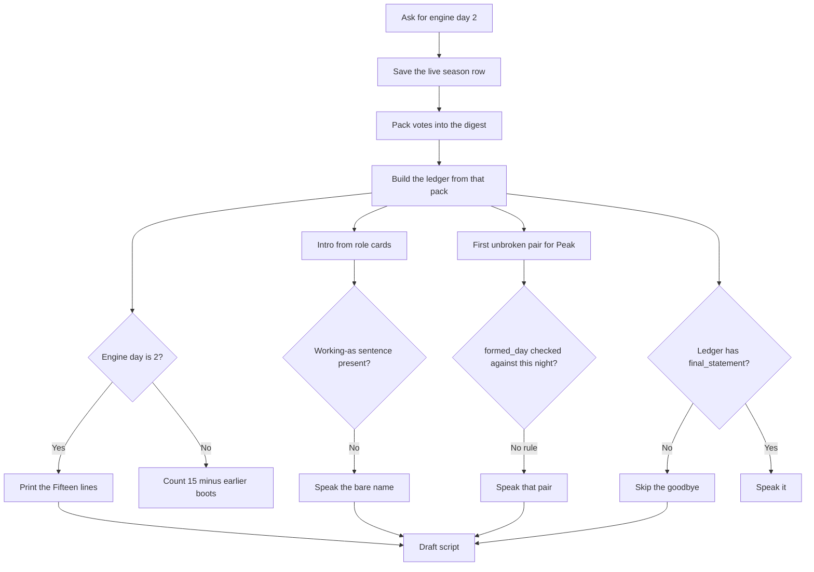

# Daily closer — story of the night

**2026-10-02.** Working note. Not the contract.

The live contract stays [`SOT-video.md`](SOT-video.md) §9 until a script from this note is accepted and a bake matches it. The open board is [`TODO_video.md`](TODO_video.md). Do not write in [`daily/archive/SOT-new-daily-history.md`](daily/archive/SOT-new-daily-history.md).

Do not rewrite the specimen `double-video/data/20260823-2/trailer_ready_day2`. The draft under review is `double-video/data/20261001-2/trailer_ready_day2/vo_draft_long.txt` (engine day 2, Peak Nicolás, Cost Ivan Pitts). No full bake until the script from this note is accepted.

The branch catalog is [`20261002_daily-pipeline.html`](20261002_daily-pipeline.html). It stops when the words lock. Every option shows what is read, what is kept or dropped, and the line, for today and for the wanted rule. A collision is shown on the assembled script. An open rule stays visible and blocks the lock. Pictures are a later view.

## Pin before any rewrite

### Headcount

The spoken count is how many Doubles entered at the start of that sim, then how many are still in after tonight.

Day 1 is a literal in the writer: “Fifteen of them entered Survival mode…” and “Just like that, fifteen become fourteen.” Later nights use `15` minus prior boots. That is the soul15 season.

**Checked 2026-10-02 against the live records.** `20261001-2` is a fork of `base_pit` (`simulations.parent_simulation_id`). The baseline roster is six:

1. Gosha Carnegie
2. Ivan Pitts
3. Katya Fox
4. Luba Istomina
5. Yevgenia Pritchard
6. Nicolás — `base_pit` still stores the login `Nicolasdemaria123`. Same Double.

This sim’s season row is the same six: four still in when the package was saved, plus Ivan (survival day 1) and Gosha (survival day 2). Ivan’s own fold reason says six players were in the game. Portraits in `video/assets/cohort/20261001-2` are those six files. `base_family_pittsburgh` above `base_pit` has four, under the old family names.

The start list for the line is that six. After this vote, five are still in. A seventh name is not on the baseline, this sim, or the portrait folder.

### Story, still fact-locked

The current writer fills a slot form and skips empty slots. That is why the draft sounds flat. A full-day recap stays killed (`SOT-video.md` §1.1, encyclopedia `[C]`).

Before the writer changes, this note has to say which beats of the day a stranger must hear, and which empty slots stay silent.

Stays until that decision:

- The Doubles line, once.
- Fact-lock: the ledger and the public board. Do not invent a challenge, a vote, or a chat.
- One Door.
- The `20260823-2` benchmark stays untouched.

## What the 20261001-2 draft got wrong

The script is the slot form, not the night. Package: `double-video/data/20261001-2/trailer_ready_day2`. Trailer night is engine day 2, survival day 1. The saved season row was already on survival day 3.

| Spoken line | First place it goes wrong | What the record actually holds |
|---|---|---|
| “Fifteen… / fifteen become fourteen.” | Day-1 branch prints a constant. It does not read the roster. | Six entered. Five still in after Ivan leaves. |
| “Nicolás and Gosha have each other's backs.” | The package stores the live alliance log, including pairs formed on survival day 2. The writer takes Peak’s first partner and does not check `formed_day`. | On survival day 1 the only pair is Gosha and Ivan, formed that day. |
| Ivan’s goodbye is missing. | The cast digest’s vote pack copies the name and the tally and drops `final_statement`. The writer only reads the ledger, so it never sees the sentence. | Season row, Ivan, survival day 1: “Well, this is a setback—but not the end. I've built companies from worse than a bad vote, so I'll treat this as data and pivot. Good luck out there; keep your eyes open and your alliances honest.” |
| “Nicolás.” / “Ivan Pitts.” | Role cards are built only from a `Working as … at …` sentence. The digest stores `Currently` and a daily plan instead. Ivan is also absent from the digest cast: his name is not in that day’s position rows. | Checklist jobs: Nicolás at River Vue; Ivan at Encore on 7th / O'Reilly Pub. Those workplaces are not in the ledger. |

Also in the ledger, unused by the vote lines: the tally is a tie at 2 (Ivan and Katya). A tiebreak sent Ivan home. The script says “Tonight Two people name Ivan” and “Ivan is gone.” Nicolás and Katya named him.

The fold reasons are in the ledger. The choice line only speaks a sentence shaped “I'd rather … than …”. Ivan’s reason has “I'd rather” and no “than”, so that slot stays empty. The two-hook gate would fail a bake.

Right in that draft: “Nobody held, so a draw gives Nicolás the Shield.”

## Script path — what runs today

Boundary: the night’s records go in. A script ready for pictures comes out. This is the path that produced the draft, including the constants.

Unhappy branches on this night:

| Boundary | What happened |
|---|---|
| Night cutoff | The saved season row is survival day 3. Day-2 alliances and Gosha’s exit are already in it. |
| Headcount | Day 1 uses a literal 15. The baseline roster is not read. |
| Goodbye | The sentence is on `eliminated[]`. The digest vote pack never copies it. Selection cannot recover it. |
| Which pair | Gosha and Ivan are in the log at `formed_day` 1. Peak is tried first, so Nicolás and Gosha win. No rejection reason is stored. |
| Job and place | `Currently` is not a job card. Ivan never enters the digest cast. |
| Quiet fold | A real reason is stored. The “rather than” parser leaves the slot empty. |

Do not add a new elimination table. The season row already stores who left, the survival day, the tally, the reasons, and the goodbye. Each surviving Double also gets an elimination memory. That memory is a copy for the agent. The season row is the history. The missing piece is a cutoff: the script must see the row as of this night, before later exits and later pairs.

The baseline fork is the right place for the start count. Read `parent_simulation_id` up to `base_pit` and count that roster. Do not count `remaining_players` on a later day. On this package that list is four, after two exits.

## Open — decide here, then redraft the script only

1. Start list is the six above. Confirm that before the writer changes. A seventh is not in the records checked today.
2. Which beats of this day a stranger must be able to retell after one watch. The record can support: six entered; Nicolás and Ivan, with a real job and place once that source is chosen; nobody held and a draw gave Nicolás the Shield; Gosha and Ivan had each other's backs; the vote tied and Ivan left; Ivan’s goodbye; five still in; tomorrow Nicolás walks in without the Shield.
3. Which slot lines stay, and which stay silent when the ledger has nothing. A fold with no “rather than” sentence is one of those empties. The goodbye is not an empty. It was dropped before the slot.

No full bake until that script is accepted. Then the writer. Then tick `TODO_video.md` and move this file to `done/`.

## After the daily is finalized

Update [`SOT-video.md`](SOT-video.md) so the live contract matches the accepted daily. Do that after the trailers are finalized, not before. §9 is the closer lock, including the Day 1 headcount lines in §9.3.
