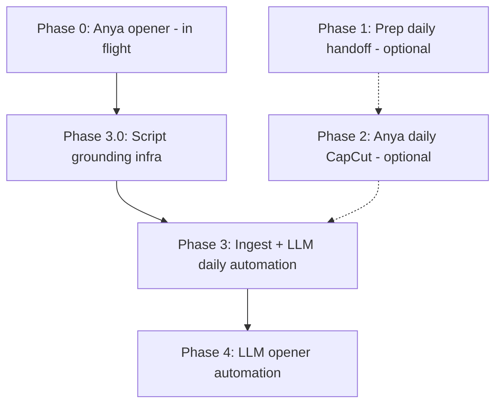

## Current status and next steps

**Updated:** 2026-07-10

### Where we are

| Area | Status |
|------|--------|
| **Opener (Phase 0)** | With Anya — locked script/VO (`script_cos.md`, ~83s) |
| **Phase 3.0 — script grounding** | ✅ Shipped (`cast_digest`, `fact_ledger`, narration fact gate, slim `day_log`) |
| **Story selection / continuity (L11–L13)** | ✅ Shipped 2026-07-10 — F1 intro memory, spicy ranking + coverage, F3 scar cards — see `daily/TODO_daily_trailer.md` §F · `sot-video.md` |
| **Creative reference package** | `20260707-chat-probe-v3` Day 2 — human VO locked; **locations restitched 2026-07-10**; **do not** `lock_day_script` to seed history/scars |
| **Stand-in sim `20260705-or-smoke`** | **Not fit for daily trailer polish** — engineering fixture only |
| **Phase 3.1+ (motion / Remotion picture)** | **Next** — Remotion render → validate → watch on chat-probe package |
| **Manual Track B daily (Anya handoff)** | Optional; auto path preferred once picture pass lands |

### Why we paused on `20260705-or-smoke` (still true)

This smoke sim is **not a valid story substrate** for daily trailer work:

- **Zero chats** — no dialogue on movement records for **any** Double on Day 1 or Day 2. Survival drama needs social exchange.
- **Ghost / stale data** — eliminated players still appear in timelines; immunity flags over-count; challenge metadata inconsistent.
- **Engineering value only** — Phase 3.0 used it to prove digest, fact ledger, and fact gate. **Do not** treat its auto scripts as creative ground truth.

### Next steps (live sim)

**Good substrate:** `20260707-chat-probe-v3` (Day 2 package + digest) and overnight sims with real chats (e.g. `20260709-1` when ready).

1. **Generate Day N** — `generate_trailer <sim> --mode day_overview --day N --force --skip-render`; confirm spicy scores + coverage note in `cast_digest.md`.
2. **Writer / accept pass** — lock narration; then `lock_day_script` (writes F1 history **and** F3 scar).
3. **Day N+1** — generate only **after** Day N is locked so coverage + scars stay accurate.
4. **Picture pass** — re-stitch → Remotion → validate → owner watch (+ optional D1 comprehension gate).
5. **Do not** backfill chat-probe into `trailer_featured_history` / `trailer_day_scar`.

**Refs:** `sot-video.md` L11–L13 · `daily/TODO_daily_trailer.md` · `TODO_script_draft.md` (gold VO shape).

---

## Part 1 — What daily trailers should inherit from the opener work

The opener manual push locked decisions and exposed failures. Daily auto-gen should treat these as **non-negotiable**, not re-litigate them.

### A. Product & taxonomy (from `sot-video.md` + opener brief)

| Inherit | Why it matters for dailies |
|--------|----------------------------|
| **Three trailer types** — opener [A] lean ~60s · normal day [B] · survival day [C] &lt;120s | Dailies are **[C] `day_survival`** recaps, not a repeat of the opener. |
| **“Same show, next episode”** | Shared 9:16, voice, end-card pattern, validators — different story job. |
| **L-Talks masking + Press Play season** | Display “L-Talks”; never real group names on screen. |
| **Message-derived Doubles** | Cold viewers should still feel these are real people distilled from how they talk — weave that into Day 1 concept reset, not only the opener. |
| **Intellectual-thriller tone** | Quiet tension, ideas have consequences — not reality-TV melodrama. |
| **Per-Double trait lines → [B] only** | Opener has **no** spoken traits (D8). Survival dailies feature **2–4 Doubles** with “who they are / why they act” woven in — not all 15. |
| **Hero/portrait assets** | Opener held them back (D8). **Dailies use them** — featured Doubles get hero spotlights + sketch/cutout cards. |

### B. Craft & motion (why automation failed — carry forward)

| Inherit | Source | Daily implication |
|--------|--------|-------------------|
| **Visual timeline ≠ narration timeline** | Automation doc §2, workbook readout | Biggest gap: auto dailies score ~2.8 visual changes/min vs opener ~23.5/min. Each VO line needs 2–4 micro-beats, not one static card. |
| **`type-then-hold` text** | SOT §5, automation Phase 5–6 | Type while spoken → hold still ≥0.8s → exit on transition. |
| **Motivated handoffs** | SOT §6, playbook | Camera dive / pixel fracture for 2D→3D (`daily-2D-3D-blend.md`); no bare crossfades. |
| **Producer timecodes** | Workbook CapCut ingest, `teadown/` | Beat-level `narration_timing.json` locks on-screen copy — same discipline as `l-talk/audio/`. |
| **Anya motion grammar** | `l-talk/reference/anya-scene-spec-pistsov-reference.md` | Palette, typography, easing — reuse; swap Pistsov cast for L-Talks assets. |
| **End card: `questionToUrlTakeover`** | Opener D6–D7, daily TODO C1 | Daily variant: dramatic question + “Day N ends” / “What happens tomorrow?” + `doubland.ai`. |
| **Editorial-motion gates** | SOT §9.2, daily TODO C2 | ≥16/min visual changes, &lt;2.5s static runs — report honestly; 2D→3D clips are one lever. |

### C. Assets & data (from workbook + automation plan)

| Inherit | Rule |
|--------|------|
| **Supabase `trailer_asset` registry** | Resolve heroes by `persona_id`; baseline cohort fallback for forks (`20260628-4` → `soul15_seed_20260224`). |
| **No wrong-cohort silent fallback** | Fail or warn — never substitute Pistsov/Anya assets. |
| **Brand kit reuse** | `l-talk/brand/` — Village, Pressure, SFX, anthem, end cards. |
| **Location plates** | `video/assets/village/interior/` + `exterior/` for clip prompts and on-screen location labels. |
| **Moment clips** | 1–3 per day at `moment_clips/<sim>/<day>/beat_<scene_id>.mp4`; manual first, automate later (B4). |
| **CapCut = blueprint, not engine** | Full project package on return: layers, masks, keyframes, SFX placement — feeds Remotion motion grammar. |
| **Prompt log → automation registry** | Every hand-made Grok clip documents prompt, inputs, accept/reject — same pattern as workbook § Prompt log. |

### D. Story engine (already built in code — align manual cut with it)

| Inherit | Detail |
|--------|--------|
| **Two-stage narration** | Day Story Producer → Narration Writer (cached per day; keys `story_v8` / `narration_v11`). **Phase 3.0 adds deterministic fact ledger between stages** — Writer must not infer beyond it. |
| **Cast digest before LLM** | One positions fetch → all-Double day summary (`cast_digest.json`); spicy ranking + coverage candidate; deep extract top 3 only. |
| **Spicy ranking + coverage (L12)** | Drama-gap `rank_score`; last top-N prefers never-featured alive Doubles; soft elim +2 only (never +50). |
| **First-feature intro (L11)** | `intro_mode` full\|recall; Survival Day 1 (engine day 2) always full; history written only on `lock_day_script`. |
| **Prior-day scars (L13)** | Lock writes `scar.json` + Supabase; engine day ≥3 feeds producer/writer. Lock Day N before Day N+1. |
| **Beat vocabulary** | `yesterday_scar`, `today_pressure`, `countermove`, `vote_reveal`, etc. — flexible 3–6 beats. |
| **Day 1 vs Day ≥2** | Premiere/grace (engine day 1) vs Survival days (engine day ≥2). Survival Day ≥2: brief touch + “Previously on” from scars. |
| **Plain language, cliffhanger close** | No jargon; end on rising tension, never a bow. |
| **First-name VO, full names on cards** | Locked in daily TODO. |
| **Fact gate before publish** | `validate_trailer.py` cross-checks elimination/vote/immunity claims vs ledger (Phase 3.0.5). |

### E. Day 1 vs Day 2+ branching (single pipeline)

**Decision:** One survival-daily auto-gen pipeline — `--mode day_overview --day N`. Do **not** split Day 1 and Day 2+ into separate compilers.

| | Grace / premiere (engine day 1) | Survival Day 1 (engine day 2) | Survival Day ≥2 (engine day ≥3) |
|---|-------|--------|--------|
| **CLI** | `--day 1` | `--day 2` | `--day 3`, … |
| **Establishing open** | Full concept + cast | Full stamps (L11 force-full) | Brief concept + recall/full mix |
| **`yesterday_scar`** | Not used | Not used (no prior competitive day) | First arc beat; fed by L13 scar cards |
| **Story arc, voice, assets, 2D→3D, end card** | Identical | Identical | Identical |
| **Per-day cache** | Separate narration cache row per `day_number` | Same | Same |

Branching lives in `showrunner.py` (Survival Day 1 = engine day **2** for intro modes; scars load when engine day ≥3). Render, props, and validators share one path.

**Manual Anya handoff:** Same folder layout (`l-talk/daily/day-{N}/`); only `brief/` and `HANDOFF.md` content differs (intro block + whether “Previously on” appears). Arc beats, clips, brand kit, and end-card pattern are the same.

**Not the same split:** SOT type **[B] `day_normal`** (every cast member, habitat + trait lines, 60–90s) will need a **new mode** later — that is a different trailer type, not “Day 1 pipeline.”

### F. Script grounding — known failure (Day 2, `20260705-or-smoke`)

**Incident:** Auto-generated Day 2 script (`data/20260705-or-smoke/overview_day2&002/script.json`) failed manual review and was rewritten (`video/TODO_script_draft.md` §4). Do not ship auto narration without grounding gates.

| Failure | What the draft did | Ground truth |
|--------|---------------------|--------------|
| **Elimination day mis-tag** | Scene 7 narrates Alex Butcher eliminated “at the vote” on Day 2 | Alex eliminated **Day 1 only**; Day 2 has vote *activity* but **no elimination** in extract |
| **Coalition flattening** | “Mike voted with the winning side — alongside Max and Vincent” | Day 1 split board: Vincent → Alex; Mike & Max → Vincent; Alex, Max, and Vincent each **received** 3 votes — no unified bloc |

**Root cause (confirmed against code, not just hypothesis):**

- **Grounding problem, amplified by missing context** — not missing raw data in Supabase.
- `day_log.json` is **~374KB** (full timelines for top-3 only) but `_compact_context_for_story_producer` in `showrunner.py` **strips timelines** before the LLM sees them. Producer/Writer get reflections, highlight stats, and **stale** `survival_context` (`today_elimination` still points at Day 1 Alex on a Day 2 run).
- **No cast-wide digest** — pipeline deep-extracts top 3 only; writers cannot verify featured-Double choice against all 14 without running 14× `extract_day_log` (slow: RIR/embeddings per persona).
- **Two-stage LLM** (Story Producer → Narration Writer) has **no deterministic fact packet** between stages — Writer is allowed to summarize/generalize (“three votes again”, “winning coalition”) without hard checks.

**Open engineering questions (resolve in Phase 3.0):**

| Question | Where to look |
|----------|----------------|
| Is today vs yesterday explicit in Producer output schema? | `showrunner.py` — `DAY_OVERVIEW_STORY_PRODUCER_*`, `beat_plan` |
| Are vote tallies structured numbers or prose summaries by Stage 2? | `_compact_context_for_story_producer`, `_survival_brief` |
| Machine-readable `eliminated_on_day` per person? | `survival_context.season.eliminated[]` — exists; `trigger_events` / `today_elimination` can be stale |

**Token / model policy for script path:**

| Layer | Tool | Model |
|-------|------|-------|
| Positions fetch + cast digest + ranking + fact ledger | Python (`summarize_cast_day.py`, `persona_ranker.py`) | **None** |
| Deep extract (top 3 only) | `extract_day_overview` | **None** |
| Story Producer + Narration Writer | `showrunner.py` (cached) | **Tier B only** — 2 calls/day |
| Human polish / regression review | Optional | Fable — **after** facts locked |

**Never:** dump full `day_log.json` into an LLM; never run 14× `extract_day_log` for a daily brief.

---

## Part 2 — Consolidated step-by-step plan (all four phases)



---

### Phase 0 — Finish L-Talks opener with Anya *(in flight)*

**Goal:** Ship the viral opening asset; lock craft reference for everything after.

| Step | Action | Doc / artifact |
|------|--------|----------------|
| 0.1 | ~~**Lock script**~~ — **`script_cos.md`** (v2) locked with Anya | `opening/TODOs-opening-trailer.md` |
| 0.2 | ~~**Record final VO**~~ — **`script_cos_oneshot_speed12/narration_cos.mp3`** @ 1.2× | `l-talk/audio/experiments/script_cos_oneshot_speed12/` |
| 0.3 | ~~**Confirm HANDOFF.md**~~ — `l-talk/HANDOFF.md` | `l-talk/` |
| 0.4 | **Anya edits** — CapCut, ~83s, cut to `narration_cos.mp3` | `l-talk/README.md`, `script_cos.md` block map |
| 0.5 | **You review** — motion, tone, cold-viewer clarity, captions-without-sound | SOT §9 comprehension criteria |
| 0.6 | **Collect CapCut package** — project + media + fonts + SFX + export settings | Workbook § CapCut Request For Anya |

**Exit gate:** Approved opener MP4 + CapCut project archived.

---

### Phase 1 — Prep manual daily trailer for Anya *(start now)*

**Goal:** Mirror the opener handoff quality for **one survival daily** — this becomes the golden reference for Phase 3 automation.

**Recommended pick:** **Day 2** of sim `20260628-4` — already validated in auto pipeline (`overview_day2&013`, ~87s, all gates pass). Day 1 is heavier (full cast intros); Day 2 is a cleaner “episode 2” shape.

#### 1.1 Create folder structure (mirror opener)

```
video/l-talk/daily/day-2/          # or day-1 if you prefer Episode 1 shape
├── README.md                      # Anya-facing: what we need, trailer shape
├── HANDOFF.md                     # Shot-by-shot map (primary instruction)
├── brief/
│   └── scenario-writer-brief.md   # Daily-specific: moment, leads, cliffhanger
├── script/
│   ├── script.md
│   ├── script.json
│   └── on-screen-copy.md          # Every card + target timecode
├── audio/
│   ├── narration.mp3
│   └── narration_timing.json      # Beat-level sync anchors
├── cast/
│   ├── hero/                      # 2–4 featured Doubles ONLY (opposite of opener D8)
│   └── portraits/
├── moments/                       # 1–3 Grok clips for clip-eligible beats
│   └── beat_<scene_id>.mp4
├── world/
│   └── location_plates/           # Interior/exterior plates used in clips
├── brand/                         # Symlink or copy from l-talk/brand/
└── reference/
    ├── anya-opener-grammar.md     # From l-talk/reference/
    └── daily-2D-3D-blend.md       # Transition rules (camera dive / pixel fracture)
```

#### 1.2 Generate starting materials from auto pipeline

Run the existing compiler to produce a **draft** script, VO, and asset list — then **edit by hand** before Anya sees it (automation is a draft engine, not the final cut).

```bash
python -m video.generate_trailer 20260628-4 --mode day_overview --day 2 --top 3 --voice-profile warm
```

Pull from output dir (`data/20260628-4/overview_day2&…/`):
- `script.json` → rewrite into `l-talk/daily/day-2/script/`
- `audio/narration.mp3` + `narration_timing.json`
- Featured Double heroes from cast pack / Supabase registry
- Arc beat list with `location` fields (for on-screen labels + clip prompts)

**Ref:** `daily/TODO_daily_trailer.md` § How to run, § Key files.

#### 1.3 Write daily scenario brief (new doc)

Adapt the opener brief pattern for **[C] survival daily**:

| Section | Content |
|---------|---------|
| **Which day / sim** | `20260628-4`, Day 2, Press Play, L-Talks |
| **Episode job** | Recap today’s pressure, featured Doubles, cliffhanger for tomorrow |
| **Featured Doubles** | 2–4 names + one-line “who they are” each |
| **1–3 moments** | Concrete events (who, what, where) — source: day log |
| **Dramatic question** | End-card hook |
| **Clip-eligible beats** | Which beats get 2D→3D clips (max 3) | `daily-2D-3D-blend.md` §1 |
| **Tone** | Intellectual thriller — continues opener |
| **Duration target** | &lt;120s (aim ~80–90s) | SOT L10 |
| **Locked decisions** | Same voice, end-card pattern, brand kit, no real names |

#### 1.4 Hand-generate 1–3 moment clips (B1 manual)

For each clip-eligible beat (`today_pressure`, `countermove`, `vote_reveal`, etc.):

1. Read beat `location` + featured Double + action from script
2. Pick location plate from `video/assets/village/`
3. Composite or reference hero photo + plate
4. Grok Imagine → 5–6s silent clip, 9:16 if possible
5. Drop at `moments/beat_<scene_id>.mp4`

**Ref:** `daily/TODO_daily_trailer.md` §B1, `daily-2D-3D-blend.md` §4.1.

#### 1.5 Write HANDOFF.md (shot-by-shot)

Structure like the opener README blocks, but for daily shape:

| Block | ~Time | Visuals | Notes |
|-------|------:|---------|-------|
| Establishing | 0–12s | Day ≥2: brief concept + optional “Previously on” | 2D only |
| Cast touch | 12–24s | Featured Double cards (hero + trait) | Use portraits held from opener |
| Arc beat 1 | … | 2D card → **camera dive** → moment clip → **pixel fracture** | First clip |
| Arc beat 2–N | … | Same grammar on 1–2 more beats | |
| Cliffhanger | … | Rising tension, no resolution | |
| End card | final ~5s | Dramatic question → `doubland.ai` → “Day 2 ends · Episode 3 tomorrow 18:30” | `questionToUrlTakeover` pattern |

Anchor every on-screen card to `narration_timing.json` segments.

**Ref:** `daily-2D-3D-blend.md` §2–3, `sot-video.md` §12.

#### 1.6 Polish script + re-record VO if needed

- Plain language pass (marketer-simple, no jargon)
- Word budget: intro words reserved, per-beat caps (fixes from `showrunner.py` July 1)
- Re-run TTS → lock `narration.mp3` + timing JSON

#### 1.7 Deliver to Anya

Handoff checklist (parallel to opener):

- [ ] `HANDOFF.md` + `on-screen-copy.md`
- [ ] `narration.mp3` + `narration_timing.json`
- [ ] Featured hero/portrait PNGs (2–4)
- [ ] 1–3 moment clips in `moments/`
- [ ] Location plates used in clips
- [ ] `brand/` kit (reuse opener)
- [ ] `reference/` — opener grammar + 2D↔3D blend rules
- [ ] Optional: auto-generated draft MP4 as **rhythm reference only** (like `spotlight_preview_v2.mp4`)

**Exit gate:** Anya has everything needed to cut without asking you questions.

---

### Phase 2 — Anya produces daily trailer in CapCut

| Step | Action |
|------|--------|
| 2.1 | Anya cuts to `narration.mp3`, syncs cards to timing JSON |
| 2.2 | Implements 2D→3D transitions per blend grammar (camera dive / pixel fracture) |
| 2.3 | Layers SFX + music from `brand/sfx/` — duck under VO |
| 2.4 | Exports final 9:16 MP4 (&lt;120s) |
| 2.5 | **Returns CapCut project package** — same ask as workbook § CapCut Request |

**Your review (before automation):**

| Check | Rubric |
|-------|--------|
| Cold viewer | Names leads, dramatic question, what changes tomorrow |
| Same show as opener | Voice, palette, motion feel, end card |
| 2D↔3D reads | “I watch pixels, I feel real life” on clip beats |
| Motion | Subjective: does it feel alive, not slideshow? |
| Duration | &lt;120s, no dead tail |

**Ref:** `daily/TODO_daily_trailer.md` §D1 comprehension gate.

**Exit gate:** Approved daily MP4 + CapCut project = **golden reference** for automation.

---

### Phase 3.0 — Script grounding & cast digest *(engineering prerequisite — do before Phase 3 motion work)*

**Goal:** Fix daily narration **facts** and **cast context** cheaply (scripts, no bulk LLM). Phase 3 motion automation builds on trustworthy scripts — not the other way around.

**Stand-in sim for fixtures:** `20260705-or-smoke` Day 2 (`overview_day2&002`) until production L-Talks fork exists. Corrected script: `video/TODO_script_draft.md` §4.

#### 3.0.1 Cast digest — one fetch, all Doubles (`summarize_cast_day.py`)

**Status:** ✅ Shipped (`video/summarize_cast_day.py`, wired in `generate_trailer.py`).

**Problem:** `day_log.json` only deep-extracts top 3; ranking scores all 14 but does not publish a writer-facing day story. Running 14× `extract_day_log` is the wrong tool (RIR/embeddings each — minutes).

**Build:** New module `video/summarize_cast_day.py` (or `extract_cast_digest.py`):

| Input | One `get_all_step_positions` for day range (same fetch `persona_ranker` already uses) |
| Output per alive Double | Job line · schedule summary (activity transitions) · top 3–5 poignancy moments (`dbl_get_sim_memories`, **no RIR**) · challenge/vote flags · key co-locations |
| Artifacts in overview dir | `cast_digest.json` (~10–20KB) · `cast_digest.md` (human brief) · `cast_ranking.json` (full ordered scores, not just top 3) |

**Wire:** `generate_trailer --mode day_overview` writes digest **before** deep extract; `extract_day_overview` still deep-extracts top 3 only.

**Exit:** Full cast day story readable in &lt;60s wall time; no LLM tokens.

#### 3.0.2 Fix survival snapshot bugs in extract

**Status:** ✅ Shipped — `_elimination_on_trailer_day` (season day == trailer day); explicit `eliminated_today`.

**Problem:** Day 2 runs carry stale fields that mislead Producer/Writer (`today_elimination` = Day 1 Alex; `trigger_events` at day-end step repeats Alex boot; `snapshot_day_in_season` lag).

**Fix in `extract_day_log.py` / `extract_day_overview`:**

- [ ] `today_elimination` → only set when `eliminated.day == overview_day`; else `null` + explicit `day_N_elimination: null`
- [ ] `trigger_events` → filter to eliminations whose `day` matches overview day
- [ ] Pass **structured Day 1 vote tally** into digest/ledger when `day >= 2` (who voted whom, votes received per person)

**Exit:** `cast_digest.json` and `survival_context` agree; no phantom Day 2 elimination.

#### 3.0.3 Slim persisted artifacts

**Status:** ✅ Shipped — `slim_day_overview_for_disk`; `cast_digest.json` + `cast_ranking.json` + `fact_ledger.json` alongside slim `day_log.json`.

**Problem:** `day_log.json` is ~374KB (170 timeline rows × 3 protagonists + 507-entry `shared_timeline`) but LLM compact context **excludes timelines** — file is debug bloat, not producer input.

**Change:**

| Artifact | Contents |
|----------|----------|
| `cast_digest.json` | All 14 — small, canonical for humans + LLM |
| `cast_ranking.json` | Scores + justification for all personas |
| `day_log.json` | Top-3 deep slice only; drop redundant `shared_timeline` on disk (or move to `day_log_timeline.json` optional) |
| `fact_ledger.json` | See 3.0.4 |

**Exit:** Overview folder &lt;100KB typical; producer input documented.

#### 3.0.4 Deterministic fact ledger (between Producer and Writer)

**Status:** ✅ Shipped — `video/build_fact_ledger.py`; wired into Story Producer + Narration Writer prompts.

**Problem:** Production team assessment — Writer generalizes (“winning coalition”, “eliminated again”) because Stage 1 hands prose, not bound facts.

**Build:** `video/build_fact_ledger.py` (or inline in showrunner pre-Writer):

Structured table from `cast_digest` + `survival_context` — **no LLM**:

```
per_day:
  eliminated: { name, day, vote_count } | null
  vote_tallies: { cast: target, votes_received: { name: count } }
  challenge: { type, outcomes: [{ name, token_claimed: bool }] }
yesterday_bridge: (day >= 2 only)
today_facts: (immutable list for Writer)
```

**Wire:** Narration Writer prompt gets `fact_ledger.json` with instruction: **cite only ledger facts; never infer alliances or eliminations beyond it.**

**Exit:** Writer cannot narrate a Day 2 elimination when `today.eliminated` is null.

#### 3.0.5 Post-generation fact-check gate (`validate_trailer.py`)

**Status:** ✅ Shipped — `video/narration_facts.py` + `_check_narration_facts` hard gate; Writer retry on mismatch.

**Pattern:** Same as LUFS / duration / asset-presence gates.

**Build:** `validate_narration_facts(script, fact_ledger)` — parse narration for:

- Elimination claims → must match `eliminated.day`
- Vote outcome claims → must match tally (no “voted together” unless targets match)
- Immunity claims → must match challenge outcomes

On mismatch: **reject and retry** Writer (or fail pipeline with actionable diff).

**Exit:** `python -m video.validate_trailer` hard-fails on Alex-double-elimination class of errors.

#### 3.0.6 Golden regression fixture — Day 2 corrected script

**Status:** ✅ Shipped — `video/test_day_overview_facts.py` (bad auto-script + ledger fixtures).

**Lock:** `video/TODO_script_draft.md` §4 plain-text script + `fact_ledger` for `20260705-or-smoke` Day 2.

**Tests (`tests/test_day_overview_facts.py` or extend existing):**

- [ ] Fact ledger for Day 2: `eliminated_today == null`, Alex `eliminated_day == 1`
- [ ] Vote math: split board (3 names × 3 votes Day 1)
- [ ] Auto pipeline with mocked Writer: fact gate rejects “Alex Butcher is eliminated” on Day 2 narration
- [ ] Optional few-shot: corrected script excerpt in Writer prompt cache (Phase 3.5)

**Re-verify:** Production team flagged they reviewed against summary tables, not raw `day_log.json` — **re-run digest + ledger against live extract** before treating §4 as permanent ground truth.

**Exit gate for Phase 3.0:** `generate_trailer 20260705-or-smoke --mode day_overview --day 2 --skip-render` produces digest + ledger + narration that passes fact gate; golden tests green.

---

### Phase 3 — Automate daily trailer generation (LLM-heavy)

**Prerequisite:** Phase 3.0 complete (cast digest, fact ledger, fact gate, golden tests).

**Goal:** `generate_trailer --mode day_overview` produces Anya-quality output without hand edits.

| Step | Action | Ref |
|------|--------|-----|
| 3.1 | **Ingest CapCut project** — extract layer stacks, keyframe timing, SFX map, transition durations | Workbook § CapCut ingest, automation § Layer A |
| 3.2 | **Teardown daily golden cut** — timecode index CSV (mirror `teadown/` for opener) | `20260617_vertical-trailer-automation.md` §2 |
| 3.3 | **Encode motion grammar in Remotion** — micro-beats per VO segment, 2D→3D primitives, intra-card motion | SOT §3–§6, daily blend doc |
| 3.4 | **LLM visual beat planner** — input: script + word timing + golden sub-moments → output: visual sub-moments (not 1:1 with VO lines) | Automation §4.2 visual beat planner |
| 3.5 | **LLM narration polish** — two-stage producer/writer; **fact ledger required input**; golden Day 2 script as few-shot + regression fixture | `showrunner.py` §F, Phase 3.0.4–3.0.6, `TODO_script_draft.md` |
| 3.6 | **Automate moment clips (B4)** — `generate_moment_clips.py` + compositing strategy | daily TODO §B4 |
| 3.7 | **Wire editorial-motion hard** — lift from ~2.8/min toward ≥16/min | daily TODO §C2 finding |
| 3.8 | **Second-day smoke test** — Day 3 auto render vs golden; diff at timecodes + **fact gate** on Day 3 ledger | Workbook Phase 7 pattern |
| 3.9 | **Merge `ivan/daily-trailer` → `main`** | daily TODO §D2 |

**Exit gate:** Day N auto-render passes validators + your side-by-side rating “near golden” on motion and comprehension.

---

### Phase 4 — Automate opener for new sims/casts

**Goal:** Revisit opener automation with daily lessons — avoid the slideshow trap.

| Step | Action | Ref |
|------|--------|-----|
| 4.1 | **Apply visual beat planner** from Phase 3 to opener mode | automation §4 |
| 4.2 | **Lean opener shape** — ~60s, group cast only, no trait VO (L-Talks D1–D8 locked) | `TODOs-opening-trailer.md`, SOT L1–L6 |
| 4.3 | **Cohort asset pipeline** — `generate_cohort_assets` one-command for new casts | workbook § Automation definition of done |
| 4.4 | **Ingest Anya L-Talks opener CapCut** — motion grammar for hook, cast stack, survival tease | Phase 0 deliverable |
| 4.5 | **Second-cohort smoke test** — new sim, DB + Storage only | workbook Phase 7 |
| 4.6 | **Retire manual `l-talk/` handoff** for cohort N+1 | Target: one command |

**Exit gate:** New sim with new cast → opener MP4 without manual CapCut.

---

## What to do right now

**Story plumbing (L11–L13) is shipped** — see **Current status** at top. Next bottleneck is **picture / Remotion**, not ranking.

**On the next live Survival day package:**

1. Generate Day N → check spicy scores + coverage in `cast_digest.md`.
2. Accept VO → `lock_day_script` (F1 history + F3 scar).
3. Only then generate Day N+1.
4. Re-stitch → Remotion → validate → watch.

**Parallel (ongoing):** Phase 0 opener with Anya.

**Do not use:** `20260705-or-smoke` for creative daily work. **Do not** `lock_day_script` on chat-probe to seed history/scars.


---

## Doc map (quick reference)

| Phase | Primary docs |
|-------|----------------|
| Shared grammar | `sot-video.md` Part I, `video_playbook.md` §Core 2D↔Cinematic |
| Opener manual | `opening/TODOs-opening-trailer.md`, `l-talk/README.md`, `20260701_scenario-writer-brief…` |
| Daily survival | `daily/TODO_daily_trailer.md`, `daily-2D-3D-blend.md`, `sot-video.md` §12 + L11–L13 |
| Gold VO shape | `TODO_script_draft.md` (chat-probe Day 2 — creative reference only) |
| Script grounding incident | `video/TODO_script_draft.md`, `TODO_video.md` §F, Phase 3.0 |
| Automation architecture | `20260617_vertical-trailer-automation.md` |
| Asset / Supabase patterns | `20260625_trailer-workbook.md` |
| CapCut ingest | Workbook § CapCut Request + § Working approach Layer A |
